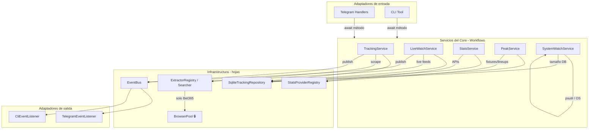

# Especificación de Arquitectura y Servicios — BetBot (Migración)

> Versión corregida y completada de la especificación previa.
> Corrige inconsistencias con el código real, completa el catálogo de comandos (~95) y los 8 jobs de fondo, y deja asentadas las decisiones que acordamos (locks por recurso, EventBus one-way, esquema "delgado", reversión de bitmasks de settings).
> Patrón: **DI + EventBus** (ports & adapters pragmático). Comandos = `await` directo (request-reply); avisos = EventBus one-way.

---

## 1. Capas



> **Nota hexagonal honesta:** para ser hexagonal "puro" el Core debería depender de un *port* (`RepositoryPort`, `ScraperPort`) y no de `SqliteTrackingRepository` concreto. Para el tamaño del bot es aceptable inyectar la clase concreta (DI pragmático); si más adelante querés testear el Core sin SQLite, definí los ports. No lo vendas como "hexagonal" si no hay puertos — llamalo **DI + EventBus**.

---

## 2. Servicios del Core

| Servicio | Archivo | Responsabilidad |
| :--- | :--- | :--- |
| `TrackingService` | `services/tracking.py` | Ciclo de cuotas prematch: scrape → upsert → detección vs baseline por chat → `publish(OddsChangedEvent)`. Registro/confirmación de ligas, suscripciones, cambios menores, registro unificado de ligas. |
| `LiveWatchService` | `services/live_watch.py` | Poll in-play + fuzzy match vs watchlist (cuotas y stats-only) → `publish(MatchLiveEvent)`. Import de planilla. Ajustes de alertas live. |
| `StatsService` | `services/stats.py` | Búsqueda/linkeo de ligas de stats, reportes consolidados, comandos de federación, refresh de sesión y prefetch. Import del token Sportradar (replay). |
| `PeakService` | `services/special_peak.py` | Scoring 1-10 de rotación (Fin/Swe), digest diario y suscripciones. **(Faltaba en el spec previo.)** |
| `SystemWatchService` | `monitoring.py` | Métricas de RAM/CPU/Chromium (vía `psutil`/OS), tamaño de DB, warnings al chat admin. |

**Locks (van en la infraestructura/servicio, nunca en un mediador):**
- `BrowserPool._lock` — serializa el uso de Chromium (solo Bet365). Vive dentro del `Searcher`/extractor.
- `TrackingService._refresh_lock` — serializa el ciclo de refresh (manual vs scheduled) para no duplicar baselines.
- Rate-limit por proveedor de stats (sesión/token) dentro de `StatsService`.

---

## 3. Catálogo completo de comandos (request-reply directo)

> ~95 comandos reales. Los marcados *(UI)* no tocan el Core (solo manejan teclado/ayuda).

### 3.1. Tracking de cuotas → `TrackingService`
| Comando | Método del Core | Retorno |
| :--- | :--- | :--- |
| `/track_url <url>` | `request_track(url, chat_id)` | `PendingTrackRequest` |
| `/track_league` | `discover_leagues(platform, country)` → `confirm_league_track(...)` | `Sequence[LeagueDiscoveryOption]` → `TrackedCompetition` |
| `/confirm_track` | `confirm_pending_track(chat_id)` | `TrackedCompetition` |
| `/confirm_empty_track` | `confirm_empty_pending_track(chat_id)` | `TrackedCompetition` |
| `/update_track_url <id> <url>` | `update_track_source(chat_id, idx, url)` | `bool` |
| `/untrack <n>` | `remove_subscription(chat_id, idx)` | `bool` |
| `/list_tracks` | `list_subscriptions(chat_id)` | `Sequence[TrackedCompetitionSubscription]` |
| `/refresh_tracks` | `refresh_for_chat(chat_id)` | `RefreshSummary` |
| `/odds_on` `/odds_off <n>` | `toggle_odds_alerts(chat_id, idx, enabled)` | `bool` |
| `/set_change_percent <n>` | `update_change_threshold(chat_id, percent)` | `float` |
| `/reminders_league <n>` | `toggle_league_reminders(chat_id, idx)` | `bool` |
| `/reminders_match <n>` | `toggle_match_reminder(chat_id, idx)` | `bool` |

### 3.2. Cambios menores → `TrackingService`
| Comando | Método | Retorno |
| :--- | :--- | :--- |
| `/check_little_changes` | `list_pending_small_changes(chat_id)` | `Sequence[SmallChangeRecord]` |
| `/confirm_change <n>` | `confirm_small_change(chat_id, change_id)` | `bool` |
| `/confirm_all_little_changes` | `confirm_all_small_changes(chat_id)` | `int` |

### 3.3. Partidos y URLs → `TrackingService` / registry
| Comando | Método | Retorno |
| :--- | :--- | :--- |
| `/matches` | `list_stored_active_matches(chat_id)` | `Sequence[EventSnapshot]` |
| `/match <n>` `/view_match <n>` | `get_match_detail(chat_id, idx)` | `EventSnapshot` |
| `/event_url <n>` | `get_event_url(chat_id, idx)` | `str` |
| `/competition_url <n>` | `get_competition_url(chat_id, idx)` | `str` |
| `/platforms` | `extractor_registry.list_platforms()` | `Sequence[PlatformDescriptor]` |

### 3.4. Registro unificado de ligas → `TrackingService` (registro de ligas)
| Comando | Método | Retorno |
| :--- | :--- | :--- |
| `/leagues` | `list_unified_leagues(chat_id)` | `Sequence[UnifiedCompetition]` |
| `/league <id>` | `get_unified_league(chat_id, unified_id)` | `UnifiedLeagueCard` |
| `/link_league <a> <b>` | `link_unified(a_id, b_id)` | `bool` |
| `/unlink_league <id>` | `unlink_unified(unified_id)` | `bool` |
| `/relink_leagues` | `recompute_unified_links()` | `int` |

### 3.5. Estadísticas (directas) → `StatsService`
| Comando | Método | Retorno |
| :--- | :--- | :--- |
| `/stats <match_id>` | `get_match_stats_report(match_id)` | `MatchStatsReport` |
| `/explore_stats <prov> <país>` | `search_leagues(provider_key, country)` | `Sequence[StatsLeagueOption]` |
| `/link_stats <odds_id> <stats_id>` | `link_leagues(odds_league_id, stats_league_id)` | `bool` |
| `/stats_links` | `list_linked_leagues(chat_id)` | `Sequence[LeagueLinkRecord]` |
| `/stats_leagues <país>` | `list_provider_leagues(country)` | `Sequence[StatsLeagueOption]` |

### 3.6. Estadísticas por federación → `StatsService` (consolidado)
> 37 comandos hoy: `{fin,swe,no,ro,sk,al}_{help,leagues,standings,fixtures,today,match}` + `swe_results`.
> **Recomendado:** parametrizar a 6 genéricos con el país como argumento/botón inline. Mantener alias por país por retrocompat.

| Comando (genérico) | Método | Retorno |
| :--- | :--- | :--- |
| `/standings <país> [liga]` | `get_standings(country, league_id)` | `StandingsReport` |
| `/fixtures <país> [liga]` | `get_fixtures(country, league_id)` | `Sequence[StatsFixture]` |
| `/today <país>` | `get_today(country)` | `Sequence[StatsFixture]` |
| `/match <país> <id>` | `get_federation_match(country, match_id)` | `MatchStatsReport` |
| `/stats_leagues <país>` | `list_provider_leagues(country)` | `Sequence[StatsLeagueOption]` |
| `/stats_help` | *(UI)* | — |
| `/swe_results` | `get_recent_results("SWE")` | `Sequence[StatsFixture]` |

### 3.7. Stats-only live + Sportradar → `LiveWatchService` / `StatsService`
| Comando | Método | Retorno |
| :--- | :--- | :--- |
| `/track_stats <stats_id>` | `live.subscribe_stats_only(stats_league_id, chat_id)` | `bool` |
| `/stats_tracks` | `live.list_stats_only_subscriptions(chat_id)` | `Sequence[LiveWatchSubscription]` |
| `/sportradar_token <token>` | `stats.import_sportradar_token(token)` | `bool` |

### 3.8. Live watch → `LiveWatchService`
| Comando | Método | Retorno |
| :--- | :--- | :--- |
| `/watch_live <fixture\|url>` | `add_watch(chat_id, fixture)` | `LiveWatchEntry` |
| `/unwatch <n>` | `remove_watch(chat_id, idx)` | `bool` |
| `/watching` | `list_watching(chat_id)` | `Sequence[LiveWatchEntry]` |
| `/live_status` | `get_live_status(chat_id)` | `Sequence[LiveWatchEntry]` |
| `/live_match <n>` `/view_live_match <n>` | `get_live_match(chat_id, idx)` | `LiveEventSnapshot` |
| `/live_settings` | `get_or_update_live_settings(chat_id, ...)` | `LiveWatchSettings` |
| `/import_sheet` | `import_sheet_now(chat_id, url)` | `Sequence[LiveWatchEntry]` |

### 3.9. Peak → `PeakService`
| Comando | Método | Retorno |
| :--- | :--- | :--- |
| `/peak_today` `/peaks` | `get_today_peaks()` | `Sequence[PeakScore]` |
| `/peak_on` `/peak_off` | `set_digest_subscription(chat_id, enabled)` | `bool` |

### 3.10. Sistema / UI → `SystemWatchService` / UI-only
| Comando | Método | Retorno |
| :--- | :--- | :--- |
| `/status` `/ping` | `get_health_status()` | `SystemStatus` |
| `/resources` | `get_resource_metrics()` | `ResourceMetrics` |
| `/start` `/guide` `/help` `/help_*` `/cancel` `/echo` | *(UI)* | — |

---

## 4. Trabajos de fondo (8 loops) — disparados por el `Scheduler`

> El `Scheduler` (ex-"Orchestrator") **solo dispara timers**; no rutea mensajes. Cada método publica al EventBus solo si corresponde.

| Job | Intervalo | Servicio.método | Evento | Sink / efecto |
| :--- | :--- | :--- | :--- | :--- |
| Monitoreo de cuotas | 120 s | `tracking.refresh_due_leagues()` | `OddsChangedEvent` (uno por chat) | `TelegramEventListener.on_odds_changed` |
| Vigilancia en vivo | 10–60 s (dinámico) | `live.poll_once()` | `MatchLiveEvent` | `TelegramEventListener.on_live_event` |
| Refresh de sesión stats | 30 min | `stats.ensure_sessions_fresh()` | — | renueva token (off en replay-only) |
| Prefetch diario stats | 24 h | `stats.warm_tracked_leagues()` | — | calienta cache + purga cache vencida |
| Import de planilla | 15 min | `live.import_sheet_if_changed()` | — | notifica al chat configurado |
| Peak digest | diario 08:00 ARG | `peak.push_digest()` | — | envía a suscriptores |
| Resource monitor | 60 s | `systemwatch.sample_metrics()` | — | warning / alerta a chat admin |
| Limpieza de DB | 24 h | `maintenance.prune_old_data(days=14)` | — | DELETE + **VACUUM**, log de auditoría |

> `prune_old_data` es transversal (purga `active_events`, `sent_alerts`, cache, `live_watch_entries`). Ubicarlo en un `MaintenanceService`/repo, no en `TrackingService`.

---

## 5. Modelos de datos (corregidos)

```python
from dataclasses import dataclass, field
from datetime import datetime, timezone
from typing import Any, Optional

def _utcnow() -> datetime:
    return datetime.now(timezone.utc)

@dataclass(frozen=True)
class Odds1X2:
    home: float | None      # los books pueden omitir selecciones
    draw: float | None
    away: float | None

@dataclass(frozen=True)
class EventSnapshot:
    # NO redefinir recortado: el contrato del extractor necesita estos campos
    fixture_id: str
    home: str
    away: str
    odds: Odds1X2
    scheduled_at: Optional[datetime]
    scheduled_label_date: Optional[str]
    scheduled_label_time: Optional[str]
    event_url: Optional[str]
    markets_payload: Optional[dict[str, Any]] = None

@dataclass(frozen=True)
class MatchStatsReport:
    home_team: str
    away_team: str
    markdown: str                       # texto ya renderizado (lo que consume Telegram)
    # métricas opcionales: federaciones (FOGIS/Palloliitto) NO traen corners/posesión
    minute: Optional[int] = None
    score: Optional[tuple[int, int]] = None
    extra: dict[str, Any] = field(default_factory=dict)

# --- EVENTOS (EventBus, one-way) ---

@dataclass(frozen=True)
class OddsChangedEvent:
    chat_id: int                         # un evento por chat suscripto (fan-out en el servicio)
    league_name: str
    home: str
    away: str
    previous_odds: Odds1X2
    current_odds: Odds1X2
    change_percent: float
    event_url: Optional[str]
    timestamp: datetime = field(default_factory=_utcnow)   # NO datetime.now() directo

@dataclass(frozen=True)
class MatchLiveEvent:
    chat_id: int
    home: str
    away: str
    minute: int
    score_home: int
    score_away: int
    event_type: str                      # 'kickoff' | 'goal' | 'red_card'
    timestamp: datetime = field(default_factory=_utcnow)
```

---

## 6. Decisiones de esquema (espacio en VPS)

1. **Una sola fuente de verdad.** No correr `events` + `event_odds_snapshots` (esquema nuevo) en paralelo con `active_events`. Hoy en el worktree coexisten y solo el CLI lee el nuevo → datos divergentes. Decidir: o se migra el runtime al esquema nuevo, o no se crea todavía.
2. **El ahorro real:** dejar de persistir `raw_payload_json` por defecto (gatear con `EXTRACTOR_SAVE_DEBUG_PAYLOADS`), o guardarlo gzip en `event_payloads_debug` con TTL corto. Eso es el 70–90% del tamaño.
3. **VACUUM tras prune** (ya está) + prune de `sent_alerts` (append-only).
4. **Bitmask:** revertir para settings booleanos (`notify_odds_changes`, etc.) — perdés `WHERE col=1` e índices por flag a cambio de ~12 bytes/fila. Usar bitmask **solo** en `status_flags` de lifecycle de partido (estados combinables). Medir antes con `dbstat`:
   ```sql
   SELECT name, SUM(pgsize) AS bytes FROM dbstat GROUP BY name ORDER BY bytes DESC;
   SELECT SUM(LENGTH(COALESCE(raw_payload_json,''))) FROM active_events;
   ```

---

## 7. Flujos de ejecución

> Los 7 diagramas de secuencia de la versión previa (A–G) son correctos en estructura. Correcciones puntuales:
> - **Flujo C (refresh):** el ciclo aplica `_refresh_lock` y batching con semáforo (concurrencia explícita en la receta, no secuencial).
> - **Detección de cambios:** es **por chat suscripto** (cada uno con su baseline) → el servicio hace fan-out publicando un `OddsChangedEvent` por chat; el listener queda tonto.
> - **Flujo F (`/stats`):** primero intenta la cache (`stats_payload_cache`) antes de pegarle al provider.

### Flujo de refresh corregido (concurrencia explícita)

```python
async def refresh_due_leagues(self):
    leagues = self.repo.list_due_competitions()
    sem = asyncio.Semaphore(self.max_parallel)          # política en la receta
    async with self._refresh_lock:                       # serializa vs refresh manual
        async def one(lg):
            async with sem:
                snap = await self.searcher.extract_league(lg.url)   # lock del browser: dentro de searcher
                records = self.repo.upsert_active_events(snap)
                for chat in self.repo.subscribers(lg.id):           # fan-out por chat
                    alert = evaluate_subscription_odds_change(records, chat)
                    if alert:
                        await self.bus.publish(OddsChangedEvent(chat_id=chat, ...))
        await asyncio.gather(*(one(l) for l in leagues), return_exceptions=True)
```

---

## 8. Checklist de correcciones aplicadas vs spec previo

- [x] Catálogo completo de ~95 comandos (faltaban live-watch, federaciones, ligas unificadas, peak, reminders, sportradar_token, platforms, import_sheet).
- [x] 8 jobs de fondo (faltaban sheet import, peak digest, resource monitor; stats split en sesión + prefetch).
- [x] `PeakService` agregado.
- [x] Bug `timestamp = datetime.now()` → `field(default_factory=...)`.
- [x] `Odds1X2` opcional; `EventSnapshot` no recortado; `MatchStatsReport` provider-agnóstico.
- [x] Locks por recurso documentados (browser, refresh, rate-limit).
- [x] Decisiones de esquema (una sola fuente de verdad, drop raw_payload, bitmask solo en lifecycle).
- [x] Fan-out por chat en eventos de cuotas.
