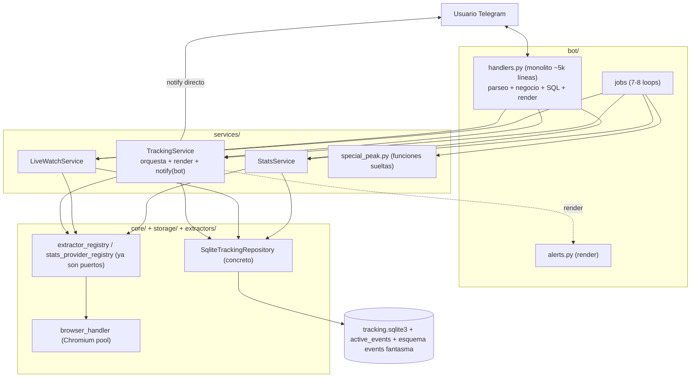
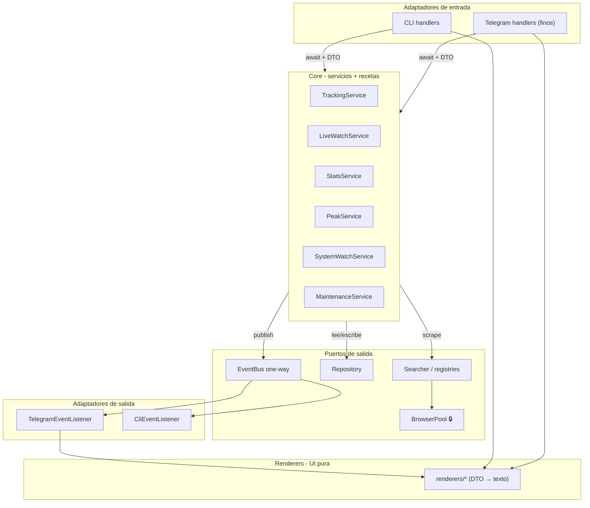

# Plan de Migración Arquitectónica — BetBot

> Diseño de la migración incremental hacia **DI + EventBus (hexagonal pragmático)**, sin reescribir todo de golpe y sin romper comandos.
> Complementa `ESPECIFICACION_MIGRACION.md` (catálogo completo de ~95 comandos y modelos) y `REPORTE_ARQUITECTURA_BetBot.md` (auditoría del estado actual).
> Diseño verificado contra el código real del worktree `migration-architecture`. Las incertidumbres van marcadas con **⚠️ DECISIÓN**.

---

## Índice
1. [Resumen ejecutivo](#1-resumen-ejecutivo)
2. [Arquitectura actual (diagrama)](#2-arquitectura-actual)
3. [Arquitectura propuesta (diagrama)](#3-arquitectura-propuesta)
4. [Servicios finales](#4-servicios-finales)
5. [Recetas (workflows) por servicio](#5-recetas-por-servicio)
6. [Comandos normalizados](#6-comandos-normalizados)
7. [Eventos del EventBus](#7-eventos-del-eventbus)
8. [Background jobs](#8-background-jobs)
9. [Modelos de datos](#9-modelos-de-datos)
10. [Esquema SQLite propuesto](#10-esquema-sqlite-propuesto)
11. [Plan de migración por fases](#11-plan-de-migración-por-fases)
12. [Checklist de implementación](#12-checklist-de-implementación)
13. [Riesgos y mitigaciones](#13-riesgos-y-mitigaciones)
14. [Incertidumbres / decisiones abiertas](#14-incertidumbres)

---

## 1. Resumen ejecutivo

BetBot ya tiene una base sólida para esta migración: el **registry de extractores/proveedores ya es ports & adapters**, y los servicios (`TrackingService`, `LiveWatchService`, `StatsService`) **ya contienen la orquestación** (las "recetas" como `refresh_due_leagues`, `poll_once`). El problema no es la lógica de negocio: es que esos servicios además **(a) renderizan texto** (`build_*_message`, `render_*`) y **(b) hablan con Telegram directamente** (`notify_for_refresh_result(bot)`, `monitor_once(bot)`).

Por lo tanto la migración es, sobre todo, **una extracción**, no una reescritura:

1. Sacar el **rendering** de los servicios → módulo `renderers/` (UI).
2. Reemplazar el **push directo a Telegram** por `EventBus.publish(Event)` + sinks (Telegram/CLI).
3. Adelgazar `bot/handlers.py` (handlers finos que llaman servicios y delegan el render).
4. Optimizar SQLite (sacar `raw_payload_json`, prune+VACUUM, índices) **manteniendo una sola fuente de verdad**.

El worktree actual **se adelantó** en EventBus, scheduler único, esquema serie-temporal y bitmasks, pero los dejó **a medio cablear** (EventBus sin un solo `subscribe`, esquema `events` fantasma en paralelo con `active_events`, bitmasks que rompen queryabilidad). Este plan reordena el trabajo en fases disciplinadas y marca qué de eso conviene **terminar, revertir o posponer**.

**Restricciones respetadas:** comandos = `await` directo a servicios; EventBus solo one-way; SQLite viable en VPS chico; sin big-bang; aliases viejos preservados.

---

## 2. Arquitectura actual

**Problemas marcados:** render dentro de servicios; `notify(bot)` acopla a Telegram; `handlers.py` mezcla capas; repo concreto sin puerto; esquema `events` fantasma coexiste con `active_events`.

---

## 3. Arquitectura propuesta

Diferencias clave: el **render sale de los servicios** (los servicios devuelven DTOs; los renderers producen texto); el **notify directo se reemplaza por EventBus + sinks**; los handlers quedan finos.

---

## 4. Servicios finales

| Servicio | Responsabilidad única | Qué sale de `handlers.py`/servicios hacia acá | Estado |
| :--- | :--- | :--- | :--- |
| **TrackingService** | Ciclo de cuotas prematch: registro/confirmación de ligas, refresh, detección vs baseline por chat, cambios menores, registro unificado de ligas | parseo de `/track_*`, SQL ad-hoc de suscripciones | existe (sacarle render+notify) |
| **LiveWatchService** | Watch in-play (cuotas + stats-only), fuzzy match, import de planilla, ajustes de alertas live | parseo de `/watch_*`, `/live_*`, `/import_sheet` | existe (sacarle render) |
| **StatsService** | Búsqueda/linkeo de ligas de stats, reportes, federaciones, refresh de sesión, prefetch, token Sportradar | parseo de `/stats*`, `/explore_stats`, federaciones | existe (sacarle render) |
| **PeakService** ⭐ | Scoring 1-10 de rotación (Fin/Swe), digest diario, suscripciones | envolver `special_peak.py` (hoy funciones sueltas) en una clase con estado/deps | **nuevo (clase)** |
| **SystemWatchService** ⭐ | Métricas RAM/CPU/Chromium (psutil), salud, tamaño de DB, warnings admin | `/status`, `/ping`, `/resources`, loop de recursos | **nuevo** |
| **MaintenanceService** ⭐ | Pruning + VACUUM + checkpoint WAL (transversal a varias tablas) | `prune_old_data` (hoy en repo) + job diario | **nuevo (delgado)** ⚠️ DECISIÓN: puede quedarse como método del repo llamado por el scheduler |

**UI-only (no tocan el Core):** `/start`, `/guide`, `/help*`, `/cancel`, `/echo`, paginación y teclados inline.

**Lógica que debe salir de los servicios (no solo de handlers):** todos los métodos `build_*_message` y `render_*` que hoy viven en `services/tracking.py`, `services/stats.py`, `services/live_watch.py`. Devuelven texto/`CommandResult`; deben pasar a `bot/renderers/` y los servicios devolver DTOs puros.

**Sin servicios redundantes:** se evaluó un `LeagueRegistryService` (ligas unificadas). ⚠️ DECISIÓN: por ahora vive en `TrackingService` (`learn_unified_merges`, link/unlink). Extraerlo solo si crece; no crearlo preventivamente.

---

## 5. Recetas por servicio

> "Receta" = método de orquestación (secuencia de `await` a infraestructura). Derivadas de los métodos públicos reales.

### TrackingService
| Receta | Disparador | Pasos (resumen) | Devuelve |
| :--- | :--- | :--- | :--- |
| `create_pending_track_from_url` | `/track_url` | resolver extractor → scrape metadata → guardar pending | `PendingTrackRequest` |
| `confirm_pending_track` / `confirm_empty_pending_track` | `/confirm_track` | leer pending → activar suscripción | `TrackedCompetition` |
| `search_discoverable_leagues` → `track_discovered_league` / `bulk_track_leagues` | `/track_league` | discovery por país → activar | `LeagueDiscoveryOption[]` |
| `refresh_due_leagues` / `refresh_chat_tracks` / `refresh_tracked_league` | job 120s / `/refresh_tracks` | due filter → `try_start_refresh` (lock) → gather(scrape) → upsert → detección por chat → **publish OddsChangedEvent** | `RefreshSummary` |
| `monitor_once` | job 120s | wrapper de refresh + dispatch | `RefreshSummary` |
| `get_pending_little_changes` / `confirm_little_change_by_index` / `confirm_all_pending_little_changes` | `/check_little_changes`, `/confirm_change*` | leer/confirmar → mover baseline | `SmallChangeRecord[]` / `CommandResult` |
| `set_odds_change_notifications` / `set_change_percent` | `/odds_on\|off`, `/set_change_percent` | update settings | `bool`/`float` |
| `untrack_chat` | `/untrack` | borrar suscripción | `CommandResult` |
| `learn_and_notify_league_merges` | job/learn | fuzzy merge ligas unificadas → **publish** | — |

### LiveWatchService
| Receta | Disparador | Pasos | Devuelve |
| :--- | :--- | :--- | :--- |
| `poll_once` | job 10-60s | listar watches → `collect_live_events` (books) → fuzzy match → marcar fired → **publish MatchLiveEvent** | `LiveWatchHit[]` |
| `add_fixture_lines` / `import_sheet` | `/watch_live`, `/import_sheet`, job 15m | parsear líneas/CSV → alta de watches | `LiveWatchEntry[]` |
| `list_watches` / `remove_watch*` / `clear_watches` | `/watching`, `/unwatch` | CRUD de watchlist | — |
| `update_alert_settings` / `get_alert_settings` | `/live_settings` | toggles goles/rojas/amarillas | `LiveWatchSettings` |
| `track_stats_league` (stats-only) | `/track_stats` | suscripción live sin cuotas | `bool` |

### StatsService
| Receta | Disparador | Pasos | Devuelve |
| :--- | :--- | :--- | :--- |
| `ensure_provider_sessions_fresh` | job 30m | mint/refresh token off-request | — |
| `warm_tracked_leagues` | job 24h | prefetch overview+reportes a cache → purga cache vencida | `dict` |
| `search_and_rank_leagues` / `search_leagues` | `/explore_stats` | buscar+rankear por fuzzy | `StatsLeagueOption[]` |
| `link_league` | `/link_stats` | persistir vínculo cuotas↔stats | `CommandResult` |
| `build_match_stats_report` / `build_direct_match_report` / `build_unified_match_stats_report` | `/stats` | cache→provider→armar reporte | `MatchStatsReport` |
| `resolve_event` / `resolve_unified_event` | interno | matching fonético partido↔stats | `StatsMatchLink` |

### PeakService (nuevo wrapper)
| Receta | Disparador | Pasos | Devuelve |
| :--- | :--- | :--- | :--- |
| `build_peak_scores` | `/peak_today`, job digest | levantar modelos Fin/Swe → scorear rotación | `SpecialMatchScore[]` |
| `push_digest` | job diario 08:00 ARG | scores → render por TZ → enviar a suscriptores (**publish RotationAlertEvent** o envío directo) | — |
| `set_digest_subscription` | `/peak_on\|off` | alta/baja suscripción | `bool` |

### SystemWatchService (nuevo)
| Receta | Disparador | Pasos | Devuelve |
| :--- | :--- | :--- | :--- |
| `get_health_status` / `get_resource_metrics` | `/status`, `/resources` | leer psutil + tamaño DB | `SystemStatus`/`ResourceMetrics` |
| `sample_metrics` | job 60s | medir → si supera umbral **publish SystemWarningEvent** (+ reiniciar Chromium, P0.2) | — |

### MaintenanceService (nuevo delgado)
| Receta | Disparador | Pasos | Devuelve |
| :--- | :--- | :--- | :--- |
| `prune_old_data` | job 24h, `cli prune` | DELETE inactivos/alertas/cache/watches → VACUUM → checkpoint WAL | `PruningStats` |

---

## 6. Comandos normalizados

> Catálogo completo (~95) en `ESPECIFICACION_MIGRACION.md §3`. Acá, la normalización por bucket y los aliases.

| Bucket | Comandos finales | Aliases retrocompat |
| :--- | :--- | :--- |
| Tracking | `/track_url`, `/track_league`, `/confirm_track`, `/untrack`, `/list_tracks`, `/refresh_tracks`, `/odds_on\|off`, `/set_change_percent`, `/reminders_*` | `/confirm_empty_track`, `/update_track_url` |
| Cambios menores | `/changes` (lista + botones confirmar) | `/check_little_changes`, `/confirm_change`, `/confirm_all_little_changes` |
| Partidos/URLs | `/matches`, `/match <n>`, `/event_url`, `/competition_url`, `/platforms` | `/view_match`, `/help_matches` |
| Ligas unificadas | `/leagues`, `/league <id>`, `/link_league`, `/unlink_league`, `/relink_leagues` | — |
| Stats directas | `/stats`, `/explore_stats`, `/link_stats`, `/stats_links` | `/stats_leagues` |
| Federaciones | `/standings <país>`, `/fixtures <país>`, `/today <país>`, `/match <país> <id>` (país por botón inline) | **mantener** `/{fin,swe,no,ro,sk,al}_*` (37) por retrocompat ⚠️ DECISIÓN |
| Stats-only live | `/track_stats`, `/stats_tracks` | — |
| Live watch | `/watch`, `/unwatch`, `/watching` (combina status+settings con botones) | `/watch_live`, `/live_status`, `/live_settings`, `/live_match` |
| Peak | `/peak_today`, `/peak_on\|off` | `/peaks` |
| Sportradar | `/sportradar_token` | — |
| Sistema/UI | `/status` (combina ping+resources), `/start`, `/guide`, `/help`, `/cancel` | `/ping`, `/resources`, `/echo` (borrar `/echo` en prod) |

**Capa de routing:** `Telegram command → handler fino (parsea args + chat_id) → service.method(...) → DTO → renderer.render(dto) → reply`. El handler nunca arma SQL ni texto largo.

---

## 7. Eventos del EventBus (solo one-way)

| Evento | Publicado por | Cuándo | Consumido por |
| :--- | :--- | :--- | :--- |
| `OddsChangedEvent` | TrackingService | cambio ≥ umbral confirmado (uno por chat) | TelegramSink, CliSink |
| `MatchLiveEvent` | LiveWatchService | watch va in-play / gol / roja | TelegramSink, CliSink |
| `RotationAlertEvent` | PeakService | peak alto detectado / digest | TelegramSink |
| `CompetitionUnavailableEvent` | TrackingService | 3 fallas + cooldown 12h | TelegramSink (al suscriptor) |
| `SystemWarningEvent` | SystemWatchService | RAM/disco/proxy fuera de umbral | TelegramSink (chat admin) |

**Regla:** todo lo que espera respuesta (`/stats`, `/explore_stats`, `/refresh_tracks`) **NO** pasa por el bus — es `await` directo. El bus es solo para avisos que nadie está esperando sincrónicamente.

**Fix obligatorio en `core/events.py`:** `timestamp: datetime = datetime.now()` → `field(default_factory=lambda: datetime.now(timezone.utc))`. Y en `EventBus.publish`, usar `asyncio.gather` para que un sink lento no bloquee a los otros.

---

## 8. Background jobs

| Job | Intervalo (config) | Servicio.método | Publica | Lock |
| :--- | :--- | :--- | :--- | :--- |
| Tracking monitor | 120 s | `TrackingService.refresh_due_leagues` | OddsChangedEvent | `_refresh_lock` (ya existe: `try_start_refresh`) |
| Live watch | 10-60 s dinámico | `LiveWatchService.poll_once` | MatchLiveEvent | — (lectura) |
| Stats session refresh | 30 min | `StatsService.ensure_provider_sessions_fresh` | — | lock de token en StatsService |
| Stats prefetch | 24 h | `StatsService.warm_tracked_leagues` | — | — |
| Sheet import | 15 min | `LiveWatchService.import_sheet` | — (notifica chat) | — |
| Peak digest | diario 08:00 ARG | `PeakService.push_digest` | RotationAlertEvent | — |
| Resource monitor | 60 s | `SystemWatchService.sample_metrics` | SystemWarningEvent | BrowserPool lock al reiniciar |
| DB pruning | 24 h | `MaintenanceService.prune_old_data` | — | VACUUM toma lock de DB (correr en horario muerto) |

**Locks — dónde viven:**
- `BrowserPool._lock`: en `core/browser_handler.py` (infra). Solo Bet365.
- `_refresh_lock`: en `TrackingService` (ya existe). Serializa refresh manual vs scheduled.
- Token/sesión de stats: en `StatsService`.
- **Nunca** un lock global por servicio ni en un mediador (evita reentrancia/deadlock).

> Mantener los jobs como loops independientes **o** un scheduler único es secundario. ⚠️ DECISIÓN: el `OrchestratedScheduler` del worktree funciona, pero los 7-8 loops independientes son más simples y aislados ante fallos. Recomiendo **loops independientes**; si se mantiene el scheduler, que cada job siga siendo su propia task con try/except.

---

## 9. Modelos de datos

| Categoría | Modelos | Regla |
| :--- | :--- | :--- |
| **Dominio** (contrato de extractor/provider) | `Odds1X2`, `EventKey`, `CompetitionKey`, `EventSnapshot`, `CompetitionExtraction`, `LiveEventSnapshot`, `StatsFixture`, `StatsLeagueOption`, `SpecialMatchScore` | inmutables; `Odds1X2` campos `float \| None`; no recortar |
| **DTO** (servicio ↔ UI / eventos) | `RefreshSummary`, `MatchStatsReport`, `SubscriptionOddsAlert`, `PendingTrackRequest`, `LeagueDiscoveryOption`, `SystemStatus`, `ResourceMetrics`, `PeakScore`, eventos del bus | salida pura sin texto renderizado |
| **Persistencia** (fila SQL) | `ActiveEventRecord`, `TrackedCompetition`, `CompetitionSubscription`, `EventBaseline`, `SmallChangeRecord`, `StatsLeagueLink`, `StatsMatchLinkRecord`, `LiveWatchEntry`, `LiveWatchSettings`, `UnifiedCompetition` | mapeados por `storage/mappers.py` |

**Correcciones:**
- `CommandResult` (texto) que hoy devuelven los servicios es un **leak de UI** → transición: los servicios devuelven DTOs, el renderer arma el texto.
- `MatchStatsReport`: provider-agnóstico — `markdown` ya renderizado + métricas opcionales (las federaciones no traen corners/posesión).
- **No** unificar a un `MatchSnapshot` god-object: los 5 modelos de "partido" viven en capas distintas (extractor / fila SQL / DTO de matching). Mantener separados.

**Contratos input/output:** ver `ESPECIFICACION_MIGRACION.md §3` (cada comando → método → DTO).

---

## 10. Esquema SQLite propuesto

| Dato | Clasificación | Acción |
| :--- | :--- | :--- |
| `active_events` (odds, equipos, fechas) | **fuente de verdad** | mantener; **es la única** fuente (no correr `events`/`event_odds_snapshots` en paralelo) |
| `raw_payload_json` | debug | **no persistir** por defecto; solo con `EXTRACTOR_SAVE_DEBUG_PAYLOADS` (gzip en `event_payloads_debug`, TTL corto) → 70-90% del tamaño |
| `markets_json` | derivable | guardar solo números parseados o gzip |
| `stats_payload_cache` | cache | TTL + purga diaria (ya está) |
| `user_event_baselines`, suscripciones, `chat_settings`, `live_watch_entries` | **estado de usuario no reconstruible** | backup prioritario; nunca purgar activos |
| `sent_alerts` | derivable (dedupe) | **prune** > 14 días (append-only hoy) |

**Acciones:** `prune_old_data` + **VACUUM** (ya en worktree); **índices** en FKs que disparan CASCADE (`user_event_baselines.active_event_id`, `small_changes.active_event_id`, `sent_alerts.active_event_id`, `stats_match_links.active_event_id`); `PRAGMA wal_autocheckpoint` para acotar el `-wal`.

**Bitmask:** revertir para settings booleanos (se pierde `WHERE col=1` e índices por flag). Usar `status_flags` **solo** para lifecycle de partido (estados combinables). Medir antes con `dbstat` (ver §6 ESPECIFICACION).

⚠️ **DECISIÓN crítica:** el worktree creó `events`/`event_odds_snapshots` (serie temporal) que **hacen crecer** la DB y hoy son un esquema fantasma. Decidir: **(A)** descartarlos y quedarse con `active_events` (recomendado si no querés historial de cuotas), o **(B)** migrar el runtime entero al esquema nuevo y borrar `active_events`. **Coexistir es la peor opción** (dos fuentes de verdad).

---

## 11. Plan de migración por fases

> El worktree ya tocó parcialmente F3/F4/F5 (a medio cablear). Este orden los reconcilia. Cada fase debe terminar con la suite verde (`./run_tests.sh -t .`).

### Fase 0 — Red de seguridad (antes de tocar)
- **Archivos:** ninguno. `git tag pre-migration`, backup de `data/tracking.sqlite3`, correr suite completa y guardar baseline (285+ tests).
- **Riesgo:** nulo. **Validación:** suite verde. **Rollback:** trivial.

### Fase 1 — Interfaces + DTOs (sin cambiar comportamiento)
- **Archivos:** `core/models.py`, `core/ports.py` (nuevo, opcional), `services/models.py`. Arreglar bug `timestamp` en `core/events.py`. Definir DTOs faltantes (`SystemStatus`, `ResourceMetrics`, `PeakScore`).
- **Riesgo:** bajo (solo agrega tipos). **Validación/tests:** la suite existente debe pasar sin cambios. **Rollback:** revertir commit.
- ⚠️ `RepositoryPort` (Protocol): solo si vas a escribir tests unitarios del Core con un `FakeRepository`. Si no, omitir.

### Fase 2 — Separar handlers por dominio + extraer renderers
- **Archivos:** `bot/handlers/*` (ya es paquete), nuevo `bot/renderers/{tracking,stats,live,system}.py`. Mover los `build_*_message`/`render_*` desde `services/*` a `renderers/*`. Los servicios pasan a devolver DTOs.
- **Riesgo:** **medio** (regresión de texto). **Validación/tests:** tests "golden" del texto renderizado (snapshot del output actual antes de mover). **Rollback:** los renderers son funciones puras; revertir es contenido.

### Fase 3 — EventBus (reemplazar push directo)
- **Archivos:** `core/event_bus.py` (gather en publish), `bot/telegram_listener.py` (nuevo sink), `services/tracking.py` y `live_watch.py` (cambiar `notify_*(bot)` por `publish(Event)`), `bot/application.py` (suscribir sinks).
- **Riesgo:** **medio** (entrega de alertas). **Validación/tests:** unit test de sinks (evento → mensaje correcto) + integración (publish dispara send). Probar en un chat de prueba antes de prod.
- **Rollback:** mantener `notify_*` viejo detrás de un flag hasta validar; el bus es aditivo.

### Fase 4 — Scheduler / Maintenance / SystemWatch
- **Archivos:** `bot/jobs/*`, `monitoring.py` → `SystemWatchService`, nuevo `MaintenanceService`. Cablear job de pruning y de recursos (con reinicio de Chromium, P0.2). Separar los 2 jobs de stats (sesión 30m + prefetch 24h).
- **Riesgo:** bajo-medio. **Validación/tests:** test de que cada job registra/dispara; medir RAM con monitoreo activado. **Rollback:** jobs son independientes; deshabilitar por flag.

### Fase 5 — Optimización SQLite
- **Archivos:** `storage/tracking_repository.py`. Dejar de persistir `raw_payload_json` (flag), índices FK, `wal_autocheckpoint`, prune+VACUUM. **Resolver la ⚠️ DECISIÓN del esquema fantasma.**
- **Riesgo:** **medio** (datos). **Validación/tests:** medir tamaño DB antes/después con `dbstat`; verificar reconstrucción. **Rollback:** backup de Fase 0 + el flag de payload es reversible.

### Fase 6 — Normalizar comandos
- **Archivos:** `bot/handlers/*`. Consolidar federaciones a genéricos con alias; combinar `/status`+`/resources`, `/changes`. Borrar `/echo`.
- **Riesgo:** medio (UX). **Validación/tests:** tests de que cada alias viejo sigue resolviendo. **Rollback:** mantener todos los aliases registrados.

---

## 12. Checklist de implementación

- [ ] F0: tag + backup DB + baseline de tests.
- [ ] F1: fix `timestamp`; DTOs nuevos; (opcional) `RepositoryPort`.
- [ ] F2: `bot/renderers/`; servicios devuelven DTOs; tests golden de texto.
- [ ] F3: `gather` en publish; `TelegramEventListener`; `notify_*` → `publish`; sinks suscritos; flag de rollback.
- [ ] F4: `SystemWatchService` + `MaintenanceService`; reinicio Chromium por RAM; split jobs de stats.
- [ ] F5: drop `raw_payload_json`; índices FK; `wal_autocheckpoint`; **decidir esquema fantasma**.
- [ ] F6: consolidar federaciones + aliases; combinar `/status`; borrar `/echo`.
- [ ] Final: suite verde en cada fase; `EventBus` con ≥1 `subscribe` real; `events`/`event_odds_snapshots` resuelto.

---

## 13. Riesgos y mitigaciones

| Riesgo | Severidad | Mitigación |
| :--- | :--- | :--- |
| Regresión de texto al mover renderers (F2) | media | tests golden snapshot del output antes de mover |
| Alertas perdidas/duplicadas al pasar a EventBus (F3) | media | flag para correr `notify_*` viejo en paralelo; probar en chat de test |
| Pérdida de datos al optimizar SQLite (F5) | media | backup F0; drop de payload reversible por flag |
| Esquema fantasma → dos fuentes de verdad | **alta** | resolver la ⚠️ DECISIÓN antes de F5; no shippear coexistencia |
| EventBus se vuelve dependencia de comandos | media | regla dura: bus solo one-way; comandos = `await` directo (lint/review) |
| Scheduler único oculta fallos de un job | baja | cada job = task propia con try/except, o volver a loops independientes |
| `handlers.py` sigue creciendo durante la migración | media | F2 primero; PRs chicos por bucket |

---

## 14. Incertidumbres

Marcadas explícitamente para que las decidas vos:

1. **⚠️ Esquema serie-temporal (`events`/`event_odds_snapshots`):** descartar (quedarse con `active_events`) vs migrar runtime completo. **Bloquea F5.** Recomendación: descartar salvo que quieras historial de cuotas como feature.
2. **⚠️ Federaciones:** consolidar a 6 genéricos vs mantener 37 alias. Recomendación: genéricos + alias por retrocompat (no romper nada).
3. **⚠️ `MaintenanceService`:** clase propia vs método del repo llamado por el scheduler. Recomendación: método del repo + job (más simple) salvo que crezca.
4. **⚠️ `RepositoryPort`:** solo si vas a testear el Core sin DB. Si no, DI concreto.
5. **⚠️ `LeagueRegistryService`:** mantener en TrackingService vs extraer. Recomendación: no extraer aún.
6. **⚠️ Scheduler único vs 7-8 loops:** funcionalmente equivalentes; recomiendo loops independientes por simplicidad y aislamiento de fallos.
7. **⚠️ Bitmask:** confirmar reversión de settings booleanos (mantener solo `status_flags` de lifecycle).
