# Reporte de Arquitectura y Plan de Migración: BetBot

Este reporte presenta la especificación técnica definitiva para la migración incremental de BetBot hacia una **Arquitectura Hexagonal (Puertos y Adaptadores)** con inyección de dependencias (DI) y notificaciones reactivas basadas en un `EventBus` en memoria.

---

## 1. Resumen Ejecutivo

BetBot es un bot de Telegram monolítico modular diseñado para el monitoreo de cuotas de apuestas, alertas en vivo de partidos (*live-watch*), integración con proveedores de estadísticas federativas y predicciones de rotaciones (*peaks*). 

La arquitectura actual presenta un acoplamiento estrecho entre la interfaz de usuario (Telegram Handlers) y la lógica de negocio (consultas directas a base de datos, scraping y formateo de mensajes HTML redundantes). Esta migración tiene como objetivo:
*   **Desacoplar el Core:** Separar la lógica de negocio pura de las APIs de Telegram y la consola CLI.
*   **EventBus One-Way:** Utilizar el bus de eventos en memoria únicamente para alertas asíncronas de salida (desacoplando notificaciones de Telegram y logs).
*   **Request-Reply Directo:** Comunicar comandos interactivos mediante llamadas asíncronas directas (`await`) entre referencias inyectadas, preservando la pila de llamadas (*stack traces*) y evitando el overhead de colas internas.
*   **Simplificación y Robustez:** Reducir y consolidar los 95 comandos reales en buckets funcionales e integrar los jobs de fondo de manera segura contra bloqueos concurrentes de SQLite y Chromium.

---

## 2. Diagrama de Arquitectura Actual (Monolito Acoplado)

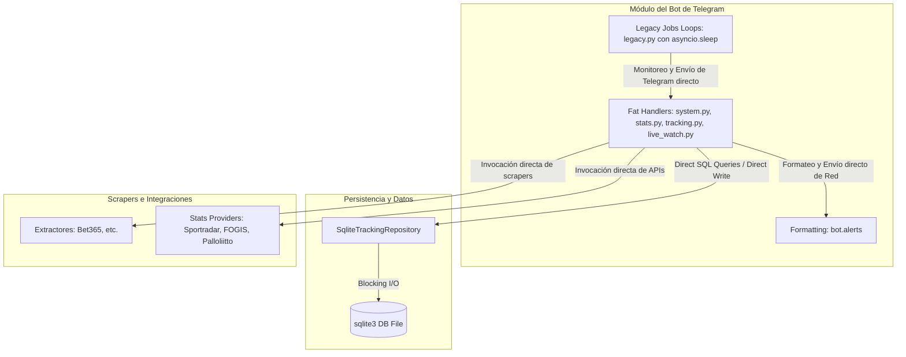

---

## 3. Diagrama de Arquitectura Propuesta (Hexagonal / Ports & Adapters)

El siguiente diagrama muestra el flujo de control y las capas desacopladas. Las interfaces de usuario (Telegram y CLI) llaman directamente a los servicios del Core mediante referencias inyectadas (DI), el runtime autónomo disparado por `runtime/scheduler.py` ejecuta las tareas periódicas de forma neutral, y los eventos asíncronos unidireccionales (alertas) se notifican mediante el `EventBus` hacia los Sinks escuchadores. Esto incluye tanto notificaciones a Telegram a través del `TelegramEventListener` como la opción de mostrar dichos mensajes en la consola en tiempo real a través del `CliEventListener` si el bot se ejecuta desde la consola de comandos.

```mermaid
graph TD
    %% Entrada (Transportes / Interfaces)
    subgraph Interfaces [interfaces/ (Transportes)]
        TelegramUI[Telegram Handlers]
        ConsoleCLI[Console CLI Tool]
    end

    %% Desencadenador Autónomo
    subgraph Runtime [runtime/ (Autónomo)]
        Scheduler[runtime/scheduler.py (asyncio loop)]
    end

    %% Capa de Casos de Uso (Servicios)
    subgraph Services [services/ (Casos de Uso)]
        TrackingService[TrackingService]
        LiveWatchService[LiveWatchService]
        StatsService[StatsService]
        PeakService[PeakService]
        SystemWatchService[SystemWatchService]
        MaintenanceService[MaintenanceService]
    end

    %% Capa de Dominio / Interfaces Abstractas
    subgraph Core [core/ (Dominio Puro)]
        Models[core/models/ (DTOs)]
        Ports[core/ports/ (Interfaces/ABC)]
        EventBus[core/event_bus.py]
    end

    %% Capa de Adaptadores (Implementación I/O)
    subgraph Adapters [adapters/ (Implementaciones)]
        Storage[adapters/storage/* (SQLite)]
        Extractors[adapters/extractors/* (Scrapers)]
        StatsProviders[adapters/stats_providers/* (APIs)]
        Browser[adapters/browser/* (Playwright)]
    end

    %% Capa de Salida (Sinks)
    subgraph TelegramSink [interfaces/telegram/sink.py]
        TGEventListener[TelegramEventListener]
    end
    subgraph ConsoleSink [interfaces/cli/sink.py]
        CliEventListener[CliEventListener]
    end

    %% Flujos de dependencias
    TelegramUI -->|Llama| Services
    ConsoleCLI -->|Llama| Services
    Scheduler -->|Dispara métodos| Services
    
    Services -->|Orquesta usando| Ports
    Services -->|Publica alertas| EventBus
    
    Storage -.->|Implementa| Ports
    Extractors -.->|Implementa| Ports
    StatsProviders -.->|Implementa| Ports
    Browser -.->|Implementa| Ports

    EventBus -->|Notifica| TGEventListener
    EventBus -->|Notifica| CliEventListener
    TGEventListener -->|Envía mensajes| TelegramUI
    CliEventListener -->|Imprime mensajes| ConsoleCLI
```

---

## 4. Estructura Objetivo y Modularización del Código

Esta sección detalla la estructura física del proyecto refactorizado, las responsabilidades de cada directorio, la división de archivos complejos y el listado de archivos obsoletos a eliminar para limpiar el repositorio.

### 4.1. Árbol de Carpetas Objetivo

```
betbot/
├── main.py                      # Composition Root: inicializa y ensambla el grafo de dependencias
├── config.py                    # Configuración global y parseo de variables de entorno (.env)
│
├── core/                        # DOMINIO PURO (Sin dependencias de Telegram, SQL o HTTPX)
│   ├── models/                  # Dataclasses sencillas, una por concepto de negocio
│   │   ├── odds.py, event.py, fixture.py, peak.py, league.py
│   ├── events.py                # Definición de eventos del bus (OddsChangedEvent, MatchLiveEvent...)
│   ├── event_bus.py             # EventBus en memoria para notificaciones unidireccionales
│   ├── league_naming.py         # Lógica pura de normalización de nombres de ligas
│   └── ports/                   # INTERFACES (Contratos abstractos de entrada/salida)
│       ├── repository.py        # RepositoryPort (contratos de persistencia)
│       ├── extractor.py         # ExtractorPort (contratos de scrapers)
│       ├── stats_provider.py    # StatsProviderPort (contratos de APIs de estadísticas)
│       ├── browser.py           # BrowserPort (contratos de control del navegador)
│       └── notifier.py          # EventListener (contratos para sinks/escuchadores)
│
├── services/                    # CASOS DE USO (Orquestadores de la lógica de negocio; sin Telegram)
│   ├── tracking.py              # Gestión y barrido periódico de cuotas
│   ├── live_watch.py            # Monitoreo y fuzzy matching de partidos en-play
│   ├── stats.py                 # Standings, fixtures, caching y prefetch de federaciones
│   ├── peak/                    # Lógica de predicción (model.py, scoring.py, digest.py)
│   ├── system_watch.py          # Monitoreo de memoria, CPU y Chromium graceful restart
│   ├── maintenance.py           # Pruning y VACUUM de SQLite
│   └── change_detection.py      # Algoritmos puros de análisis de fluctuaciones
│
├── adapters/                    # IMPLEMENTACIONES DE INFRAESTRUCTURA (Conexiones I/O reales)
│   ├── storage/                 # Persistencia SQLite (segmentada en archivos pequeños por agregado)
│   │   ├── connection.py        # Inicialización de la conexión
│   │   ├── schema.py            # Definición del esquema limpio de base de datos
│   │   ├── competitions.py      # Repositorio de ligas/competencias seguidas
│   │   ├── events.py            # Repositorio de eventos y cuotas
│   │   ├── subscriptions.py     # Repositorio de ajustes y suscripciones de chats
│   │   ├── baselines.py         # Repositorio de cuotas baseline históricas
│   │   ├── small_changes.py     # Repositorio de alertas/cambios menores en espera
│   │   ├── stats_links.py       # Repositorio de vinculación de ligas cuotas-stats
│   │   ├── live_watch.py        # Repositorio de vigilancia en vivo
│   │   └── mappers.py           # Mapeadores entre tuplas de SQLite y DTOs del Core
│   ├── extractors/              # Scrapers reales (Bet365, Betovo, etc.)
│   ├── stats_providers/         # Clientes HTTP de APIs de federaciones (Sportradar, Palloliitto, etc.)
│   └── browser/                 # Implementación de Playwright (BrowserHandler)
│
├── interfaces/                  # CAPA DE TRANSPORTE (Entradas/Salidas al usuario externo)
│   ├── telegram/                # Aislamiento de toda la interacción con Telegram
│   │   ├── handlers/            # Handlers finos (tracking.py, stats.py, live.py, system.py)
│   │   ├── renderers/           # Formateadores DTO -> HTML/Markdown (alerts.py, message_builders.py)
│   │   ├── sink.py              # TelegramEventListener (suscrito al bus de eventos)
│   │   └── app.py               # Configuración e inicio de la Application de PTB
│   └── cli/                     # CLI de administración por consola y sink de consola
│       ├── commands.py          # Definición de comandos CLI
│       └── sink.py              # CliEventListener
│
├── runtime/                     # PLANIFICADORES Y RUNTIMES
│   └── scheduler.py             # ~40 líneas de asyncio loop neutro (no acoplado a Telegram)
│
└── tests/                       # Suite de pruebas unitarias e integración
```

### 4.2. Roles y Reglas de Dependencias

| Directorio | Rol en la Arquitectura | Regla de Oro de Dependencias |
| :--- | :--- | :--- |
| `core/` | Modelos de dominio y contratos abstractos (puertos). | **Prohibido** importar de `adapters/`, `interfaces/` o librerías de infraestructura (`telegram`, `sqlite3`, `httpx`). |
| `services/` | Lógica de casos de uso (orquesta puertos y retorna DTOs). | Solo depende de `core/` y sus puertos abstractos. Retorna DTOs puros, nunca HTML preformateado. |
| `adapters/` | Implementación de bajo nivel de los puertos del dominio. | El único lugar del código donde se permite código SQL, Scraping (Playwright) o clientes HTTP externos. |
| `interfaces/` | Canales de comunicación con el exterior (Telegram, CLI). | Traduce inputs del usuario, llama a los servicios, renderiza DTOs con sus renderers y devuelve mensajes de red. |
| `runtime/` | Temporizadores de background independientes. | Ejecuta un loop asíncrono puro de python llamando a los servicios del Core. Totalmente desacoplado de Telegram. |
| `main.py` | Composición y ensamblado. | El único archivo que conoce a todos los módulos para instanciar e inyectar las dependencias en el arranque. |

### 4.3. Fragmentación de Archivos "Monstruo" (Split de Archivos Grandes)

Para garantizar un código limpio, legible y con responsabilidades acotadas, realizaremos la siguiente segmentación:

| Archivo Original | Líneas Actuales | Destino Hexagonal | Método de División |
| :--- | :--- | :--- | :--- |
| **`storage/tracking_repository.py`** | ~6063 | `adapters/storage/*.py` | Se divide por agregado en archivos dedicados: `competitions.py`, `events.py`, `subscriptions.py`, `baselines.py`, `stats_links.py`, `live_watch.py` y `maintenance.py`. Se unifica la lógica en `connection.py`. |
| **`services/tracking.py`** | ~2244 | `services/tracking.py` | Se extrae la persistencia a los puertos de base de datos, el renderizado de texto a `interfaces/telegram/renderers/` y la publicación de alertas al `EventBus`. El servicio se reduce a ~300 líneas de orquestación pura. |
| **`bot/special_leagues.py`** | ~3144 | `services/peak/*` y `interfaces/telegram/renderers/` | Se extrae la lógica matemática de scoring y procesamiento de picos al Core (`services/peak/`), y el formateo HTML de reportes a renderers de Telegram. |
| **`bot/alerts.py`** y `build_*` | ~1105 | `interfaces/telegram/renderers/` | Funciones puras que reciben DTOs del Core y los transforman a HTML o Markdown para su envío a Telegram. |
| **`bot/handlers/*.py`** | Varios | `interfaces/telegram/handlers/*.py` | Manejadores del bot finos y de baja complejidad que solo parsean inputs, invocan al servicio del Core, pasan el resultado al renderer y envían. |

### 4.4. Catálogo de Archivos a Eliminar (Borrado Seguro)

Para limpiar el worktree de archivos obsoletos y redundancias en esta reescritura, se procederá al borrado físico de los siguientes archivos:
*   `core/flags.py` (Mapeo de bitmask descartado).
*   `bot/jobs/legacy.py` (Lógica vieja de loops repetidos).
*   `bot/jobs/base.py` y `bot/jobs/tasks.py` (Reemplazados por el scheduler asíncrono neutro).
*   `monitoring.py` (Migrado a `services/system_watch.py`).
*   Directorio `sandbox/` y `temp/` (Limpieza de archivos temporales de investigación).
*   Esquema y queries redundantes de la tabla `active_events` (Se unifica todo en la tabla limpia `events` en el nuevo esquema).

---

## 5. Tabla de Servicios Finales del Core

| Servicio | Responsabilidad Primaria | Dependencias Inyectadas | Métodos Principales |
| :--- | :--- | :--- | :--- |
| **`TrackingService`** | Ciclo de actualización de cuotas, baselines y detección de fluctuaciones significativas. | `Repository`, `Searcher`, `EventBus` | `request_track()`, `confirm_pending_track()`, `toggle_odds_alerts()`, `refresh_due_leagues()` |
| **`LiveWatchService`** | Monitoreo en vivo de partidos vigilados (apuestas o directo de estadísticas) y alertas de kickoff. | `Repository`, `Searcher`, `EventBus` | `subscribe_live()`, `unsubscribe_live()`, `poll_once()`, `import_google_sheet()` |
| **`StatsService`** | Integración con Sportradar/FOGIS/Palloliitto, standings, fixtures, vinculación de ligas y precalentamiento de caché/sesiones. | `Repository`, `StatsProviders` | `get_match_stats_report()`, `search_leagues()`, `link_leagues()`, `list_linked_leagues()`, `ensure_provider_sessions_fresh()`, `warm_tracked_leagues_cache()` |
| **`PeakService`** | Scoring 1-10 de rotaciones diarias y compilación del digest matutino de picos. | `Repository`, `StatsProviders`, `EventBus` | `list_active_peaks()`, `compile_and_send_digest()`, `trigger_digest_generation_now()` |
| **`SystemWatchService`**| Monitoreo de hardware (RAM, CPU, Chromium child processes) usando `psutil` y query de DB. | `Repository` | `get_system_status()`, `get_resource_metrics()`, `log_and_check_limits()` |
| **`MaintenanceService`**| Pruning de SQLite y compactación del tamaño físico del archivo de base de datos. | `Repository` | `run_db_pruning()`, `run_db_vacuum()` |

> [!NOTE]
> **Integración entre LiveWatch, Tracking y Aprendizaje de Ligas:**
> *   **Monitoreo en Vivo sin dependencias de Prematch/Cuotas:** El sistema sabe si un partido debe alertarse en vivo mediante la lista de vigilancia (*LiveWatch subscriptions*) activa para el chat, la cual no requiere que el partido haya estado en prematch ni que posea cuotas registradas. `LiveWatchService` monitorea esta lista y realiza una búsqueda de similitud de nombres (*fuzzy matching*) sobre los feeds en vivo expuestos por los extractores.
> *   **Servicio de Aprendizaje y Vinculación Automática:** Si la liga del partido en vivo o importada no es conocida aún por el bot, entra en juego el servicio de aprendizaje (`learn_and_notify_league_merges` en `TrackingService`). Este servicio vincula dinámicamente tanto las ligas como sus respectivos extractores entre sí, registrándola como una liga conocida del bot. Una vez registrada, esta liga se lista en el baseline del chat del usuario que realizó la carga.
> *   **Persistencia Compartida:** Ambos servicios se integran a nivel de base de datos compartida en SQLite, evitando acoplamientos rígidos en tiempo de ejecución.


---

## 6. Tabla de Comandos Actuales por Bucket

Mapeo de los 95 comandos reales agrupados por funcionalidad:

### Bucket 1: General / Otros
*   `/start` ➔ Inicializa ajustes del chat. (UI-only)
*   `/help` / `/guide` ➔ Muestra la guía rápida de uso. (UI-only)
*   `/cancel` ➔ Cancela una conversación interactiva en curso. (UI-only)
*   `/ping` ➔ `system_watch_service.get_system_status()` (Retorna latencia/ping)
*   `/status` ➔ `system_watch_service.get_system_status()` (Uptime, DB rows, ping)
*   `/resources` ➔ `system_watch_service.get_resource_metrics()` (RAM/CPU/Chromium)
*   `/echo <text>` ➔ Devuelve el texto ingresado. (UI-only para diagnóstico)

### Bucket 2: Ligas de Apuestas & URLs (Tracking)
*   `/track_url <url>` ➔ `tracking_service.request_track(url, chat_id)` (Retorna: `PendingTrackRequest`)
*   `/track_league` ➔ `tracking_service.discover_leagues(...)` (Inicia búsqueda interactiva por país)
*   `/confirm_track` ➔ `tracking_service.confirm_pending_track(chat_id)`
*   `/confirm_empty_track` ➔ `tracking_service.confirm_empty_pending_track(chat_id)`
*   `/untrack` ➔ `tracking_service.remove_subscription(chat_id, idx)`
*   `/list_tracks` / `/leagues` / `/league` ➔ `tracking_service.list_subscriptions(chat_id)`
*   `/refresh_tracks` ➔ `tracking_service.refresh_for_chat(chat_id)` (Monitoreo manual forzado)
*   `/update_track_url <id> <url>` ➔ `tracking_service.update_subscription_url(id, url)`
*   `/platforms` ➔ `extractor_registry.list_platforms()`
*   `/competition_url <id>` ➔ `tracking_service.get_competition_url(id)`
*   `/help_matches` / `/help_leagues` ➔ Guía de comandos de seguimiento. (UI-only)

### Bucket 3: Ligas Unificadas (Mapeos)
*   `/link_league <odds_id> <stats_id>` ➔ `stats_service.link_leagues(odds_id, stats_id)`
*   `/unlink_league <odds_id>` ➔ `stats_service.unlink_leagues(odds_id)`
*   `/relink_leagues` ➔ `stats_service.auto_relink_all_leagues()`

### Bucket 4: Notificaciones & Fluctuaciones (Reminders & Odds Changes)
*   `/odds_on` / `/odds_off` ➔ `tracking_service.toggle_odds_alerts(chat_id, idx, enabled)`
*   `/set_change_percent <n>` ➔ `tracking_service.update_change_threshold(chat_id, percent)`
*   `/check_little_changes` ➔ `tracking_service.list_pending_small_changes(chat_id)`
*   `/confirm_change <id>` ➔ `tracking_service.confirm_small_change(chat_id, id)`
*   `/confirm_all_little_changes` ➔ `tracking_service.confirm_all_small_changes(chat_id)`
*   `/reminders_league` ➔ `tracking_service.toggle_league_reminders(chat_id, idx)`
*   `/reminders_match` ➔ `tracking_service.toggle_match_reminder(chat_id, match_id)`

### Bucket 5: Live Watch (Monitoreo en Vivo)
*   `/watch_live` ➔ `live_watch_service.subscribe_live(match_id, chat_id)`
*   `/unwatch` ➔ `live_watch_service.unsubscribe_live(match_id, chat_id)`
*   `/watching` ➔ `live_watch_service.list_watched_matches(chat_id)`
*   `/live_status` ➔ `live_watch_service.get_poller_status()`
*   `/live_match <id>` / `/view_live_match` ➔ `live_watch_service.get_live_details(id)` (Muestra detalles del partido en vivo en-play)
*   `/matches` ➔ `tracking_service.list_stored_active_matches(chat_id)` (Partidos del día seguidos, prematch/live)
*   `/event_url <id>` ➔ `live_watch_service.get_event_url(id)`
*   `/live_settings` ➔ `live_watch_service.update_settings(chat_id, similarity, interval)`
*   `/help_live` ➔ Guía de monitoreo en vivo. (UI-only)
*   `/import_sheet` ➔ `live_watch_service.trigger_sheet_import(chat_id)`

### Bucket 6: Estadísticas Genéricas & Federaciones
*   `/standings [pais/id]` ➔ `stats_service.get_standings(query)`
*   `/fixtures [pais/id]` ➔ `stats_service.get_fixtures(query)`
*   `/results [pais/id]` ➔ `stats_service.get_recent_results(query)`
*   `/today [pais]` ➔ `stats_service.get_today_matches(query)`
*   `/match [pais] <match_id>` ➔ `stats_service.get_provider_match_details(pais, match_id)` (Detalles del partido del stats provider)
*   `/stats <match_id>` ➔ `stats_service.get_match_stats_report(match_id)`
*   `/explore_stats` ➔ `stats_service.explore_league_stats(query)`
*   `/stats_links` ➔ `stats_service.list_linked_leagues(chat_id)`
*   `/track_stats` ➔ `stats_service.subscribe_stats_league(chat_id, league_id)`
*   `/stats_tracks` / `/stats_leagues` ➔ `stats_service.list_stats_subscriptions(chat_id)`
*   `{fin,swe,no,ro,sk,al}_help` ➔ Mensajes de ayuda por federación. (UI-only)
*   `{fin,swe,no,ro,sk,al}_leagues` ➔ `stats_service.get_special_leagues(country)`
*   `{fin,swe,no,ro,sk,al}_standings <lc>` ➔ `stats_service.get_special_standings(country, lc)`
*   `{fin,swe,no,ro,sk,al}_fixtures` ➔ `stats_service.get_special_fixtures(country)`
*   `{fin,swe,no,ro,sk,al}_today` ➔ `stats_service.get_special_today(country)`
*   `{fin,swe,no,ro,sk,al}_match <id>` ➔ `stats_service.get_special_match(country, id)`
*   `/swe_results` ➔ `stats_service.get_special_results("sweden")`

### Bucket 7: Peak (Rotaciones)
*   `/peaks` ➔ `peak_service.list_active_peaks()`
*   `/peak_today` ➔ `peak_service.trigger_digest_generation_now(chat_id)`
*   `/peak_on` / `/peak_off` ➔ `peak_service.toggle_digest_subscription(chat_id, enabled)`

### Bucket 8: Sportradar
*   `/sportradar_token` ➔ `stats_service.update_sportradar_token(token)`

---

### 6.1. Propuesta de Comandos Simplificados (UX Futura)

Para reducir la complejidad cognitiva del usuario, se propone consolidar los 95 comandos en **10 comandos interactivos** utilizando botones inline (*Callback Queries*) para las confirmaciones de flujos de conversación:

1.  **`/track [url/pais]`**: Maneja tanto URLs directas como búsquedas interactivas por país para suscribirse a ligas.
2.  **`/untrack`**: Muestra la lista de suscripciones con un botón inline `[❌ Eliminar]` al lado de cada una.
3.  **`/list`**: Muestra una lista unificada de todas las ligas seguidas (cuotas y estadísticas standalone).
4.  **`/matches`**: Lista partidos activos del día, ofreciendo botones inline `[📊 Ver Stats]` y `[🔗 Ver Apuesta]`.
5.  **`/stats <match_id>`**: Genera estadísticas consolidadas en vivo (funciona para ligas de apuestas y directas).
6.  **`/changes`**: Muestra fluctuaciones menores con botones inline: `[Confirmar]` y `[Confirmar Todos]`.
7.  **`/settings`**: Panel central interactivo para activar/desactivar alertas y ajustar la sensibilidad (%) con sliders inline.
8.  **`/links`**: Muestra y gestiona los vínculos cuotas-estadísticas con botón `[Vincular Nueva]` y `[❌ Desvincular]`.
9.  **`/status`**: Diagnóstico unificado del bot (uptime, tamaño de DB, ping y consumo de RAM/CPU de Chromium).
10. **`/help`**: Guía rápida de uso y comandos simplificados.

---

## 7. Diseños y Contratos de Datos (Data Classes)

Esquemas de datos reales definidos en `core/models.py`:

```python
from dataclasses import dataclass, field
from datetime import datetime, timezone
from typing import Any, Optional, Sequence

@dataclass(frozen=True)
class Odds1X2:
    home: Optional[float]
    draw: Optional[float]
    away: Optional[float]

@dataclass(frozen=True)
class EventKey:
    platform: str
    competition_external_id: str
    external_event_id: str

@dataclass(frozen=True)
class EventSnapshot:
    key: EventKey
    competition_name: str
    home: str
    away: str
    scheduled_label_date: Optional[str]
    scheduled_label_time: Optional[str]
    scheduled_at: Optional[str]
    source_url: Optional[str]
    odds_1x2: Odds1X2
    extracted_at: str
    stats_url: Optional[str] = None
    markets_payload: Optional[dict[str, Any]] = None
    metadata: dict[str, Any] = field(default_factory=dict)
    raw_payload: dict[str, Any] = field(default_factory=dict)
```

---

## 8. Tabla de Eventos del EventBus (One-Way)

| Evento | Publicado Por | Suscrito Por (Sink) | Propósito / Acción del Receptor |
| :--- | :--- | :--- | :--- |
| **`OddsChangedEvent`** | `TrackingService` | `TelegramEventListener`<br>`CliEventListener` | Genera y envía mensaje HTML a chats (o imprime en consola stdout). |
| **`MatchLiveEvent`** | `LiveWatchService` | `TelegramEventListener`<br>`CliEventListener` | Alerta del inicio del partido en vivo o eventos clave (goles, tarjetas). |
| **`RotationAlertEvent`**| `PeakService` | `TelegramEventListener`<br>`CliEventListener` | Envía digest consolidado matutino de picos de rotación. |
| **`SystemWarningEvent`**| `SystemWatchService`| `TelegramEventListener` (Admin)<br>`CliEventListener`| Alerta del sistema si Chromium satura RAM. |

> [!NOTE]
> **Consola CLI como canal de salida alternativo:**
> Si el sistema o el bot se ejecuta desde la terminal o consola CLI de administración, el `CliEventListener` se suscribe a los eventos del `EventBus` y muestra los mensajes y alertas directamente en la salida estándar (stdout) en tiempo real, permitiendo la monitorización sin necesidad de depender de los chats de Telegram.

---

## 9. Persistencia SQLite Delgada y Mantenimiento

Para evitar el crecimiento indefinido de la base de datos y eliminar riesgos de migración innecesarios, se redefine la persistencia bajo un enfoque de **Esquema de Estado Actual Limpio (Greenfield DB)**:

### A. Estructura y Limpieza de Payloads (Esquema Current-State Limpio)
*   **Inicialización Limpia:** Se elimina la base de datos legacy acoplada y se escribe un generador de esquema limpio en `adapters/storage/schema.py`. El bot inicia con una base de datos vacía y nueva, descartando scripts de migración complejos.
*   **Definición de Tablas del Esquema Limpio (Current-State):**
    *   `events`: Almacena el estado actual y cuotas de partidos seguidos (prematch o en vivo). Columnas: `platform`, `competition_id`, `external_event_id`, `home`, `away`, `scheduled_at`, `status` (texto: PREMATCH, LIVE, FINISHED), `home_odds`, `draw_odds`, `away_odds`, `extracted_at`, `stats_url`. Se descartan los historiales en `event_odds_snapshots`.
    *   `competitions`: Ligas seguidas por el bot. Columnas: `id`, `platform`, `name`, `url`, `country`, `active`.
    *   `chat_subscriptions`: Asociación de chats con ligas y banderas booleanas de notificación independientes (`notify_new_matches` e `notify_odds_changes` como columnas de enteros indexables), evitando payloads JSON acoplados.
    *   `baselines`: Cuotas de referencia guardadas para calcular fluctuaciones. Columnas: `platform`, `external_event_id`, `home_odds`, `draw_odds`, `away_odds`, `recorded_at`.
    *   `small_changes`: Cambios menores de cuota pendientes de confirmación. Columnas: `id`, `chat_id`, `external_event_id`, `old_odds`, `new_odds`, `detected_at`.
    *   `stats_links`: Mapeo entre identificadores de ligas de apuestas y APIs federativas. Columnas: `odds_competition_id`, `provider`, `stats_competition_id`.
    *   `live_watch`: Suscripciones activas para el monitoreo en vivo. Columnas: `external_event_id`, `chat_id`, `status`, `last_alert_at`.
    *   `chat_settings`: Ajustes generales del chat (por ejemplo, el porcentaje de fluctuación mínimo configurable). Columnas: `chat_id`, `change_threshold_percent`, `language`.
*   **Eliminación de Payloads JSON:** El campo `raw_payload` no se guarda en base de datos de manera física (salvo si se define `DEBUG_PAYLOADS=1`), reduciendo el tamaño promedio de fila a menos de 1 KB.

### B. Pruning y Mantenimiento (VACUUM & Cache Cap)
*   **VACUUM Semanal:** El archivo real de la base de datos se reconstruirá físicamente los domingos corriendo `VACUUM;` desde `MaintenanceService` para recuperar el almacenamiento real liberado al sistema operativo del VPS.
*   **Tope en stats_payload_cache:** Se impone un tope máximo en cola FIFO de 200 filas para prevenir su crecimiento desmedido.
*   **Pruning de sent_alerts y small_changes:** Se purgan automáticamente registros viejos de alertas enviadas (antigüedad > 30 días) y cambios menores no confirmados (antigüedad > 7 días). Al no existir la tabla `event_odds_snapshots`, se elimina por completo la necesidad de purgar snapshots de cuotas.

---

## 10. Mapeo de Background Jobs (Los 8 Loops de Fondo)

| Loop Job | Intervalo | Servicio Responsable | Lock Involucrado | Evento Lanzado |
| :--- | :--- | :--- | :--- | :--- |
| **Tracking Monitor** | Cada 120s | `TrackingService` | `_refresh_lock` (serializa sweeps) | `OddsChangedEvent` |
| **Live Watch** | Dinámico (10s-60s) | `LiveWatchService` | Ninguno | `MatchLiveEvent` |
| **Resource Monitor** | Cada 60s | `SystemWatchService` | Ninguno (reinicia graceful Chromium) | `SystemWarningEvent` |
| **DB Pruning & VACUUM**| Cada 24h (domingo VACUUM) | `MaintenanceService` | DB Write Lock (implícito SQLite) | Ninguno |
| **Stats Session Refresh**| Cada 30m | `StatsService` | Token Lock | Ninguno |
| **Stats Cache Prefetch**| Cada 24h (diario) | `StatsService` | Cache Lock | Ninguno |
| **Sheet Import** | Cada 15m | `LiveWatchService` | File Read Lock | `MatchLiveEvent` |
| **Peak Digest** | Diario (08:00 ARG)| `PeakService` | None | `RotationAlertEvent` |

*   **Nota de Bloqueos:** El lock de hardware `BrowserPool` vive en `core/browser_handler.py` limitando los extractores mediante `asyncio.Semaphore(3)`.
*   **Llamadas a Servicios desde Jobs:** Sí, todos los background jobs utilizan e invocan directamente a los servicios del Core correspondientes (inyectados). Los jobs actúan meramente como disparadores (*triggers*) de tiempo del planificador neutro (`runtime/scheduler.py` en asyncio, descartando depender de la JobQueue de Telegram para la lógica de fondo) y no contienen lógica de negocio.

---

## 11. Plan de Migración Incremental por Fases

### Fase 0: Snapshot, Cobertura de Tests y Preparación
*   **Objetivo:** Asegurar la red de seguridad.
*   **Acciones:** Ejecutar la suite de pruebas completa en `tests/`. Crear snapshots de los retornos JSON de los extractores.
*   **Riesgo:** Nulo.
*   **Rollback:** No aplica.

### Fase 1: Creación de DTOs e Interfaces de Puertos
*   **Objetivo:** Declarar las dataclasses y los tipos de eventos sin cambiar código funcional.
*   **Acciones:** Escribir `core/listener.py` con `EventListener`. Normalizar `Odds1X2` y `EventSnapshot` en `core/models.py`.
*   **Riesgo:** Bajo.
*   **Validación:** Ejecutar `pytest tests/core/`.

### Fase 2: Extracción de Servicios e Inyección de Dependencias
*   **Objetivo:** Mover la lógica pesada de `bot/handlers/*.py` y `bot/jobs/tasks.py` hacia los servicios del Core.
*   **Acciones:** Modularizar `TrackingService` y `StatsService`. Inyectar dependencias mediante el *Composition Root* en `bot/application.py`.
*   **Riesgo:** Alto (pérdida de variables de estado o inicializaciones).
*   **Validación:** Probar comandos `/track` y `/stats` en entorno local.

### Fase 2.5: Desacople y Extracción de Renderers
*   **Objetivo:** Desacoplar por completo el formateo de salida HTML/Markdown de la lógica interna de los servicios.
*   **Acciones:** Crear el paquete `bot/renderers/`. Mapear las funciones de renderizado y formateo (`build_*_message()`, `render_*()`) a clases del bot (ej: `TelegramMessageRenderer`). Los servicios del Core retornarán únicamente DTOs limpios y la UI invocará al renderer correspondiente.
*   **Riesgo:** Bajo-Medio.
*   **Validación:** Tests unitarios de los renders y verificación en paralelo.

### Fase 3: Integración del EventBus (One-Way)
*   **Objetivo:** Retirar llamadas directas de envío de Telegram de los servicios del Core.
*   **Acciones:** Modificar `TrackingService` y `LiveWatchService` para publicar eventos. Implementar `TelegramEventListener` y registrarlo al bus en el arranque de la app.
*   **Riesgo:** Medio.
*   **Validación:** Verificar la suite completa `tests/bot/test_tracking_refresh_notifications.py`.

### Fase 4: Reorganización de Background Jobs y Scheduler Neutro
*   **Objetivo:** Integrar los 8 jobs de fondo en un scheduler neutro asíncrono (`runtime/scheduler.py`), totalmente desacoplado de la API de Telegram.
*   **Acciones:** Eliminar `bot/jobs/legacy.py` y descartar clases de scheduler personalizadas. Escribir un loop asíncrono simple en `runtime/scheduler.py` que invoque directamente a los servicios core correspondientes.
*   **Riesgo:** Bajo.
*   **Validación:** `tests/bot/test_bot_jobs.py`.

### Fase 5: Inicialización de Base de Datos Limpia (DB Greenfield)
*   **Objetivo:** Crear el nuevo esquema simplificado actual-state de base de datos desde cero, omitiendo históricos redundantes y eliminando por completo riesgos de cutover y backfills relacionales heredados.
*   **Acciones:** Escribir `adapters/storage/schema.py` para crear el nuevo esquema SQLite de cero. El bot inicia con una base de datos vacía y limpia. Mapear repositorios para interactuar directamente con el nuevo esquema limpio (`events`, `competitions`, etc.).
*   **Riesgo:** Bajo.
*   **Validación:** Asegurar la correcta creación de la base de datos al inicio de la aplicación y verificar queries en base de datos vacía.

### Fase 6: Preservación de Comandos y Despliegue
*   **Objetivo:** Mantener el comportamiento, formato y nombres de los comandos antiguos en su totalidad para descartar regresiones en la interfaz de Telegram.
*   **Acciones:** Registrar los handlers de Telegram en `interfaces/telegram/handlers/` mapeando los nombres de comandos actuales. Cada handler delega la lógica de negocio al servicio Core, pasa el DTO resultante al renderer y envía el mensaje de respuesta.
*   **Riesgo:** Bajo.
*   **Validación:** Verificación manual de los comandos en el bot de Telegram de desarrollo.

---

## 12. Diagramas de Secuencia Críticos (Ejecución de todos los Comandos Simplificados)

### Flujo A: Detección y Confirmación de Cambios Menores (`/changes`)
Este diagrama ilustra cómo el actualizador periódico detecta fluctuaciones menores y las almacena en SQLite para su posterior confirmación manual interactiva por parte del usuario, actualizando el baseline de cuotas en memoria.

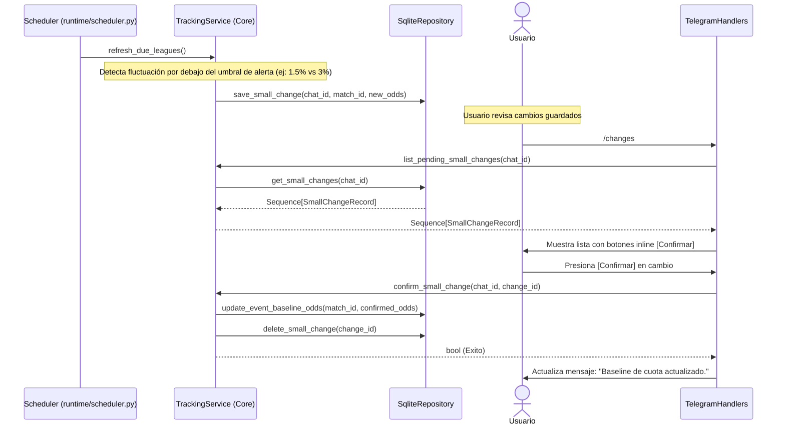

---

### Flujo B: Búsqueda y Registro por País (`/track`)

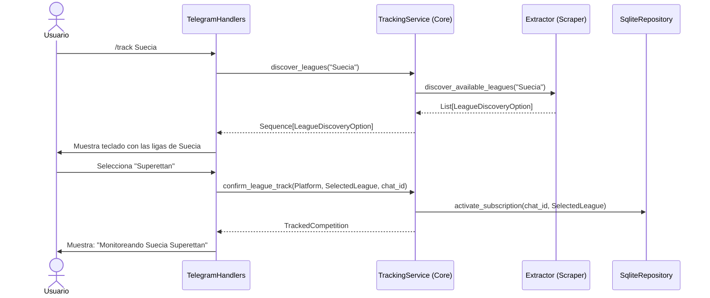

---

### Flujo C: Monitoreo Prematch de Partidos Vigilados
El actualizador corre periódicamente disparado por el scheduler para verificar ligas que aún no han comenzado y establecer las cuotas baseline iniciales silenciosas.

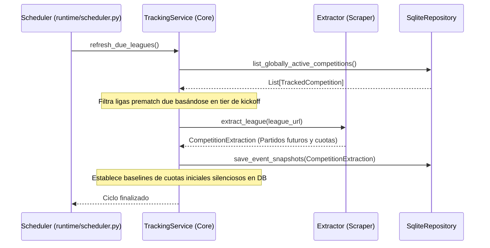

---

### Flujo D: Monitoreo en Vivo de Estadísticas (Stats-Only Live Watch)
El bot monitorea ligas de federaciones registradas en vivo (FOGIS, Palloliitto, etc.) que no requieren cuotas de apuestas, informando al usuario en vivo a través del `EventBus`.

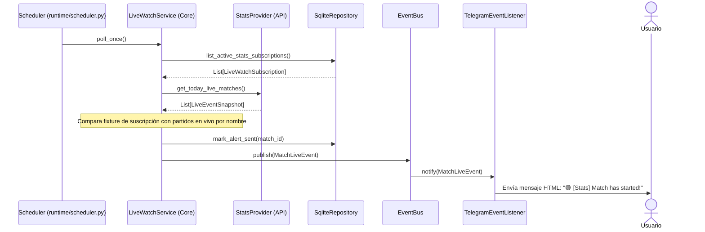

---

### Flujo E: Consulta de Estadísticas (`/stats <match_id>`)

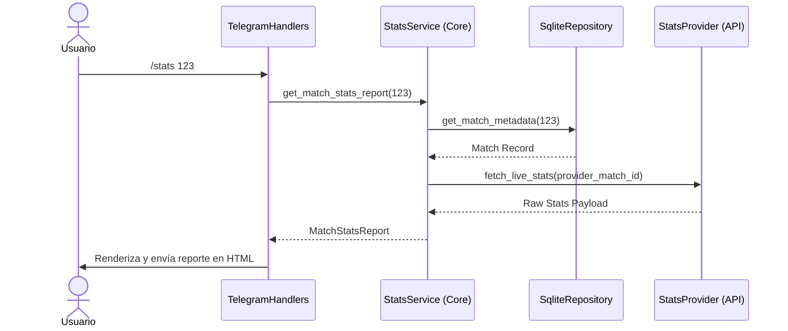

---

### Flujo F: Listar Suscripciones Activas (`/list`)

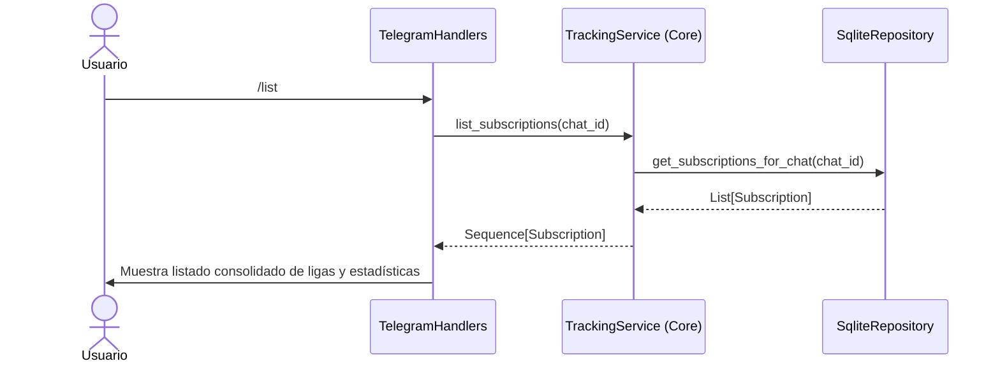

---

### Flujo G: Remover Suscripción (`/untrack`)

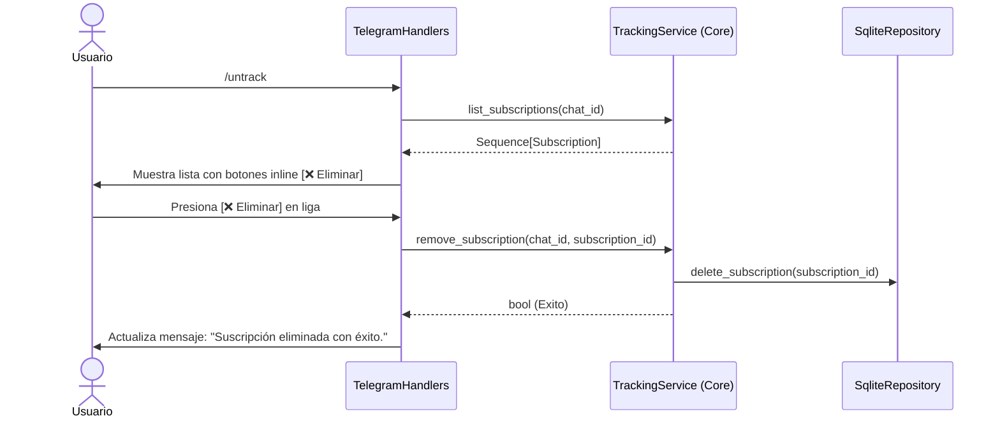

---

### Flujo H: Ver Partidos del Día (`/matches`)

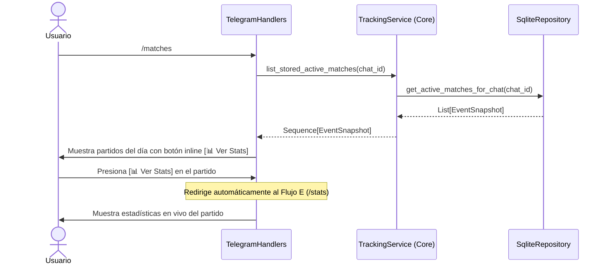

---

### Flujo I: Configuración Central de Notificaciones (`/settings`)

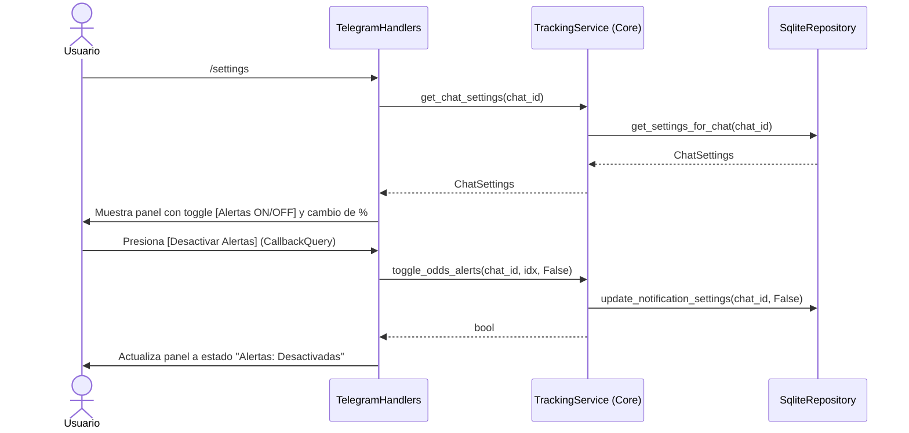

---

### Flujo J: Vincular Ligas de Cuotas con Estadísticas (`/links`)

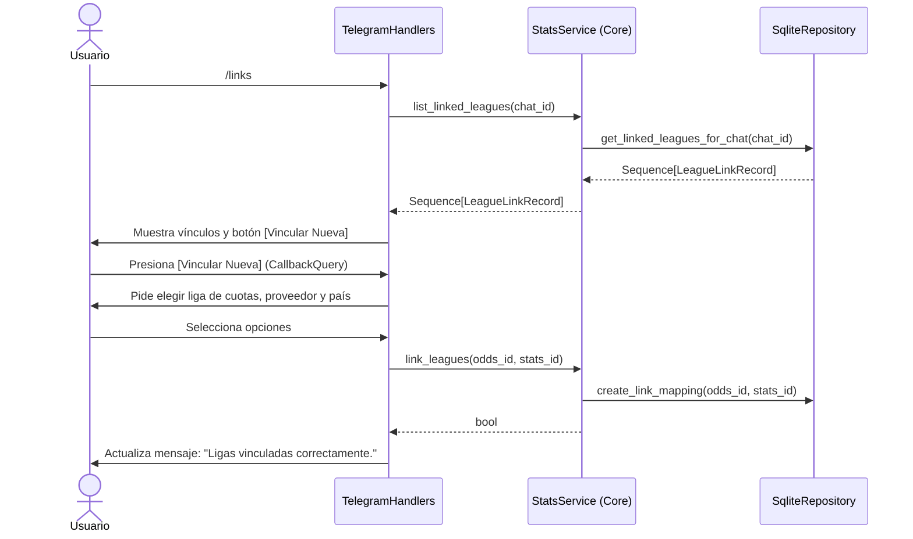

---

### Flujo K: Consulta de Diagnóstico del Sistema (`/status`)

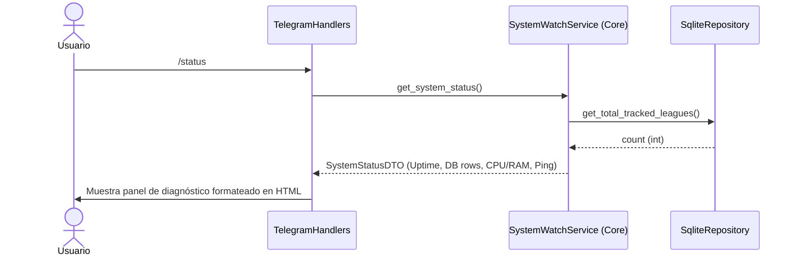

---

### Flujo L: Guía de Ayuda Interactiva (`/help`)

El comando de ayuda no es puramente estático en el handler de la UI; consulta dinámicamente al Core las plataformas activas y países especiales soportados para armar la guía interactiva.

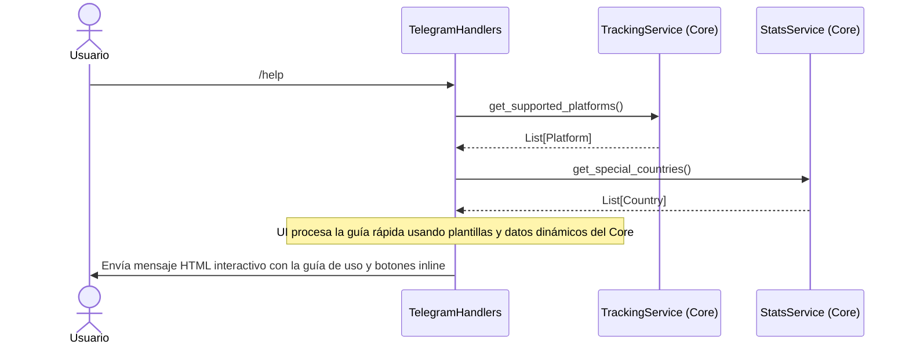

---

### Flujo M: Consulta de Ligas Especiales / Federaciones (`/standings [pais]`, `/today [pais]`, etc.)

Este flujo muestra cómo las ligas especiales de federaciones se unifican e integran dinámicamente dentro de las consultas del Core, resolviendo su respectivo adapter a través del registro de proveedores.

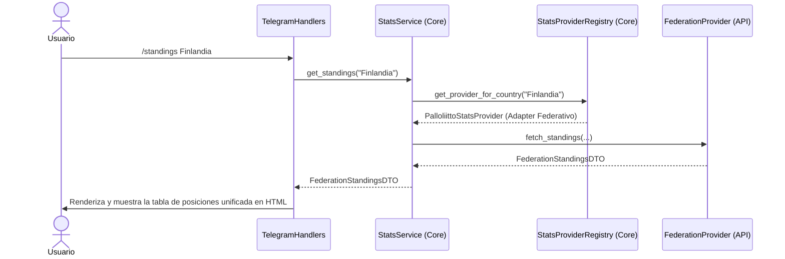

---

## 13. Diagramas de Secuencia de los Background Jobs

A continuación se detallan los diagramas de secuencia para los jobs de fondo que se ejecutan de manera autónoma, mostrando su interacción directa con los servicios del Core a través del planificador neutro.

### Job 1 & 2: Tracking Monitor & Live Watch
*(Ver Flujo C y Flujo D en la Sección 11).*

### Job 3: Resource Monitor (Métrica de Recursos de Hardware con Reinicio Graceful)

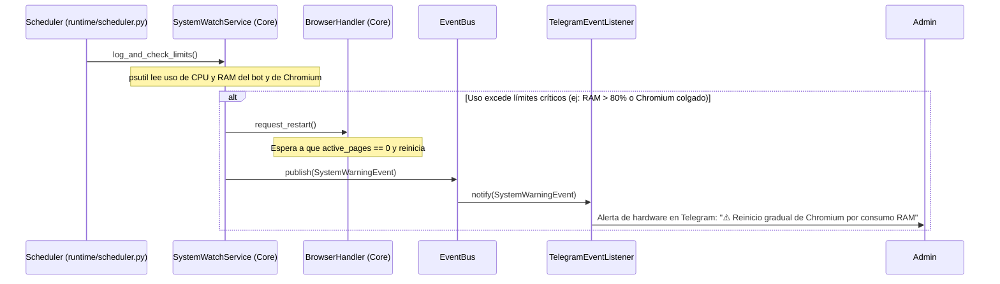

---

### Job 4: DB Pruning & VACUUM (Mantenimiento de Persistencia)

```mermaid
sequenceDiagram
    participant Sched as Scheduler (runtime/scheduler.py)
    participant Maint as MaintenanceService (Core)
    participant Repo as SqliteRepository
    
    Sched ->> Maint: run_db_pruning()
    Maint ->> Repo: prune_old_alerts(days=30)
    Repo -->> Maint: count_deleted_alerts
    alt Es Domingo (Mantenimiento Semanal)
        Maint ->> Repo: execute_vacuum()
        note over Repo: Ejecuta: VACUUM; (Reconstruye y libera disco real)
    end
```

---

### Job 5: Stats Session Refresh (Renovación de Sesiones API bajo StatsService)

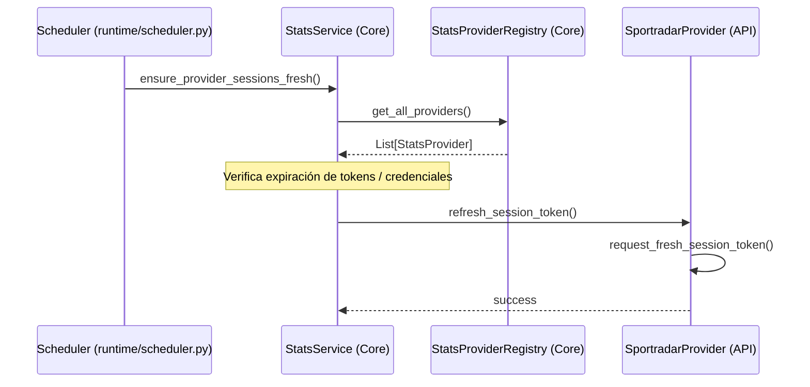

---

### Job 6: Stats Cache Prefetch (Precalentamiento Diario de Caché bajo StatsService)

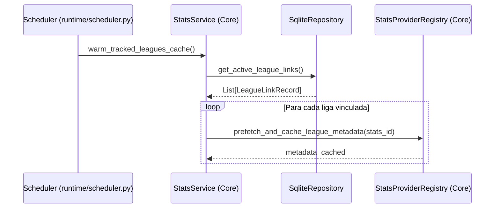

---

### Job 7: Sheet Import (Importación de Planilla de Vigilancia en Vivo)

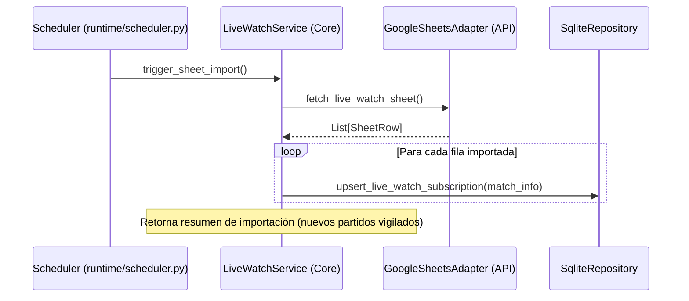

---

### Job 8: Peak Digest (Generación y Envío del Reporte Diario de Picos)

```mermaid
sequenceDiagram
    participant Sched as Scheduler (runtime/scheduler.py)
    participant Peak as PeakService (Core)
    participant Repo as SqliteRepository
    participant Bus as EventBus
    participant Listener as TelegramEventListener
    
    Sched ->> Peak: compile_and_send_digest()
    Peak ->> Repo: get_active_peaks_scoring()
    Repo -->> Peak: List[PeakRecord]
    note over Peak: Filtra y ordena picos (Scoring >= 7)
    Peak ->> Bus: publish(RotationAlertEvent)
    Bus ->> Listener: notify(RotationAlertEvent)
    Listener ->> Chat: Envía digest consolidado matutino en HTML
```

---

## 14. Estrategia de Cutover y Migración de Datos (DB Greenfield)

Dado que se ha decidido **prescindir de históricos de cuotas redundantes** y arrancar el bot con una base de datos SQLite limpia desde cero, la estrategia de cutover se simplifica a un **despliegue de limpieza en frío (Greenfield Deployment)** sin riesgos relacionales:

### Paso 1: Ventana de Downtime (5 minutos)
*   **Acción:** Se detiene el bot de Telegram legacy en el VPS.
*   **Rollback:** Se resguarda la base de datos antigua completa (`betbot_legacy.db`) como respaldo.

### Paso 2: Creación del Esquema Limpio
*   **Acción:** Al arrancar el nuevo runtime, el módulo `adapters/storage/schema.py` crea las tablas básicas del nuevo esquema.
*   **Propósito:** Contar con una base de datos libre de tablas huérfanas, índices redundantes o payloads gigantescos.

### Paso 3: Inicialización en Limpio
*   **Acción:** Los chats/usuarios vuelven a suscribirse o se realiza una carga rápida inicial de planillas Google Sheets mediante el comando `/import_sheet`.

---

## 15. Tabla de Riesgos y Mitigaciones

| Riesgo Identificado | Impacto | Nivel de Riesgo | Estrategia de Mitigación |
| :--- | :--- | :--- | :--- |
| **Crecimiento Exponencial de la DB** | Llenado del disco del VPS por acumulación de datos históricos. | **Bajo** | Se descartan por completo los snapshots históricos y la tabla `event_odds_snapshots`. Se persiste únicamente el estado actual en la tabla `events` sin guardar `raw_payload`. Se limita la caché a un tope de 200 filas y se compacta semanalmente con `VACUUM`. |
| **Pérdida de Suscripciones en el Arranque** | Los usuarios dejan de recibir alertas temporalmente al arrancar con una base de datos nueva y vacía. | **Bajo-Medio** | Los chats/usuarios vuelven a suscribirse o se realiza una carga rápida inicial de planillas Google Sheets mediante el comando `/import_sheet`. Se mantiene un backup de la DB anterior para consulta manual si es necesario. |
| **Bloqueos de SQLite por Escrituras Concurrentes** | Caídas del bot debido a accesos simultáneos desde múltiples loops de fondo y handlers de Telegram. | **Alto** | Centralizar operaciones de escritura/lectura en la capa de persistencia usando `asyncio.to_thread` para delegar el bloqueo E/S fuera del event loop. Implementar reintentos nativos ante errores `SQLITE_BUSY`. |
| **Saturación y Cuelgue de Chromium** | Pérdida de extracciones activas y fugas de memoria RAM en el VPS. | **Medio** | Restricción estricta de concurrencia mediante `BrowserPool` (Semaphore=3). Monitoreo de memoria por `SystemWatchService` con reinicio *graceful* mediante `request_restart()` esperando a que no haya extracciones en curso (active_pages == 0). |
| **Acoplamiento de handlers por rendering directo** | Pérdida de la capacidad de interactuar mediante otras interfaces (como el CLI). | **Bajo** | Desacoplamiento total en la Fase 2.5: los servicios del Core devuelven DTOs puros y el formateo HTML/Markdown se encapsula en `bot/renderers/`. |

---

## 16. Checklist de Implementación Detallado

- [ ] **Fase 0: Preparación**
  - [ ] Ejecutar `pytest tests/` y verificar que pase el 100% de la suite de pruebas actual.
  - [ ] Generar un backup completo del archivo de base de datos de producción (`betbot.db`).
- [ ] **Fase 1: Puertos y Dataclasses**
  - [ ] Definir el puerto abstracto `EventListener` en `core/listener.py`.
  - [ ] Normalizar las dataclasses de cuotas y snapshots (`Odds1X2`, `EventSnapshot`) en `core/models.py`.
- [ ] **Fase 2: Extracción de Servicios**
  - [ ] Crear y migrar lógica a `TrackingService`, `LiveWatchService` y `StatsService`.
  - [ ] Implementar inyección de dependencias en `bot/application.py`.
- [ ] **Fase 2.5: Extracción de Renderers**
  - [ ] Mover helpers y builders de mensajes HTML/Markdown a `bot/renderers/`.
  - [ ] Asegurar que todos los servicios devuelvan únicamente DTOs y no código de Telegram.
- [ ] **Fase 3: EventBus**
  - [ ] Acoplar la publicación de eventos (`OddsChangedEvent`, etc.) desde el Core.
  - [ ] Suscribir `TelegramEventListener` al bus para realizar los envíos reactivos.
- [ ] **Fase 4: Reorganización de Jobs**
  - [ ] Eliminar `bot/jobs/legacy.py` y descartar la lógica del scheduler de Telegram.
  - [ ] Implementar el loop asíncrono neutro en `runtime/scheduler.py` para disparar métodos del Core.
- [ ] **Fase 5: Inicialización de SQLite Greenfield**
  - [ ] Escribir esquema simplificado de base de datos actual-state en `adapters/storage/schema.py`.
  - [ ] Detener el bot de Telegram de producción, renombrar la base de datos vieja para backup e iniciar el bot con base de datos limpia de cero.
- [ ] **Fase 6: Preservación de Comandos**
  - [ ] Mapear los mismos comandos de Telegram antiguos en `interfaces/telegram/handlers/`.
  - [ ] Realizar pruebas funcionales manuales en canal de desarrollo.

---

## 17. Incertidumbres y Decisiones Abiertas

*   **Límite de reintentos en Scraping:** Se mantendrá un límite de 3 reintentos antes de descartar la extracción de una liga para evitar bloquear el pool de Chromium indefinidamente.
*   **Sensibilidad de alertas por defecto:** El valor por defecto de fluctuación se fija en `3%`, configurable dinámicamente por chat con `/settings`.
*   **Frecuencia del precalentamiento de cache:** Se fija en 24 horas (ejecutado durante la noche) para evitar solapamiento con los picos de partidos en vivo del fin de semana.

---

## 18. Vía Pragmática y Enfoque de Riesgo Reducido (Triage)

Para evitar el riesgo de una migración sobredimensionada ("Big-Bang") que pueda desestabilizar el bot y requerir un esfuerzo de refactorización desproporcionado, se adopta un enfoque de **triage y desarrollo incremental basado en Pull Requests (PRs) independientes**. Este plan prioriza mitigar los dolores reales del bot con mínimo riesgo operativo.

### A. Decisiones de Alcance (Qué NO hacer de inmediato)
1.  **Confirmación del Esquema Limpio (Greenfield DB):**
    *   *Razón:* Implementamos directamente el nuevo esquema simplificado con la tabla `events` (y demás tablas limpias: `competitions`, `baselines`, etc.) en lugar de intentar migrar o conservar la tabla antigua `active_events`. Se elimina por completo la tabla `active_events` al iniciar de cero, y se descarta permanentemente el esquema de series temporales (`events` + `event_odds_snapshots`) y el dual-write. De esta forma, el bot arranca con una base de datos limpia de cero.
2.  **Desacoplar el Rediseño de Comandos (Dropeo de la Fase 6):**
    *   *Razón:* Cambiar los 95 comandos reales a 10 con botones inline altera radicalmente la interfaz y comportamiento esperado del bot. Mezclar este rediseño de UX con la migración de plumbing tecnológico duplica la superficie de regresión. Se decide mantener los comandos actuales idénticos durante la migración interna. La consolidación de comandos a botones inline se tratará como un proyecto de UX independiente y posterior.

### B. Dolor Crítico Agregado: Evitar Bloqueos Síncronos en SQLite
*   *Dolor:* Dado que SQLite opera de forma síncrona, cualquier consulta pesada o escritura masiva de baselines bloqueará el único hilo del event loop asíncrono neutro (`runtime/scheduler.py`), congelando temporalmente el bucle de eventos y afectando la precisión y concurrencia del poller de alertas en vivo de `LiveWatch` y las tareas del sistema.
*   *Solución:* Se envolverán todas las llamadas de lectura y escritura síncronas de SQLite del repositorio en `asyncio.to_thread` (delegando el bloqueo E/S síncrono al pool de hilos de Python de manera nativa), asegurando que el loop de eventos asíncronos quede libre de latencias y bloqueos.

### C. Hoja de Ruta de Entrega en 3 PRs Progresivos

*   **PR 1: Estabilización Operativa Urgente (Cero cambios de arquitectura, 80% del valor inmediato)**
    *   Configurar el `VACUUM` semanal en el job de mantenimiento dominical.
    *   Imponer tope de caché de 200 filas (cola FIFO) en `stats_payload_cache`.
    *   Implementar reinicio graceful de Chromium (`request_restart()`) en `BrowserHandler`.
    *   Envolver escrituras SQLite síncronas pesadas del repositorio en `asyncio.to_thread`.
*   **PR 2: Desacople Estructural (Refactor Tranquilo de Capas)**
    *   Crear `bot/renderers/` y extraer helpers de formato y renderizado HTML/Markdown (Fase 2.5), logrando que los servicios devuelvan DTOs testeables sin dependencias de Telegram.
    *   Introducir DI simple de servicios en `bot/application.py`.
*   **PR 3: Alertas Reactivas e Integración del CLI (EventBus)**
    *   Implementar el `EventBus` en memoria para el envío de alertas reactivas unidireccionales (sinks desvinculados para Telegram y logs), habilitando el CLI sin dependencias de Telegram.


