# Reporte Técnico de Arquitectura y Auditoría — BetBot

> Auditoría realizada como arquitecto de software senior sobre el código fuente real del repositorio (rama `main`).
> Todas las afirmaciones de este documento fueron verificadas contra el código, no contra documentación previa.
> Donde el reporte anterior (`architecture_audit_report.md`) contenía imprecisiones, se corrige explícitamente en la sección [§12](#12-correcciones-al-reporte-previo).

---

## Índice

1. [Resumen ejecutivo](#1-resumen-ejecutivo)
2. [Mapa general del sistema](#2-mapa-general-del-sistema)
3. [Diagramas de arquitectura](#3-diagramas-de-arquitectura)
4. [Servicios y conexiones](#4-servicios-y-conexiones)
5. [Base de datos y persistencia](#5-base-de-datos-y-persistencia)
6. [Tipos de datos y modelos](#6-tipos-de-datos-y-modelos)
7. [Flujo de trabajo completo](#7-flujo-de-trabajo-completo)
8. [Diagramas de secuencia](#8-diagramas-de-secuencia)
9. [Evaluación técnica](#9-evaluación-técnica)
10. [Recomendaciones priorizadas (P0/P1/P2)](#10-recomendaciones-priorizadas)
11. [Conclusiones y roadmap](#11-conclusiones-y-roadmap)
12. [Correcciones al reporte previo](#12-correcciones-al-reporte-previo)
13. [Arquitectura actual en detalle (tipos, flujo de datos, wrappers)](#13-arquitectura-actual-en-detalle)
14. [Arquitectura propuesta y veredicto](#14-arquitectura-propuesta-y-veredicto)

---

## 1. Resumen ejecutivo

**BetBot** es un bot de Telegram en Python que monitorea cuotas y estadísticas de fútbol en tiempo real, con foco en ligas menores y de federaciones nacionales (Finlandia, Suecia, Noruega, Rumanía, Eslovaquia, Argelia) donde las casas de apuestas fijan mal las líneas. Combina tres capacidades:

- **Tracking de cuotas prematch** sobre múltiples casas de apuestas (1 con navegador headless, el resto vía HTTP) con detección de variaciones por encima de un umbral y alertas a chats suscritos.
- **Live-watch in-play**: emparejamiento difuso de partidos de una watchlist contra feeds en vivo de las casas, para avisar el momento exacto del kickoff y eventos (goles/tarjetas).
- **Peak digest / scoring**: análisis diario 1–10 de partidos de Finlandia/Suecia que detecta valor por rotación de alineaciones (B-Team).

Arquitectura **monolítica modular en proceso único** (`python main.py`), `asyncio` + `python-telegram-bot` en *long polling*, persistencia en **SQLite local** (modo WAL), y registries de plug-ins para extractores y proveedores de estadísticas. Toda la salida de red puede enrutarse por un proxy SOCKS5 (`BOT_PROXY_URL`).

**Estado general:** diseño desacoplado y maduro en `core/` (registries + interfaces) que facilita agregar fuentes sin tocar la capa de Telegram. Los riesgos reales no están en la arquitectura de dominio sino en: (a) acceso **síncrono** a SQLite dentro del event loop, (b) **ausencia de `VACUUM`** y de poda de tablas append-only (`sent_alerts`), (c) reinicio de Chromium por RAM **no cableado por defecto**, y (d) `bot/handlers.py` monolítico (~5.000 líneas).

---

## 2. Mapa general del sistema

### 2.1. Estructura de directorios y responsabilidades

| Carpeta / archivo | Responsabilidad | Líneas (aprox.) |
| :--- | :--- | ---: |
| `main.py` | Punto de entrada. Carga settings, configura logging, crea la `Application` y arranca `run_polling()`. | 108 |
| `monitoring.py` | Métricas de sistema (CPU/RAM, procesos Chromium, tamaño DB) y umbrales de warning. | 252 |
| `bot/application.py` | **Factory**: registra extractores/proveedores, abre repo, hace seed, instancia los 3 servicios, cablea `post_init`/`post_shutdown`. | 150 |
| `bot/config.py` | `Settings` (dataclass) ← `.env`. Define todos los defaults y mapea `BOT_PROXY_URL`→`ALL_PROXY`. | 364 |
| `bot/handlers.py` | Todos los comandos y conversaciones de Telegram. **Monolito** (mezcla transporte + negocio + SQL ad-hoc). | 5.064 |
| `bot/jobs.py` | Definición y arranque/parada de los **7 loops de background**. | 621 |
| `bot/alerts.py` | Formateo de mensajes/plantillas Markdown y `split_telegram_message`. | 1.105 |
| `bot/special_leagues.py` | Compilación de reportes analíticos de Suecia/Finlandia. | 3.144 |
| `bot/canonical_leagues.py` | Diccionarios de ligas preconfiguradas. | — |
| `bot/error_handler.py` | `handle_error` global registrado en la Application. | — |
| `core/models.py` | Modelos de dominio de cuotas/eventos (`Odds1X2`, `EventSnapshot`, `CompetitionExtraction`, `LiveEventSnapshot`…). | 196 |
| `core/stats_models.py` | Modelos del dominio de estadísticas. | — |
| `core/extractor_base.py` | Interfaz `Extractor` + excepciones (`CompetitionUnavailableError`). | — |
| `core/stats_provider_base.py` | Interfaz `StatsProvider` + `stats_provider_registry`. | — |
| `core/registry.py` | `extractor_registry` (singleton). | — |
| `core/browser_handler.py` | Pool/ciclo de vida de Chromium (Playwright), `request_restart`. | 271 |
| `core/league_naming.py` / `core/timezones.py` | Normalización canónica de ligas; TZ por chat (ContextVar). | — |
| `extractors/*` | 9 extractores de casas: `bet365` (Playwright), `bz_http`, `betovo_http`, `betsson_http`, `betwarrior_http`, `mrpunter_http`, `mystake_http`, `solcasino_http`, `xbet_http`. | — |
| `stats_providers/*` | `sportradar_http`, `sofascore_http`, `flashscore_http`, `footystats_http`, `svenskfotboll_http`, `palloliitto`, `special_federation` (norway/algeria/slovakia/romania). | — |
| `monitors/tracking.py` | `TrackingService`: orquesta el ciclo de scrape→persistencia→alertas. | 2.244 |
| `monitors/live_watch.py` | `LiveWatchService`: poll in-play + fuzzy match + import de planilla. | 1.185 |
| `monitors/stats.py` | `StatsService`: resolución/linkeo de stats, prefetch/warming, cache. | 1.083 |
| `monitors/change_detection.py` | Cálculo de variación vs baseline, **confirmación** y **anti-flapping**. | 736 |
| `monitors/models.py` | DTOs de servicio (`SubscriptionOddsAlert`, `RefreshSummary`, …). | ~80 |
| `monitors/special_peak.py` / `peak_model.py` / `peak_backtest.py` | Digest diario, scoring 1–10 y backtest. | 1.119 / 394 / 342 |
| `storage/tracking_repository.py` | **Repositorio SQLite** + esquema + migraciones + todos los dataclasses de persistencia. | 5.389 |
| `storage/mappers.py` | Mapeo fila SQL ↔ dataclass. | 283 |
| `storage/league_seed.py` | `seed_if_empty()` para bootstrap de DB nueva (cloud). | 476 |

### 2.2. Puntos de entrada

1. **`python main.py`** (vía `run.sh` / `deploy/`): único proceso de larga duración.
2. **`bot/application.create_application(settings)`**: ensambla todo y devuelve la `Application`.
3. **`post_init`** (en `application.py`): arranca los 7 loops asíncronos cuando el runtime está listo.
4. **`post_shutdown`**: cancela los loops en orden inverso y llama `extractor.stop()` (cierra Chromium).

### 2.3. Cómo se conectan los módulos

```
main.py ─► bot.application.create_application
              ├─ registra extractores  (core.registry.extractor_registry)
              ├─ registra stats providers (stats_provider_registry)
              ├─ abre SqliteTrackingRepository  + seed_if_empty()
              ├─ instancia TrackingService / StatsService / LiveWatchService
              └─ post_init ► jobs.start_* (7 loops)

handlers.py  ──usa──► servicios (bot_data) ──usan──► registries ──► extractores/proveedores
                                            └──────► SqliteTrackingRepository ► tracking.sqlite3
jobs.py      ──dispara──► servicios ──formatean con──► alerts.py ──► application.bot.send_message
```

Los 3 servicios son **singletons** guardados en `application.bot_data` y compartidos entre handlers (on-demand) y jobs (background).

---

## 3. Diagramas de arquitectura

### 3.1. Arquitectura general

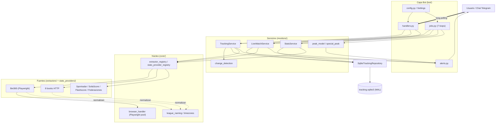

### 3.2. Arranque

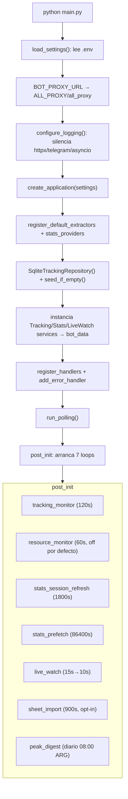

### 3.3. Extracción de datos

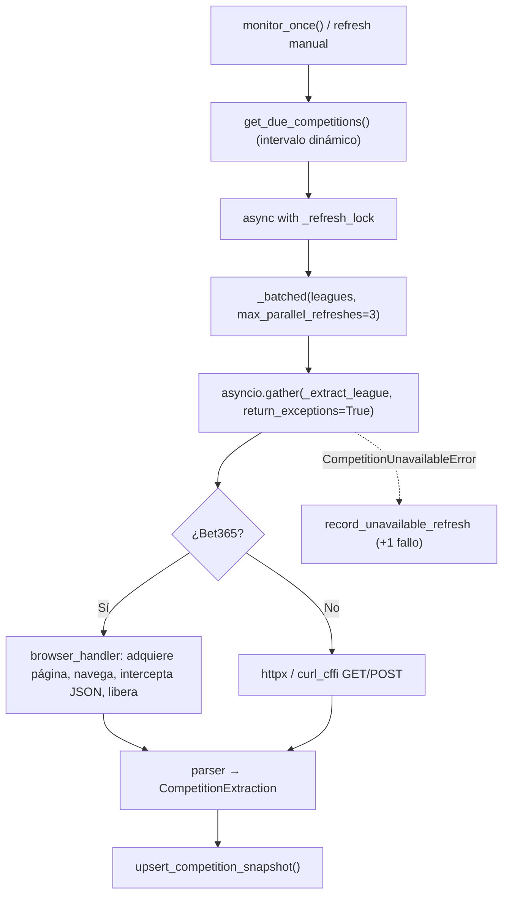

### 3.4. Persistencia

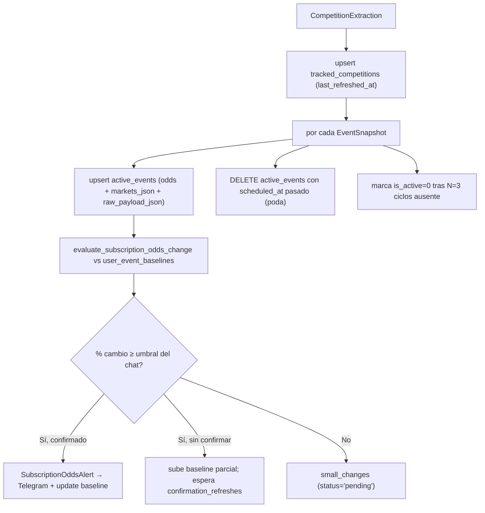

### 3.5. Live-watch

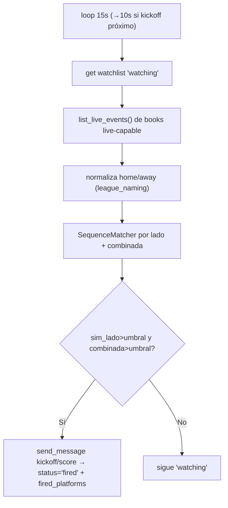

### 3.6. Errores / reintentos / fallbacks

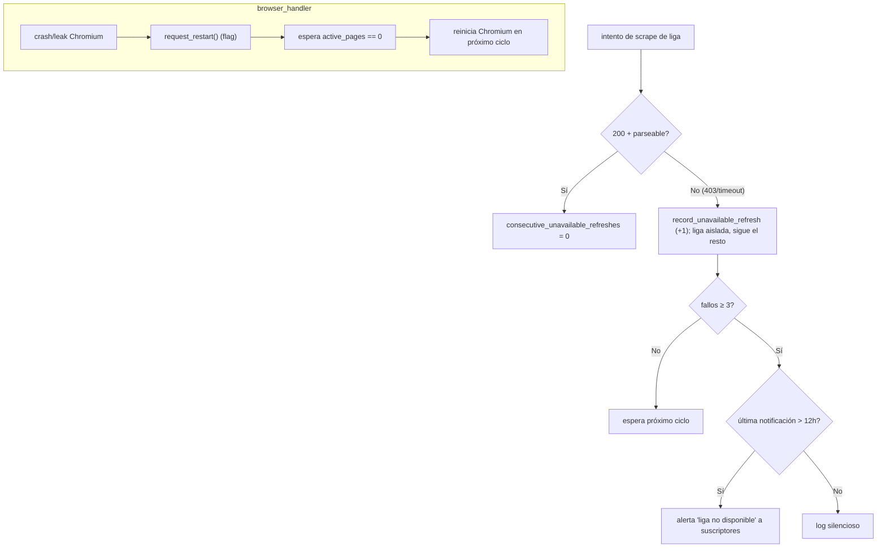

---

## 4. Servicios y conexiones

### 4.1. Telegram

- **`python-telegram-bot`** en **long polling** (`run_polling()`) — no requiere webhook ni IP pública.
- Middleware en grupo `-1`: `apply_chat_timezone_context` inyecta la TZ del chat (ContextVar) para renderizar horas locales.
- Salida proactiva con `application.bot.send_message`; mensajes >4096 chars se parten con `split_telegram_message` (`alerts.py`).
- `add_error_handler(handle_error)` captura excepciones no manejadas de los handlers.

### 4.2. Casas de apuestas y fuentes externas

- **Bet365** — único que usa **Playwright/Chromium**: carga la SPA e intercepta respuestas de red (`Page.on("response")`) para capturar los payloads.
- **8 books HTTP-only** — `httpx` (async) o **`curl_cffi`** (TLS fingerprint) para evadir protección anti-bot. Cada uno tiene su `parser.py`.
- **Estadísticas** — Sportradar (token dinámico minteado vía JS/headless), SofaScore/Flashscore (firma estática), federaciones (FOGIS/Svenskfotboll, Palloliitto, Noruega/Argelia/Eslovaquia/Rumanía).
- **Proxy de egress** — `BOT_PROXY_URL` (ej. `socks5://127.0.0.1:25344`) se exporta a `ALL_PROXY`/`all_proxy` **antes** de crear cualquier cliente, así httpx, curl_cffi y Playwright lo heredan.

### 4.3. Procesos en background (7 loops — definidos en `bot/jobs.py`)

| Loop | Función arranque | Intervalo (default) | On/Off |
| :--- | :--- | :--- | :--- |
| Tracking de cuotas | `start_tracking_monitor` | 120 s (`TRACKING_REFRESH_INTERVAL_SECONDS`) | siempre |
| Live-watch in-play | `start_live_watch_monitor` | 15 s → 10 s si hay kickoff próximo | `LIVE_WATCH_ENABLED` |
| Refresh sesión stats | `start_stats_session_refresh` | **1800 s (hardcoded en `application.py`)** | siempre |
| Prefetch stats diario | `start_stats_prefetch` | 86400 s (+ purga de cache vencida) | `STATS_PREFETCH_ENABLED` |
| Import de planilla | `start_sheet_import_monitor` | 900 s | sólo si `LIVE_WATCH_SHEET_CHAT_ID` |
| Peak digest | `start_peak_digest` | diario 08:00 ARG (`PEAK_DIGEST_HOUR_ARG`) | `PEAK_DIGEST_ENABLED` |
| Resource monitor | `start_resource_monitor` | 60 s | **`ENABLE_MONITORING` (off por defecto)** |

> El `min_ttl_seconds=5400` y el intervalo `1800` del refresh de sesión están **hardcodeados** en `post_init`, no en `Settings`.

### 4.4. On-demand vs intervalos

- **On-demand** (handlers): `/track_url`, `/confirm_track`, `/refresh_tracks`, `/stats`, `/league`, `/watch_live`, `/peak_today`, comandos de federación (`/swe_*`, `/fin_*`, …), `/status`, `/resources`, etc.
- **Por intervalo**: los 7 loops de §4.3.

### 4.5. Resiliencia ante fallos

- Cada liga se extrae con `return_exceptions=True`: un fallo **aísla** esa liga (`failed_leagues`) y no aborta el ciclo.
- `CompetitionUnavailableError` → `record_unavailable_refresh` (+1). A las **3 fallas** consecutivas se notifica al usuario, con **cooldown de 12 h** anti-spam.
- Chromium: `browser_handler.request_restart()` marca un flag y reinicia cuando `active_pages == 0` (no interrumpe capturas en curso).
- Todos los loops envuelven el cuerpo en `try/except Exception: logger.exception(...)` y re-lanzan sólo `CancelledError` → un fallo de ciclo nunca mata el loop.

---

## 5. Base de datos y persistencia

**Motor:** SQLite (`data/tracking.sqlite3`), abierto con `PRAGMA foreign_keys=ON`, `journal_mode=WAL`, `synchronous=NORMAL`, `busy_timeout=5000`. Esquema creado/migrado idempotentemente en `_initialize_schema` (incluye migraciones de constraints `UNIQUE` viejos y `_ensure_column`).

### 5.1. Tablas (15)

| Tabla | PK | Rol | Notas |
| :--- | :--- | :--- | :--- |
| `pending_track_requests` | `id` (UNIQUE por chat) | track temporal a confirmar | expira (`expires_at`) |
| `tracked_competitions` | `id` (UNIQUE `platform,external_id`) | liga monitoreada global | contadores de indisponibilidad |
| `competition_subscriptions` | `(chat_id, tracked_competition_id)` | suscripción chat↔liga | FK CASCADE; `change_threshold_percent` |
| `active_events` | `id` (UNIQUE `platform,external_event_id`) | partido + odds + JSON | FK CASCADE; índice `(tracked,is_active,scheduled_at)` |
| `stats_league_links` | `id` (UNIQUE `tracked,provider`) | liga↔liga de stats | FK CASCADE |
| `stats_league_subscriptions` | `(chat,provider,league)` | chat↔liga de stats directa | sin FK |
| `stats_match_links` | `id` (UNIQUE `active_event,provider`) | partido↔partido de stats | FK CASCADE |
| `stats_payload_cache` | `cache_key` | cache HTTP de stats | `expires_at` + **purga diaria** |
| `user_event_baselines` | `(chat_id, active_event_id)` | baseline de odds por chat | FK CASCADE; **sin índice propio en FK** |
| `small_changes` | `id` (UNIQUE `chat,active_event`) | cambios menores pendientes | FK CASCADE |
| `sent_alerts` | `id` (UNIQUE `chat,event,type`) | dedupe de alertas | FK CASCADE; **append-only, sin poda** |
| `live_watch_entries` | `id` | watchlist in-play | `status`, `fired_platforms` |
| `live_watch_settings` | `chat_id` | toggles goles/rojas/amarillas | — |
| `peak_digest_subscriptions` | `chat_id` | suscriptores del digest | — |
| `chat_settings` | `chat_id` | TZ del chat | — |
| `unified_competitions` | `id` (UNIQUE `public_id`) | liga canónica cross-plataforma | `idx_stats_league_links_unified_provider` |

### 5.2. Diagrama entidad-relación

```mermaid
erDiagram
    unified_competitions ||--o{ tracked_competitions : agrupa
    tracked_competitions ||--o{ competition_subscriptions : suscribe
    tracked_competitions ||--o{ active_events : contiene
    tracked_competitions ||--o{ stats_league_links : linkea
    active_events ||--o{ stats_match_links : linkea
    active_events ||--o{ user_event_baselines : baseline
    active_events ||--o{ small_changes : cambios
    active_events ||--o{ sent_alerts : alertas

    tracked_competitions {
        integer id PK
        text platform
        text competition_external_id
        text source_url
        integer enabled
        integer consecutive_unavailable_refreshes
        integer unified_competition_id FK
    }
    active_events {
        integer id PK
        integer tracked_competition_id FK
        text external_event_id
        text home
        text away
        text scheduled_at
        real odds_home
        real odds_draw
        real odds_away
        text markets_json
        text raw_payload_json
        integer is_active
    }
    user_event_baselines {
        integer chat_id PK
        integer active_event_id PK_FK
        real baseline_odds_home
        real baseline_odds_draw
        real baseline_odds_away
        text baseline_markets_json
    }
    small_changes {
        integer id PK
        integer chat_id
        integer active_event_id FK
        real max_change_percent
        text status
    }
```

### 5.3. Clasificación de datos

| Tipo | Columnas/tablas | ¿Reconstruible? | Recomendación |
| :--- | :--- | :--- | :--- |
| **Raw** | `raw_payload_json` (active_events), `payload_json` (cache/links) | Sí, re-scraping | comprimir o no guardar si `EXTRACTOR_SAVE_DEBUG_PAYLOADS=false` |
| **Derivado** | `odds_*`, `unified_competitions`/traits, `small_changes` | Sí | mantener |
| **Cache** | `stats_payload_cache` | Sí (TTL) | **ya se purga** a diario |
| **Estado de usuario (no reconstruible)** | subscriptions, `chat_settings`, `user_event_baselines`, `live_watch_entries`, `peak_digest_subscriptions` | **No** | backup prioritario |

### 5.4. Poda y crecimiento (verificado)

- `active_events` **sí se poda**: durante el refresh se hace `DELETE` de eventos con `scheduled_at` pasado (`_is_past_scheduled_at`), y cascada FK limpia baselines/small_changes/sent_alerts/stats_match_links.
- `stats_payload_cache` **sí se purga** diariamente (`purge_expired_stats_payloads` en el loop de prefetch).
- `live_watch_entries` tiene `purge_expired_live_watches`.
- **Gaps reales de crecimiento:** (1) **no hay `VACUUM`** → tras los DELETE, el archivo/WAL no se reduce; (2) `sent_alerts` es **append-only sin poda**; (3) eventos de ligas que dejan de refrescarse (deshabilitadas pero no removidas) no se podan; (4) varias FK que disparan CASCADE **no tienen índice propio** (`user_event_baselines.active_event_id`, `small_changes.active_event_id`, `sent_alerts.active_event_id`, `stats_match_links.active_event_id`) → el borrado hace full-scan.

---

## 6. Tipos de datos y modelos

Todos son `@dataclass(frozen=True)`. Resumen por capa (nombre · ubicación · rol · creador → consumidor):

### `core/models.py` (dominio cuotas)
- `ProviderCapabilities` — flags http/live/deep/browserless. Extractor → registry/handlers.
- `PlatformDescriptor` — identidad de un book (key, domains, supports). Extractor → `/platforms`, resolución de URL.
- `Odds1X2` — `home/draw/away: float|None`. Parsers → repo/change_detection.
- `CompetitionKey` / `EventKey` — identidad inmutable (platform[, comp][, event]).
- `EventSnapshot` — evento prematch + `odds_1x2` + `markets_payload` + `raw_payload`. Extractor → TrackingService/repo.
- `CompetitionExtraction` — resultado completo de scrapear una liga (`events`, `is_empty`, `is_provisional_name`). Extractor → TrackingService.
- `LiveEventSnapshot` — estado in-play (minuto, score, tarjetas, `is_soccer`). Parsers live → LiveWatchService.

### `core/stats_models.py` (dominio stats)
- `StatsProviderCapabilities`, `StatsProviderDescriptor`, `StatsLeagueOption`, `StatsFixture`, `MatchIdentityCandidate` (matching fonético), `StatsMatchLink`, `MatchStatsReport` (Markdown listo para Telegram).

### `monitors/models.py` (DTOs de servicio)
- `CommandResult`, `OddsChange`, `MarketChangeDetail`, `SubscriptionOddsAlert`, `CompetitionRefreshResult`, `UnavailableCompetitionRefresh`, `RefreshSummary`.

### `storage/tracking_repository.py` (persistencia)
- `LiveWatchEntry`, `LiveWatchSettings`, `PendingCompetitionTrackRequest`, `TrackedCompetition`, `CompetitionSubscription`, `TrackedCompetitionSubscription`, `ConfirmedCompetitionTrackRequest`, `UntrackCompetitionResult`, `ActiveEventUpsert`, `ActiveEventRecord`, `StatsLeagueLink`, `StatsLeagueSubscription`, `StatsMatchLinkRecord`, `EventBaseline`, `SmallChangeRecord`.

**Observación de diseño:** hay ~5 representaciones de "partido" (`EventSnapshot`, `LiveEventSnapshot`, `ActiveEventRecord`, `StatsFixture`, `MatchIdentityCandidate`) y ~3 de "suscripción". Es deuda de modelado real, pero cada una cumple un rol distinto (contrato de extractor vs fila SQL vs DTO de matching); una unificación a un `MatchSnapshot` único es deseable a largo plazo pero **no urgente** y conlleva riesgo alto de regresión.

---

## 7. Flujo de trabajo completo

```
[Arranque]
  main.main() → load_settings() → proxy → configure_logging → create_application → run_polling
  create_application: registries → repo + seed_if_empty → 3 servicios → handlers → post_init(7 loops)

[Tracking cada 120s]  jobs._tracking_monitor_loop → TrackingService.monitor_once(bot)
  async with _refresh_lock:
    get_due_competitions → _batched(3) → gather(_extract_league, return_exceptions)
    por liga OK: upsert tracked + active_events
                 por chat suscrito: change_detection.evaluate_subscription_odds_change
                   baseline ausente → initialize; cambio≥umbral & confirmado → alerta + update baseline
                   cambio chico → small_changes('pending'); flapping → se descarta
    poda eventos pasados; marca is_active=0 tras 3 ciclos ausente
    por liga error: record_unavailable_refresh; a las 3 + cooldown 12h → alerta

[Live-watch 15s→10s]  poll_once → watchlist + list_live_events → fuzzy match → 'fired' + alerta

[Stats]  session_refresh (1800s) mantiene token; prefetch (24h) calienta cache + purga vencidos
[Sheet import 900s]  GET CSV → sha256 → si cambió: parse + add_fixture_lines + notifica
[Peak digest]  diario 08:00 ARG → build_peak_scores → render por TZ de cada chat

[Apagado]  SIGINT/SIGTERM → post_shutdown: stop_* (orden inverso) + extractor.stop() (cierra Chromium)
```

---

## 8. Diagramas de secuencia

### 8.1. `/track_url` → `/confirm_track`

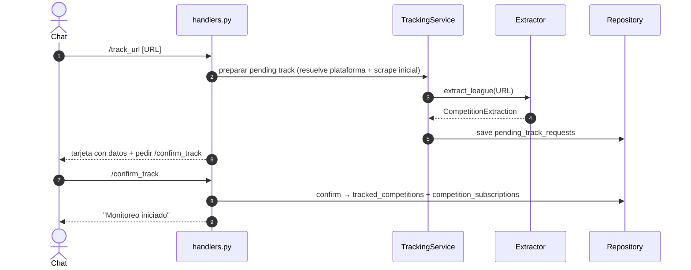

### 8.2. `/stats`

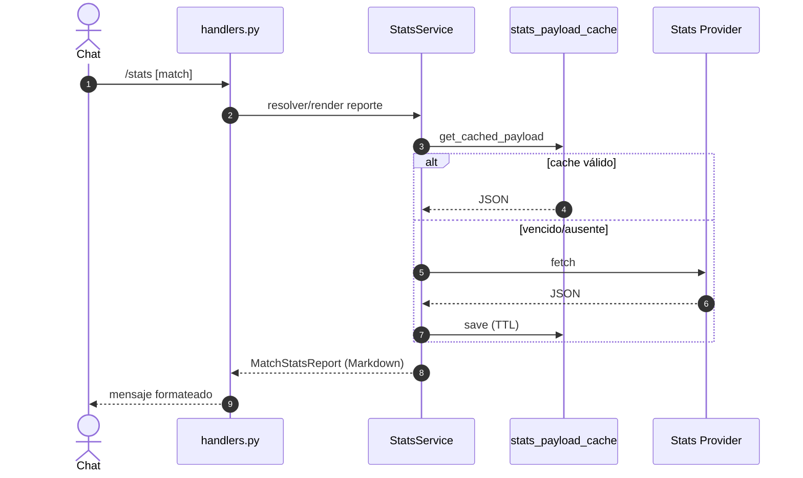

### 8.3. Detección de cambio de cuota

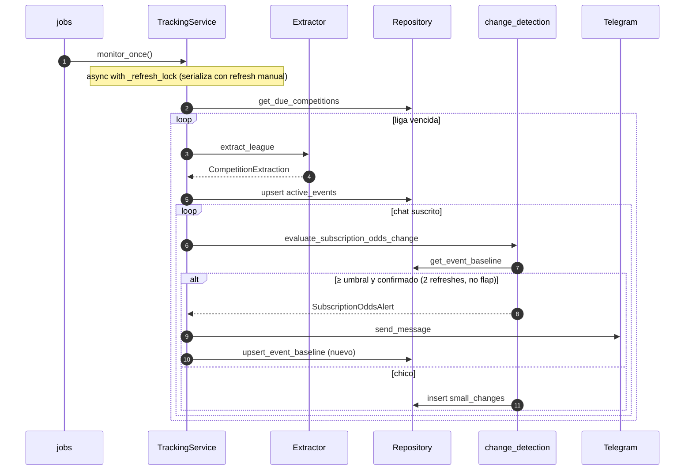

### 8.4. Live-watch

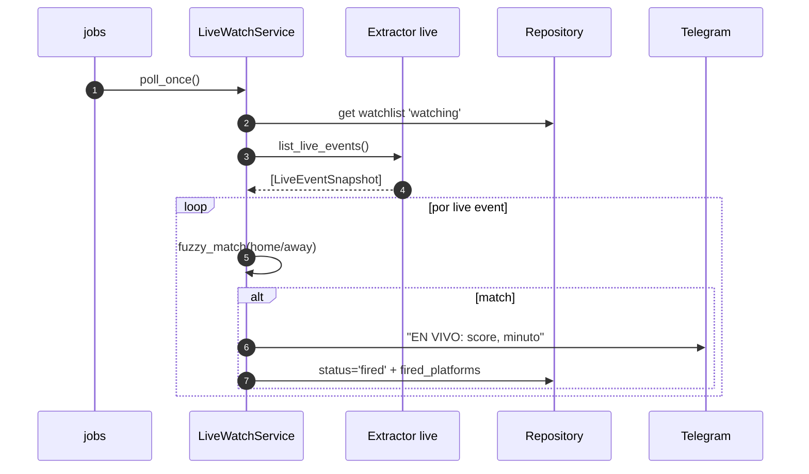

### 8.5. Reintentos / indisponibilidad

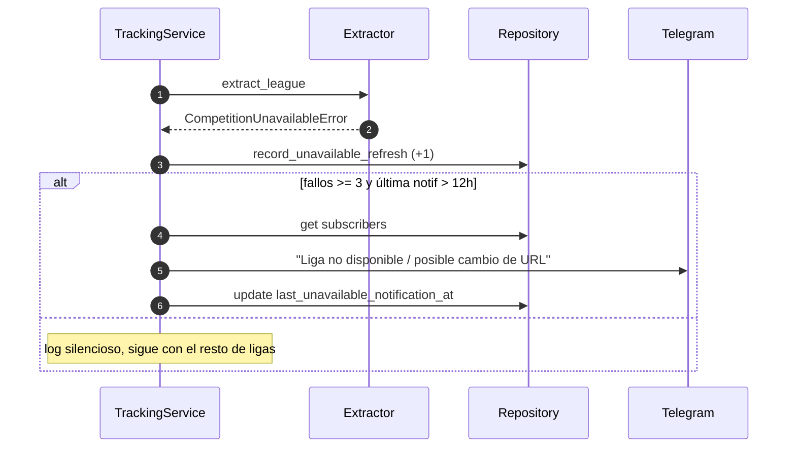

---

## 9. Evaluación técnica

### 9.1. Fortalezas
- Desacople real por **registries** + interfaces (`Extractor`/`StatsProvider`): agregar un book/proveedor es escribir el adaptador y registrarlo.
- **Anti-ruido sofisticado** en alertas: confirmación por N refreshes (`odds_change_confirmation_refreshes=2`) + ventana anti-flapping (`odds_flap_window_minutes`, `odds_flap_epsilon`) + dedupe en `sent_alerts`. (El reporte previo no lo mencionó.)
- WAL + `busy_timeout` + FK CASCADE + índices en los FKs más calientes.
- Loops robustos: cada uno tolera excepciones sin morir; `post_shutdown` cierra Chromium ordenadamente.
- Aislamiento de fallos por liga + cooldown de notificación.

### 9.2. Cuellos de botella y riesgos de recursos
| # | Hallazgo | Impacto | Severidad |
| :-- | :--- | :--- | :--- |
| 1 | SQLite **síncrono dentro del event loop** (sólo 2–3 llamadas usan `asyncio.to_thread`) | Una escritura pesada (blobs JSON) congela polling + retrasa el timer de live-watch (15 s) | Alta |
| 2 | **Sin `VACUUM`** + `sent_alerts` append-only | El archivo/WAL crece y no se recupera; disco del VPS | Alta |
| 3 | Reinicio de Chromium por RAM **no cableado**: `resource_monitor` sólo loguea warning; `EXTRACTOR_BROWSER_RESTART_AFTER_N_REFRESHES=None` | OOM-kill en VPS chico | Alta |
| 4 | Re-serialización de `raw_payload_json`/`markets_json` cada 120 s | CPU/IO por ciclo | Media |
| 5 | FK sin índice en `active_event_id` (baselines/small_changes/sent_alerts/match_links) | CASCADE DELETE hace full-scan al podar | Media |
| 6 | `resource_monitor` **off por defecto** (`ENABLE_MONITORING=false`) | Sin visibilidad de RAM/CPU en prod | Media |

### 9.3. Race conditions y errores silenciosos
- **Baseline read-modify-write**: el reporte previo lo marcó como race entre refresh manual y loop. **Está mitigado**: todos los caminos de refresh toman `self._refresh_lock` (5 usos en `tracking.py`), serializándose. El riesgo residual es sólo si en el futuro se escribiera el baseline fuera del lock.
- **Import de planilla silencioso**: `_sheet_import_loop` captura todo y loguea; si la Sheet cambia de formato o falla la red, deja de importar **sin avisar** al chat (válido).
- **Errores de scraping genéricos**: se registra `CompetitionUnavailableError` sin volcar el HTML/JSON que falló → depurar selectores rotos es difícil (válido, salvo si `EXTRACTOR_SAVE_DEBUG_PAYLOADS=true`).
- `1800/5400` del refresh de sesión hardcodeados en `application.py` (no en `Settings`) → divergencia silenciosa de configuración.

### 9.4. Código duplicado / mantenibilidad
- **`bot/handlers.py` ~5.064 líneas**: mezcla transporte Telegram + negocio + SQL ad-hoc. Difícil de testear y navegar.
- Normalización de texto duplicada: `core/league_naming.py` vs `_normalize` en `monitors/live_watch.py` (mismas reglas, código separado → riesgo de divergencia en matching).
- ~37 comandos por federación (`/swe_*`, `/fin_*`, `/ro_*`, `/sk_*`, `/al_*`, `/no_*`) repetidos.

### 9.5. Dónde agregar logs
- Volcar payload (o hash + primeras N KB) al fallar el parseo de un book.
- Métricas por ciclo: tiempo por liga, % de ligas degradadas, tamaño DB, RAM de Chromium → a un chat admin.
- Confirmar/registrar cuándo el anti-flapping descarta un cambio (hoy es casi invisible).

---

## 10. Recomendaciones priorizadas

### P0 — Críticas

**P0.1 · `VACUUM` periódico + poda de `sent_alerts`**
- Archivos: `storage/tracking_repository.py` (nuevo `purge_old_sent_alerts` + `vacuum`), `bot/jobs.py` (engancharlo al loop de prefetch diario ya existente).
- Cambio: borrar `sent_alerts`/eventos de ligas inactivas con `last_seen_at` > 14 d y correr `VACUUM` (o `wal_checkpoint(TRUNCATE)`) tras la purga diaria.
- Por qué: hoy el espacio liberado por los DELETE no se recupera y `sent_alerts` crece sin techo.
- Riesgo: bajo (no toca estado de usuario activo). `VACUUM` bloquea la DB unos instantes → correrlo en horario muerto, en `to_thread`.
- Beneficio: tamaño de DB acotado de forma indefinida.

**P0.2 · Reinicio automático de Chromium por RAM**
- Archivos: `bot/jobs.py` (`_resource_monitor_loop`), `bot/config.py` (default), `core/browser_handler.py`.
- Cambio: cuando la RAM de Chromium supere `monitor_chromium_ram_alert_mb` (800) llamar `browser_handler.request_restart(...)`; setear `EXTRACTOR_BROWSER_RESTART_AFTER_N_REFRESHES` por defecto (ej. 50). Además **activar `ENABLE_MONITORING=true`** en prod.
- Por qué: hoy sólo se loguea un warning; en VPS chico termina en OOM-kill.
- Riesgo: medio — el restart ya espera `active_pages==0`, así que no corta capturas.
- Beneficio: elimina caídas por memoria.

**P0.3 · Sacar SQLite del event loop en los caminos calientes**
- Archivos: `storage/tracking_repository.py`, llamadores en `monitors/tracking.py` y `change_detection.py`.
- Cambio: envolver lecturas/escrituras pesadas (upsert de eventos, baselines, blobs) en `asyncio.to_thread` (ya hay precedente: `purge_expired_stats_payloads`, `learn_unified_merges`).
- Por qué: una escritura grande congela polling y descompasa el live-watch de 15 s.
- Riesgo: medio — revisar reentrancia/transacciones (WAL + `busy_timeout` ya ayudan).
- Beneficio: fluidez del bot y precisión temporal del live-watch.

### P1 — Importantes

**P1.1 · Índices en FK que disparan CASCADE**
- Archivo: `storage/tracking_repository.py` (`_initialize_schema`).
- Cambio: `CREATE INDEX` sobre `user_event_baselines(active_event_id)`, `small_changes(active_event_id)`, `sent_alerts(active_event_id)`, `stats_match_links(active_event_id)`.
- Por qué: SQLite no indexa FKs automáticamente; el borrado en cascada al podar hace full-scan.
- Riesgo: bajo. Beneficio: purgas rápidas sin bloquear.

**P1.2 · Canal de alertas de sistema a chat admin**
- Archivos: `bot/error_handler.py`, `monitoring.py`, `bot/config.py` (`SYSTEM_ADMIN_CHAT_ID`).
- Cambio: enviar al admin las fallas persistentes de scrapers, caída de proxy, warnings de RAM/disco y los fallos del import de planilla (hoy silenciosos).
- Riesgo: bajo. Beneficio: detección proactiva sin SSH.

**P1.3 · Unificar la normalización de nombres**
- Archivos: `core/league_naming.py`, `monitors/live_watch.py`.
- Cambio: mover `_normalize` de live_watch a `league_naming` como normalizador reutilizable de equipos.
- Riesgo: bajo (requiere regresión de matching). Beneficio: menos falsos negativos in-play.

**P1.4 · Mover `1800/5400` del refresh de sesión a `Settings`**
- Archivos: `bot/config.py`, `bot/application.py`.
- Riesgo: muy bajo. Beneficio: config consistente.

### P2 — Mejoras futuras

- **P2.1 · Modularizar `bot/handlers.py`** en `tracking_/stats_/live_/system_handlers.py`. Riesgo bajo, gran ganancia de mantenibilidad.
- **P2.2 · Parametrizar comandos de federación**: 37 comandos → 6 genéricos (`/standings [país]`, etc.) con botones inline. Riesgo medio (UX/regresión).
- **P2.3 · Volcado de debug al fallar parseo** (gateado por flag) para depurar selectores rotos.
- **P2.4 · (Largo plazo) consolidar modelos de "partido"** a un `MatchSnapshot` único. Alto riesgo de regresión; sólo con suite verde y por fases.

> Las propuestas de rediseño profundo del esquema (serie temporal de odds, `competition_provider_mappings`, EventBus, scheduler único) del reporte previo son válidas como visión, pero son **reescrituras grandes**: trátarlas como épicas P2/P3 detrás de los P0/P1, no como trabajo inmediato.

---

## 11. Conclusiones y roadmap

BetBot es un monolito modular **bien estructurado en el dominio** y con mecanismos de calidad que el reporte previo había subestimado (lock de refresh, confirmación + anti-flapping, poda de eventos y de cache, FK CASCADE, WAL). Los riesgos genuinos son **operativos de VPS**, no de diseño: bloqueo del event loop por SQLite síncrono, falta de `VACUUM`/poda de `sent_alerts`, y reinicio de Chromium no cableado.

**Roadmap sugerido (orden de ejecución):**

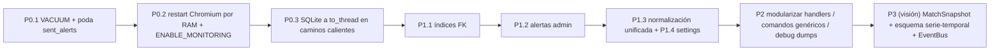

Con los P0/P1 resueltos, el bot queda estable en un VPS de bajos recursos sin tocar la lógica de negocio. El rediseño profundo (P3) sólo conviene si el catálogo de plataformas/usuarios crece a un punto donde el monolito actual deje de escalar.

---

## 12. Correcciones al reporte previo

El documento `architecture_audit_report.md` es sólido en estructura, pero contenía estas imprecisiones (corregidas arriba):

| Afirmación previa | Realidad verificada |
| :--- | :--- |
| "No hay limpieza de DB → crece sin fin (P0)" | `active_events` pasados **se borran** en cada refresh; `stats_payload_cache` **se purga** a diario; `live_watch_entries` tiene purga. El gap real es **`VACUUM`** y **`sent_alerts`** (append-only), no la ausencia total de poda. |
| "El caché de stats no se limpia" | Se purga en el loop de prefetch (`purge_expired_stats_payloads`). |
| "Race condition de baselines entre refresh manual y loop genera alertas duplicadas" | Mitigado: todos los refresh toman `self._refresh_lock`. Además hay confirmación + anti-flapping que el reporte no mencionó. |
| "6 loops de background" | Son **7** (faltaba `peak_digest`). |
| "FK sin índice bloquean cascada" (genérico) | Cierto sólo para las FK a `active_event_id` sin índice; las FK calientes (`tracked_competition_id`) **sí** tienen índice, y `foreign_keys=ON`. |
| Intervalo de refresh de sesión "30 min" como config | Está **hardcodeado** (`1800`/`5400`) en `application.py`, no en `Settings`. |
| `EventSnapshot` "tiene `odds_1x2` y `raw_payload`" (campos parciales) | También expone `markets_payload`, `scheduled_label_*`, `metadata`, properties de identidad. |

---

---

## 13. Arquitectura actual en detalle

Esta sección documenta el estado **actual** (no propuesto): cómo se organizan los tipos de datos, qué viaja entre módulos y funciones, y qué wrappers existen.

### 13.1. Catálogo de tipos de datos y contención

Todos los modelos son `@dataclass(frozen=True)`. El diagrama muestra qué tipo **contiene/usa** a cuál (las flechas son relación de composición, no de herencia).

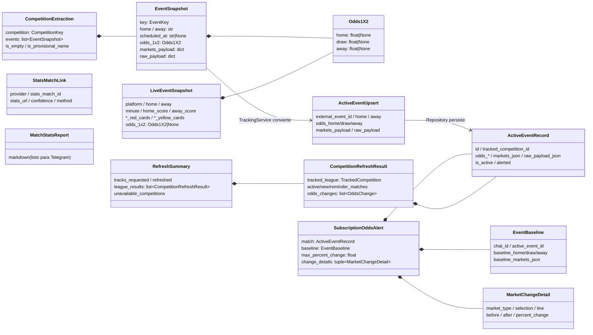

**Inventario por ubicación** (creador → consumidor):

| Tipo | Archivo | Creado por | Consumido por |
| :--- | :--- | :--- | :--- |
| `Odds1X2`, `EventKey`, `CompetitionKey` | `core/models.py` | parsers de extractores | TrackingService, repo |
| `EventSnapshot`, `CompetitionExtraction` | `core/models.py` | `Extractor.extract_league/match` | TrackingService |
| `LiveEventSnapshot` | `core/models.py` | parsers live | LiveWatchService |
| `PlatformDescriptor`, `ProviderCapabilities` | `core/models.py` | `describe_platform()` | handlers (`/platforms`), registry |
| `LeagueDiscoveryOption` | `core/extractor_base.py` | `Extractor.search_leagues` | handlers (track sin URL) |
| `StatsLeagueOption`, `StatsFixture`, `StatsMatchLink`, `MatchStatsReport`, `MatchIdentityCandidate`, `StatsProviderDescriptor` | `core/stats_models.py` | `StatsProvider.*` | StatsService, handlers |
| `ActiveEventUpsert` | `storage/…` | TrackingService (desde `EventSnapshot`) | `Repository.upsert_active_events` |
| `ActiveEventRecord`, `EventBaseline`, `SmallChangeRecord`, `TrackedCompetition`, `CompetitionSubscription`, `LiveWatchEntry`, … | `storage/…` | Repository (desde filas SQL via `mappers.py`) | servicios, change_detection, handlers |
| `OddsChange`, `MarketChangeDetail`, `SubscriptionOddsAlert`, `CompetitionRefreshResult`, `UnavailableCompetitionRefresh`, `RefreshSummary`, `CommandResult` | `monitors/models.py` | change_detection, TrackingService | TrackingService, alerts, jobs |

### 13.2. Flujo de datos entre módulos (qué tipo viaja)

```mermaid
flowchart TD
    subgraph Cuotas
        E1["Extractor.extract_league(url)"] -->|CompetitionExtraction| TS["TrackingService.monitor_once"]
        TS -->|ActiveEventUpsert| R1["Repository.upsert_active_events"]
        R1 -->|ActiveEventRecord| CD["change_detection.evaluate_subscription_odds_change"]
        CD -->|SubscriptionOddsAlert| AL["alerts → bot.send_message"]
        AL -->|texto Markdown| TG1["Chat Telegram"]
    end
    subgraph Live
        E2["Extractor.list_live_events()"] -->|"list[LiveEventSnapshot]"| LWS["LiveWatchService.poll_once"]
        LWS -->|LiveHit (fuzzy vs LiveWatchEntry)| RH["render_live_hit"]
        RH -->|texto| TG2["Chat Telegram"]
    end
    subgraph Stats
        E3["StatsProvider.resolve_match()"] -->|StatsMatchLink| SS["StatsService"]
        SS -->|StatsMatchLinkRecord| R2["Repository (persist)"]
        SS -->|MatchStatsReport| TG3["Chat Telegram"]
    end
```

**Contratos clave función ↔ tipo:**

| Función / método | Recibe | Devuelve |
| :--- | :--- | :--- |
| `Extractor.extract_league(url)` | `str` | `CompetitionExtraction` |
| `Extractor.extract_match(url)` | `str` | `EventSnapshot` |
| `Extractor.list_live_events()` | — | `list[LiveEventSnapshot]` |
| `Repository.upsert_active_events(...)` | `ActiveEventUpsert` (+ ids) | `list[ActiveEventRecord]` |
| `change_detection.evaluate_subscription_odds_change(...)` | `ActiveEventRecord`, `EventBaseline`, subscription | `SubscriptionOddsAlert | None` |
| `TrackingService.monitor_once(bot)` | `telegram.Bot` | `RefreshSummary` |
| `StatsProvider.resolve_match(...)` | criterios de partido | `StatsMatchLink | None` |
| `StatsProvider.build_match_report(id)` | `str` | `MatchStatsReport` |

### 13.3. Wrappers y capas de abstracción

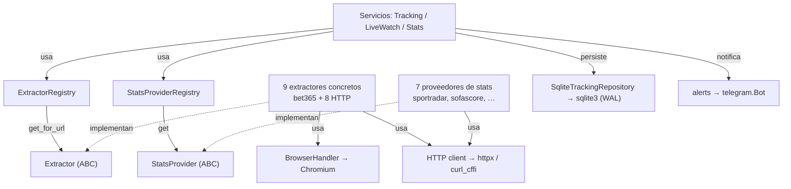

| Wrapper | Envuelve | Usado por | Notas |
| :--- | :--- | :--- | :--- |
| `ExtractorRegistry` / `StatsProviderRegistry` | dict de instancias | servicios, handlers | descubrimiento plug-and-play (`get_for_url`, `get`, `list_registered`) |
| `Extractor` (ABC) | contrato de scraping | registry | `extract_league/match`, `list_live_events`, `describe_platform` |
| `StatsProvider` (ABC) | contrato de stats | registry | `search_leagues`, `resolve_match`, `build_match_report` |
| `BrowserHandler` | Playwright/Chromium | sólo Bet365 | pool de páginas, `request_restart`, espera `active_pages==0` |
| HTTP clients (por extractor) | `httpx` / `curl_cffi` | 8 books HTTP + stats | curl_cffi para TLS fingerprint anti-bot; heredan `ALL_PROXY` |
| `SqliteTrackingRepository` | `sqlite3` | los 3 servicios + handlers | WAL, FK ON, `busy_timeout`; ~mayoría síncrono (ver §9.2) |
| `alerts` + `mappers` | `telegram.Bot` / filas SQL | TrackingService/LiveWatch / repo | formateo Markdown + `split_telegram_message`; mapeo fila↔dataclass |

> El mapa visual del esquema de DB está en el diagrama de chat correspondiente; su versión exhaustiva en tablas está en [§5](#5-base-de-datos-y-persistencia).

---

## 14. Arquitectura propuesta y veredicto

### 14.1. Arquitectura objetivo propuesta (del reporte previo)

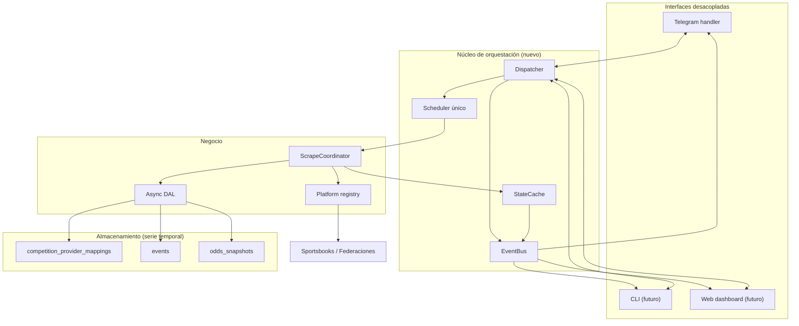

### 14.2. Veredicto por componente

| Propuesta | Veredicto | Por qué |
| :--- | :--- | :--- |
| Índices en FKs + `VACUUM` / purga de `sent_alerts` | **Adoptar ya** | barato, alto impacto operativo (= P0.1/P1.1) |
| Consolidar comandos de federación (37→6) + UX inline | **Adoptar ya** | gran win de mantenibilidad y UX |
| No persistir `raw_payload_json` por defecto | **Adoptar ya** | ese es el ahorro de disco real (no el BLOB comprimido) |
| SQLite async (`asyncio.to_thread`) | **Adoptar ya** | saca el bloqueo del event loop (= P0.3) |
| Tabla `competition_provider_mappings` | **Diferir (P2/P3)** | migración grande, valor medio; ya existe `unified_competitions` |
| `MatchSnapshot` unificando 5 modelos | **Diferir (P2/P3)** | riesgo de *god object*; los 5 tipos viven en capas distintas |
| State Store compartido tracking/live | **Diferir** | solapamiento de scraping chico hoy |
| Tabla `odds_snapshots` (serie temporal) | **Descartar / replantear** | **haría crecer** la DB, no achicarla; sólo si se quiere historial |
| EventBus + interfaces CLI/Web | **Descartar** | YAGNI: no hay segunda interfaz; el acoplamiento se resuelve con un `Notifier` inyectable |
| Scheduler maestro único | **Descartar** | cero ganancia (`asyncio.sleep` no consume ocioso) y menos robusto que 7 loops aislados |

**Síntesis:** buena visión de largo plazo, mala lista de tareas inmediatas. Los ítems "adoptar" coinciden con los P0/P1 de [§10](#10-recomendaciones-priorizadas) y dan ~90% del beneficio con ~10% del riesgo de la migración de 4 fases.

---

*Reporte generado a partir de inspección directa del código (entry points, `bot/`, `core/`, `monitors/`, `storage/`). No se modificó código fuente.*
