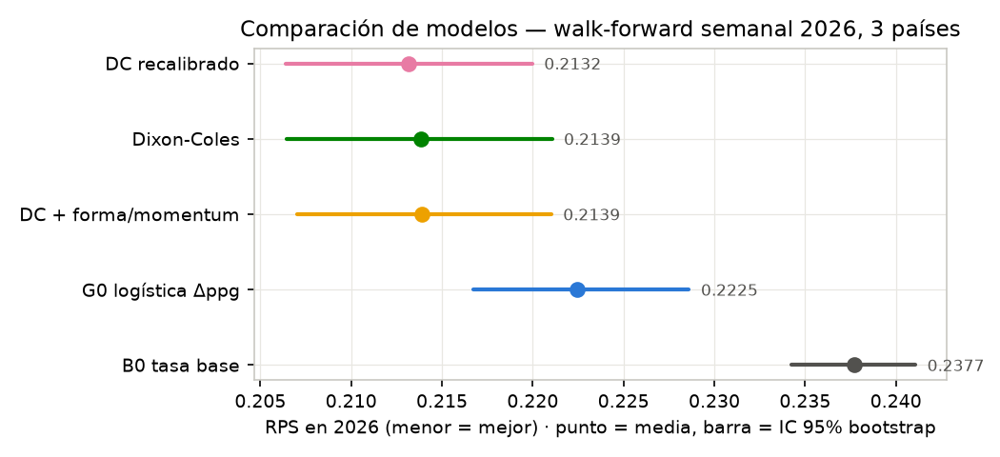
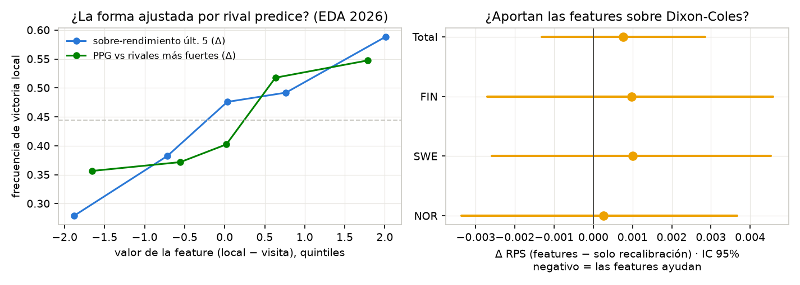
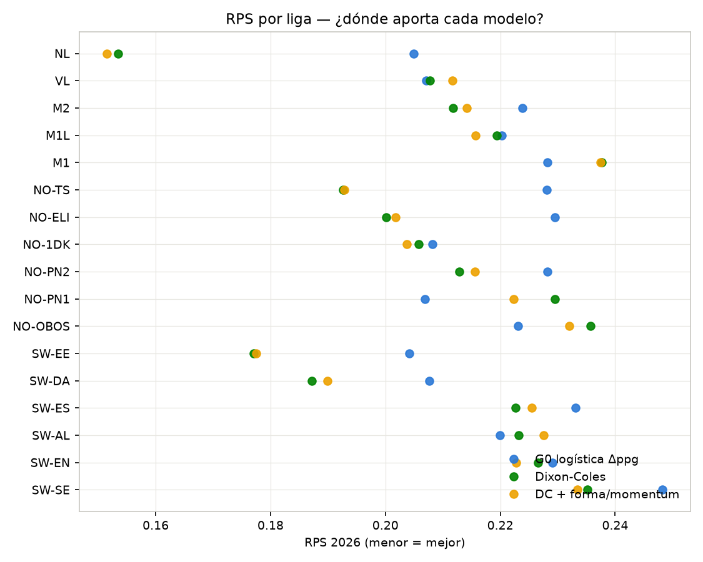
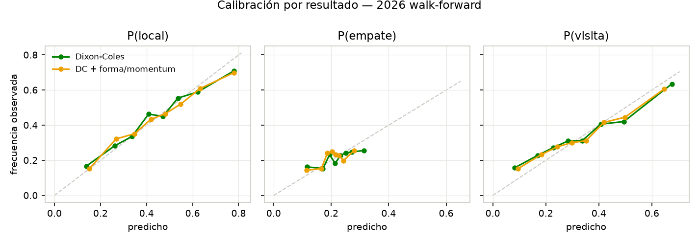
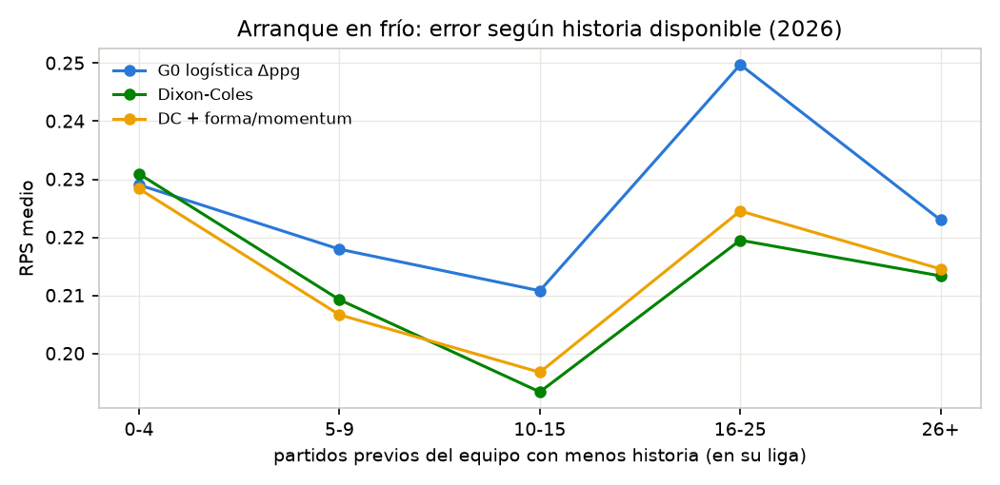
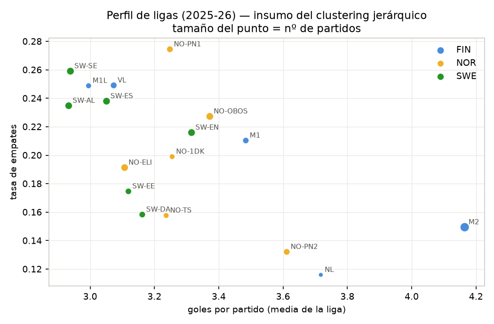

# EXP-002 — Escalera multi-país (FIN + SWE + NOR) y capa de forma/momentum

**Fecha**: 2026-07-21 · **Protocolo**: `research/PROTOCOLO_INVESTIGACION.md`
**Dataset**: 4.941 partidos jugados (abr-2025 → 20-jul-2026), **17 ligas, 3 países**:
Finlandia (VL, M1L, M1, M2, NL), Suecia (Allsvenskan, Superettan, Ettan N/S,
Damallsvenskan, Elitettan), Noruega (Eliteserien, OBOS, PostNord 1/2, Toppserien,
1. div Kvinner). Fuentes: Palloliitto, svenskfotboll.se, fotball.no (extractores propios).

## Preguntas

1. ¿El resultado de EXP-001 (Dixon-Coles > logística-tabla > tasa base) **generaliza**
   fuera de Finlandia?
2. ¿Las features de "cómo viene el equipo" ajustadas por calidad del rival — Elo,
   pendiente de rating (momentum), sobre-rendimiento vs expectativa, fuerza del
   calendario, PPG contra rivales más fuertes — **agregan señal por encima** del
   modelo de goles? (pedido explícito del director: "si viene ganando contra
   equipos buenos")

## Diseño

- Walk-forward semanal idéntico a EXP-001 (refit lunes; features y tablas point-in-time).
- Hiperparámetros DC **congelados** de EXP-001 (half-life 120d, σ=0.75, ρ) con un
  chequeo de transferencia en SWE+NOR 2025: decaimiento sigue ganando
  (RPS 0.1950 vs 0.1956 sin decaimiento, 1.333 partidos) → no se re-tunea.
- La capa apilada se entrena SOLO con predicciones out-of-sample previas del DC
  (pase OOS desde jun-2025, 3.688 predicciones) → sin leakage del meta-modelo.
- Ablación: `stack_cal` (recalibración pura de DC) vs `stack_full` (recalibración
  + 6 features de forma/momentum). La diferencia entre ambos aísla el aporte de
  las features.

## Resultado principal (2026: 1.619 partidos, los 3 países)



| Modelo | RPS | log-loss | ECE(H) | ΔRPS vs DC (IC 95%) | P(mejor que DC) |
|---|---|---|---|---|---|
| **stack_cal** (DC recalibrado) | **0.2132** | **0.9940** | **0.028** | −0.0007 (−0.0015, +0.0001) | 0.96 |
| dc_best (Dixon-Coles) | 0.2139 | 1.0007 | 0.031 | — | — |
| stack_full (DC + features) | 0.2139 | 0.9968 | 0.028 | +0.0001 (−0.0021, +0.0022) | 0.46 |
| g0_logistic_dppg | 0.2225 | 1.0243 | 0.027 | +0.0086 (+0.0032, +0.0139) | 0.001 |
| b0_base_rate | 0.2377 | 1.0633 | 0.048 | +0.0238 (+0.0170, +0.0308) | 0.000 |

### Lecturas

1. **La escalera generaliza y ahora es concluyente.** Con 1.619 partidos de test
   (vs 507 en EXP-001), la ventaja del modelo de goles sobre G0 es
   **estadísticamente significativa**: ΔRPS +0.0086 con IC (+0.0032, +0.0139) y
   p<0.001 en log-loss. El criterio del gate **G2 queda superado**: hay un modelo
   que bate a los baselines con significancia, en 3 países.
2. **Por país** (RPS de dc_best / stack_cal): FIN 0.2107/0.2106 · NOR 0.2144/0.2127
   · SWE 0.2160/0.2157. La recalibración logística nunca empeora y mejora el
   log-loss con p≈0.998 — se adopta como capa estándar (es además la
   infraestructura sobre la que luego se integrará la comparación con cuotas).

## La pregunta del momentum: ¿"viene ganando contra buenos" aporta?



Respuesta en dos partes, y es el hallazgo más instructivo del experimento:

- **Sí, la señal existe** (panel izquierdo): univariadamente, el diferencial de
  sobre-rendimiento reciente (resultados vs lo esperado por Elo, últimos 5) separa
  la tasa de victoria local de 28% a 59% entre quintiles extremos; el PPG contra
  rivales más fuertes, de 36% a 55%.
- **No, no agrega sobre Dixon-Coles** (panel derecho): la diferencia
  stack_full − stack_cal es ≈0 en total y en cada país (todos los IC cruzan 0;
  p(mejor)=0.46). Los coeficientes del meta-modelo lo confirman: pesos ≈0 para
  elo_diff, mom5 y SoS una vez que están los logits del DC
  (fig/stack_coefficients.png).

**Interpretación**: el Dixon-Coles con decaimiento de 120 días *ya contiene* la
forma reciente ajustada por rival — eso es exactamente lo que hace su verosimilitud
ponderada en el tiempo sobre el grafo de partidos. Las features de forma son
proyecciones de la misma información, no información nueva. Conclusión de
protocolo (§3.5): estas features **no pagan su lugar** como aditivos del DC y no
entran al modelo final en esta forma. Dónde sí pueden aportar (hipótesis para
EXP-003+): interacciones no lineales vía GBM, señales de *cambio de régimen* más
largas (CUSUM sobre residuos), y datos que el grafo no ve (lesiones, rotaciones,
descanso).

## Dónde gana cada modelo



- **Las ligas femeninas son las más predecibles** — RPS de DC: NL 0.151,
  SW-EE 0.177, SW-DA 0.187, NO-TS 0.193 — muy por debajo de las masculinas
  (0.20-0.24). Mayor dispersión de fuerzas + menos empates. Si el mercado no
  precifica esa asimetría, es el primer lugar donde buscar value cuando haya
  cuotas archivadas.
- **La anomalía M1 (Ykkönen) persiste**: DC 0.238 vs G0 0.228 — única liga
  finlandesa donde el modelo de goles pierde. Con el cold-start descartado como
  causa única (abajo), los sospechosos son los playoffs/estructura de la M1 y el
  tamaño de la serie (10 equipos). Queda abierto como EXP-003a.
- En SW-AL/SW-EN/NO-PN1 los modelos están apretados con G0 — ligas donde la tabla
  ya resume casi todo.

## Calibración (el requisito para hablar de value)



P(local) y P(visita) calibran bien sobre todo el rango (la diagonal queda dentro
del ruido de los octiles). **P(empate) está sobre-estimada en la cola alta**: cuando
el modelo dice >28% de empate, la frecuencia real ronda 25%. Es el defecto conocido
de la familia Poisson (la dependencia diagonal no se captura del todo con ρ).
Implicación práctica: **no apostar empates por ahora**; la recalibración lo corrige
parcialmente (ECE 0.031→0.028).

## Arranque en frío y perfil de ligas



El error cae ~0.03 RPS entre "equipo con <5 partidos" y "10-15 partidos" — la
muestra chica de comienzo de temporada es cara. El shrinkage ridge ayuda pero no
resuelve ascensos (entran como equipo promedio). El pico en 16-25 partidos viene
dominado por los lohkos de M2 y PostNord (colas de temporada con mucha rotación).
Solución estructural: el **jerárquico multi-liga** (protocolo §5) que vincule
divisiones del mismo país.



El mapa goles/empates confirma la hipótesis de clusters del director: las ligas
femeninas + PostNord avd. 2 + Kakkonen forman el cluster "muchos goles, pocos
empates" (3.6-4.2 goles, 12-16% empates) mientras Superettan/M1L/VL/SW-AL forman
el opuesto (2.9-3.1 goles, 24-26%). Este es el insumo natural del nivel intermedio
de pooling del modelo jerárquico.

## Amenazas a la validez / aclaraciones

1. Sin cuotas archivadas todavía no hay métricas económicas; todo lo anterior es
   probabilístico (bloqueado por Fase 0, chip pendiente).
2. Los per-league RPS tienen n chicos (64-135 partidos): las diferencias por liga
   individuales NO están corregidas por comparaciones múltiples; solo los
   agregados (tabla principal) tienen IC formales. No sobre-leer una liga puntual.
3. Equipos nórdicos identificados por nombre normalizado (sin id estable de
   federación); riesgo de duplicados por renombres — validador pendiente.
4. Durante el análisis se detectó y corrigió un bug de alineación fila↔RPS en los
   desgloses por liga/país (los agregados de `compare()` nunca estuvieron
   afectados). Las tablas por liga de la primera corrida del notebook g1 eran
   incorrectas; regeneradas.

## Decisiones que quedan tomadas (con evidencia)

- **Modelo de producción candidato**: Dixon-Coles (hl 120d, σ 0.75, ρ) + capa de
  recalibración logística entrenada OOS. G2 superado.
- Las features de forma/momentum, en su forma lineal actual, quedan **fuera**.
- Los empates no se juegan hasta corregir la sobre-estimación de la cola.
- Siguiente en protocolo: EXP-003 jerárquico bayesiano con clustering de ligas
  (los perfiles ya están), EXP-003a diagnóstico M1, extender dataset a Islandia
  (sportradar) y sumar targets O/U-BTTS con las matrices de marcadores ya emitidas.

## Adenda: el predictor binneado del director (g0b)

A pedido del director se integró al harness su `LeaguePredictor` (notebook
`research.ipynb` de la worktree peak-research): P(resultado | Δposición
normalizada) por histograma en 9 bins fijos con fallback nearest-bin, portado a
`zoo.make_binned_standing` con dos correcciones (probabilidades renormalizadas a
suma 1; fallback a tasa base sin tabla). Mismo walk-forward 2026, mismos 1.619
partidos (`binned_comparison.json`):

| Modelo | RPS | log-loss | ECE(H) | ΔRPS vs g0b (IC 95%) |
|---|---|---|---|---|
| stack_cal | 0.2132 | 0.9940 | 0.028 | −0.0102 (−0.0152, −0.0053) |
| dc_best | 0.2139 | 1.0007 | 0.031 | −0.0095 (−0.0148, −0.0042) |
| g0_logistic_dppg | 0.2225 | 1.0243 | 0.027 | −0.0009 (−0.0053, +0.0034) |
| **g0b_binned_standing** | 0.2234 | 1.0259 | 0.042 | — |
| b0_base_rate | 0.2377 | 1.0633 | 0.048 | +0.0143 |

Lectura: el predictor binneado **empata estadísticamente con la logística G0**
(Δ −0.0009, IC cruza 0) — son el mismo estimador conceptual (tabla → 1X2), uno
no paramétrico y otro suave. Ambos pierden contra los modelos de goles con
p>0.999. Su calibración es peor (ECE 0.042: los bins chicos meten ruido). La
idea de diseño del original (replay incremental con reversas, multi-liga,
fixtures) queda señalada como esqueleto para la fase de producción (Fase 6),
donde lo incremental sí es el requisito.

## Reproducir

```bash
PYTHONPATH=. betbot/bin/python research/peak_models/build_dataset_nordics.py  # refresca SWE+NOR
research/.venv/bin/python research/experiments/EXP-002-multiliga/run.py
research/.venv/bin/python research/experiments/EXP-002-multiliga/figures.py
```

Artefactos: `config.json`, `results.json`, `walkforward_2026.csv`, `oos_dc.csv`,
`features.csv`, `fig/*.png`.
