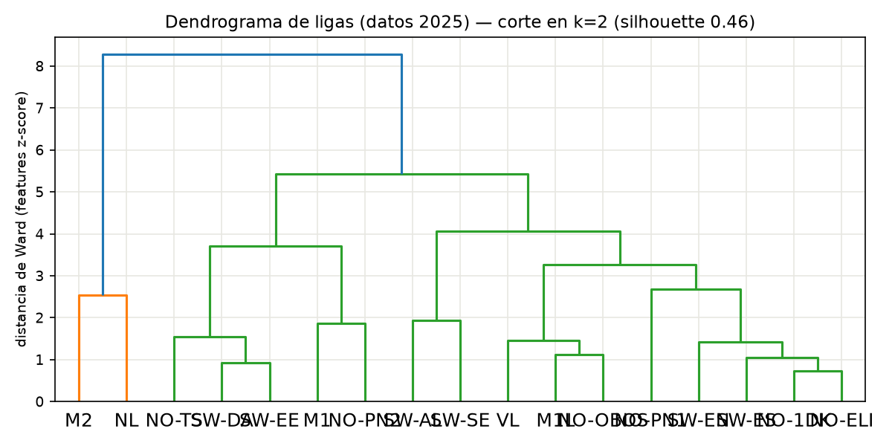
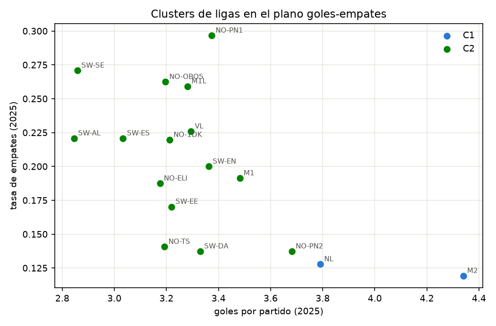
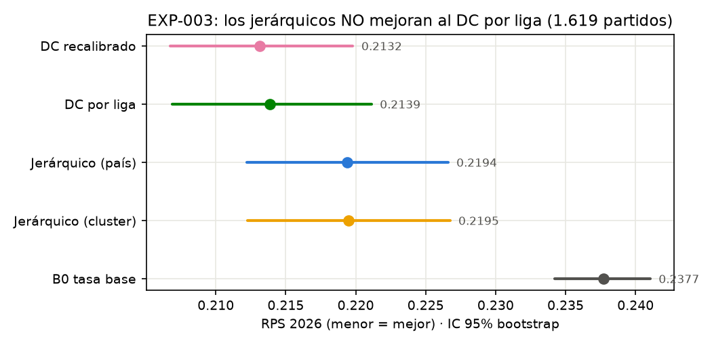
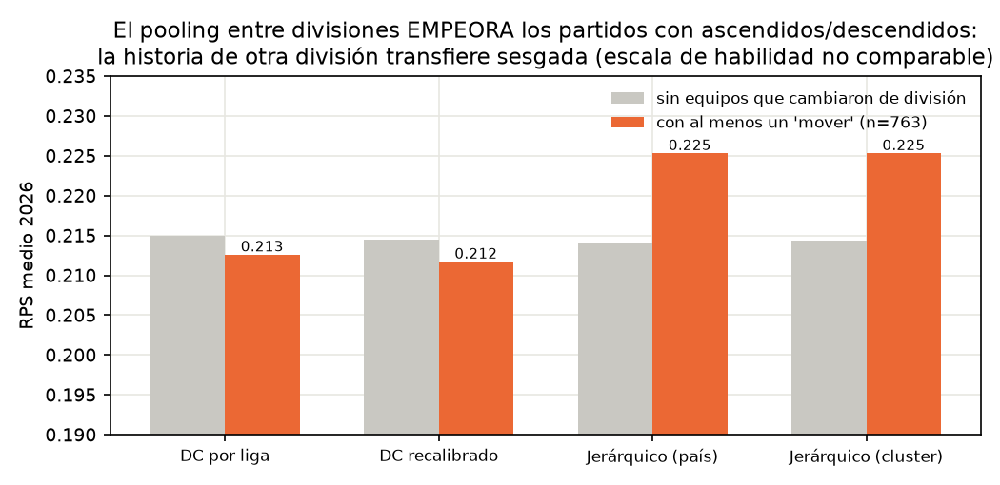
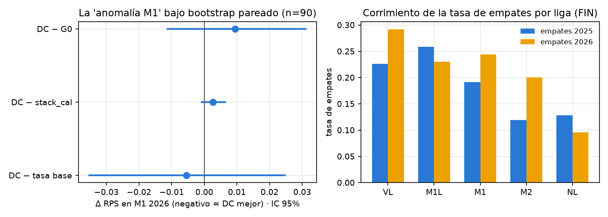
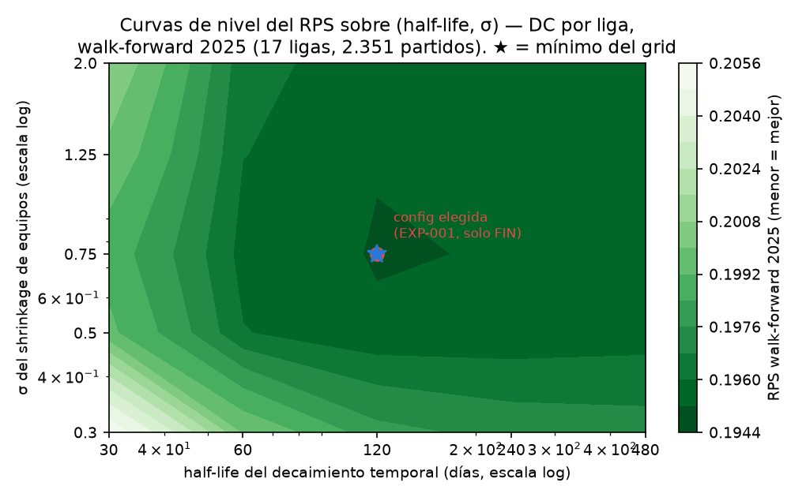
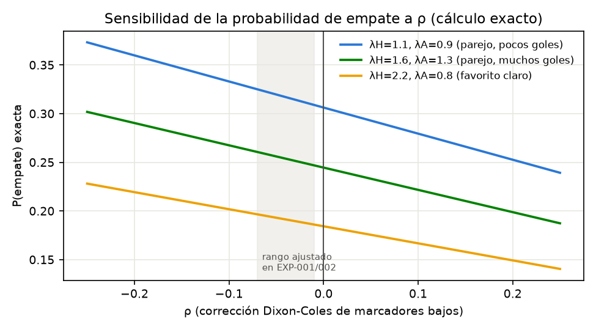
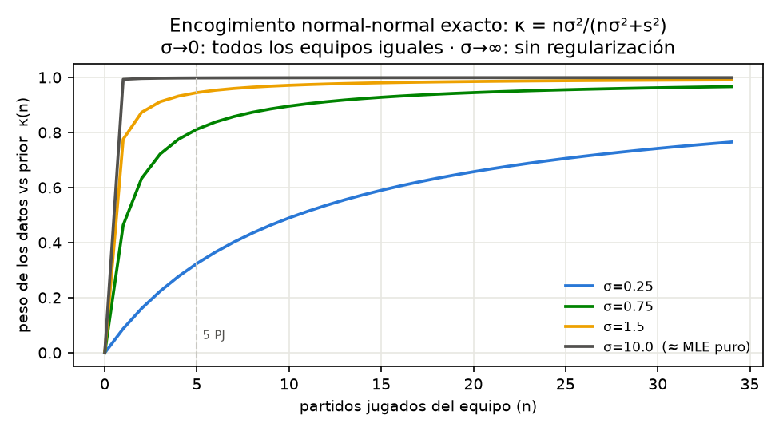
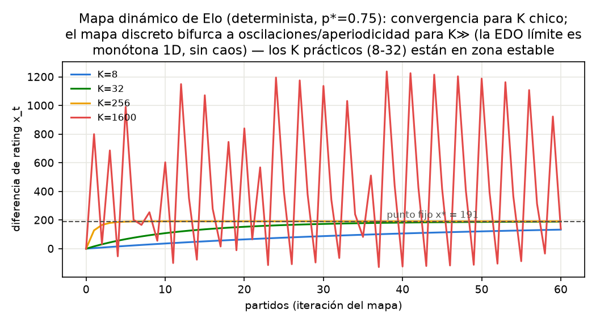

# Modelos probabilísticos jerárquicos para fútbol de ligas menores nórdicas: teoría, estimación y evaluación walk-forward

**EXP-003 + EXP-003a** · BetBot Research · 2026-07-21
**Datos**: 4.941 partidos, 17 ligas, 3 países (FIN/SWE/NOR), abr-2025 → 20-jul-2026.
**Protocolo**: `research/PROTOCOLO_INVESTIGACION.md` · experimentos previos: EXP-001 (escalera, Finlandia), EXP-002 (multi-país + momentum).

---

## Resumen

Formalizamos la familia completa de modelos usados en el programa (tasa base, logística multinomial, histograma binneado, Poisson de fuerzas, Dixon-Coles, recalibración apilada, ratings dinámicos tipo Elo y el jerárquico multi-nivel), con sus postulados, ecuaciones, límites paramétricos y propiedades de estimación. Evaluamos todo bajo walk-forward semanal estricto en 2026 (1.619 partidos nunca vistos). Resultados principales: (i) el Dixon-Coles por liga con recalibración sigue siendo el mejor modelo global (RPS 0.2132); (ii) el jerárquico multi-división es **significativamente peor** en agregado (Δ=+0.0055, IC95 [+0.0018, +0.0094]) porque la transferencia de habilidad entre divisiones está sesgada — pero **gana en el cluster de ligas con datos escasos** (C1: 0.1966 vs 0.1995), el comportamiento exacto que la teoría de pooling parcial predice; (iii) la "anomalía M1" de EXP-001/002 **no supera un test pareado** (IC [−0.0113, +0.0311], n=90): era ruido de muestra chica amplificado por comparaciones múltiples, con un mecanismo plausible de no-estacionariedad (la localía de M1 cayó de 0.52 a 0.39 entre temporadas); (iv) el análisis de sensibilidad muestra una meseta amplia alrededor de (half-life 120 días, σ=0.75) — el modelo no es frágil a sus hiperparámetros — y la dinámica subyacente (mapa de Elo, kernel de decaimiento) es estable y no caótica en el rango operativo.

---

## 1. Introducción

El objetivo del programa es producir probabilidades pre-partido calibradas $(p_H, p_D, p_A)$ — y, derivadas de la distribución de marcadores, probabilidades de over/under y BTTS — para ligas menores nórdicas, de modo de compararlas luego contra las probabilidades implícitas del mercado (fase bloqueada por el archivado de cuotas, Fase 0). La métrica primaria es el **Ranked Probability Score** (RPS), apropiada para el resultado ordinal H>D>A; secundarias: log-loss, Brier, ECE. Ninguna decisión se toma sobre accuracy.

Todos los experimentos usan el mismo protocolo: *walk-forward* semanal (cada lunes se reajusta con TODO lo anterior y se predice la semana), features congeladas al instante del partido (anti-leakage por construcción), hiperparámetros elegidos exclusivamente con 2025, y 2026 como conjunto de evaluación puro. Los intervalos de confianza son bootstrap pareado por partido (4.000 réplicas).

### 1.1 Datos

| País | Ligas | Partidos | Fuente |
|---|---|---|---|
| Finlandia | VL, M1L, M1, M2 (4 lohkos), NL | 1.394 | Palloliitto API |
| Suecia | SW-AL, SW-SE, SW-EN, SW-ES, SW-DA, SW-EE | 1.920 | svenskfotboll.se |
| Noruega | NO-ELI, NO-OBOS, NO-PN1, NO-PN2, NO-TS, NO-1DK | 1.627 | fotball.no |

Incluyen 1ª a 4ª división masculina y 1ª-2ª femenina. El pipeline es agnóstico al país (los ids de temporada están mapeados en `build_dataset_nordics.py`); Rumania y Eslovaquia quedan planificadas con los extractores ya existentes.

---

## 2. Modelos

Cada subsección sigue el mismo esquema: **qué postula**, **qué predice**, **ecuaciones**, **estimación** (¿solución exacta?), y **límites** (comportamiento cuando los parámetros tienden a 0 o ∞).

### 2.1 B0 — Tasa base por liga

**Postulado**: el resultado de un partido es intercambiable dentro de su liga; ninguna información de los equipos importa.

$$P(Y=r \mid \text{liga } \ell) = \pi_{r\ell}, \qquad r \in \{H, D, A\}$$

**Estimación**: el MLE multinomial tiene **solución exacta en forma cerrada**: $\hat\pi_{r\ell} = n_{r\ell}/n_\ell$ (frecuencias observadas).

**Límites**: con $n_\ell \to \infty$ converge a las tasas verdaderas de la liga; con $n_\ell$ chico hereda toda la varianza muestral (por eso el fallback jerarquiza liga→global). Es el **piso** de la escalera: cualquier modelo que no lo supere no extrae información de los equipos.

### 2.2 G0 — Logística multinomial sobre Δppg

**Postulado**: la única señal relevante es la diferencia de puntos-por-partido acumulados hasta la fecha, $x = \mathrm{ppg}_H - \mathrm{ppg}_A$, y las log-odds de cada resultado son **lineales** en $x$.

$$P(Y=r \mid x) = \frac{e^{\alpha_r + \beta_r x}}{\sum_{s} e^{\alpha_s + \beta_s x}}$$

**Estimación**: la log-verosimilitud es **cóncava** → óptimo único, pero **sin forma cerrada** (Newton/L-BFGS). Es el modelo con menos parámetros que usa información de equipos (4 libres con la clase de referencia).

**Límites**: $\beta_r \to 0$ colapsa a B0 (softmax de constantes = frecuencias). $\beta_H \to \infty$ produce un clasificador determinista escalón en $x=0$: probabilidades 0/1, log-loss no acotado ante un solo error — ilustra por qué accuracy y log-loss divergen. La linealidad en log-odds es su límite estructural: no puede representar la no-monotonía del empate (máximo en $x\approx0$) salvo por el juego entre las tres clases.

### 2.3 G0b — Histograma binneado sobre Δposición (modelo del director)

**Postulado**: $P(Y=r \mid z)$ con $z = -(\mathrm{pos}_H - \mathrm{pos}_A)/N$ es **constante a trozos** en $B$ bins fijos de $[-1,1]$.

$$\hat P(Y=r \mid z \in b) = \frac{\#\{i \in b : y_i = r\}}{\#\{i \in b\}}$$

**Estimación**: exacta por conteo (es el MLE del modelo saturado por bin).

**Límites**: $B=1$ ≡ tasa base; $B\to\infty$ interpola los datos (varianza infinita — cada bin con 0 o 1 partidos). El trade-off sesgo-varianza óptimo escala como $B^* \sim n^{1/3}$ para funciones suaves; con $n\approx1.500$ por corte, $B=9$ está en el orden correcto. **Relación con G0**: son el mismo objeto estadístico (regresión de $Y$ sobre un resumen de la tabla); G0 impone suavidad paramétrica, G0b no impone nada. Empíricamente empatan (Δ=−0.0009, IC [−0.0053,+0.0034]) y G0b paga su flexibilidad con peor calibración (ECE 0.042 vs 0.027).

### 2.4 M1 — Poisson independiente de fuerzas (Maher 1982) con shrinkage

**Postulados**: (i) los goles de cada equipo en un partido son Poisson **independientes**; (ii) la intensidad factoriza multiplicativamente en ataque propio × defensa rival × localía:

$$G_H \sim \mathrm{Poisson}(\lambda_H), \quad G_A \sim \mathrm{Poisson}(\lambda_A)$$
$$\log\lambda_H = \mu + \gamma + \mathrm{atk}_h - \mathrm{def}_a, \qquad \log\lambda_A = \mu + \mathrm{atk}_a - \mathrm{def}_h$$

De la matriz de marcadores $P(G_H=i, G_A=j) = p_i(\lambda_H)\, p_j(\lambda_A)$ (truncada en 10) se derivan **todas** las cuotas de interés: 1X2 (sumas por triángulos), over/under (anti-diagonales), BTTS ($i,j \ge 1$), goles por equipo — una sola pieza coherente, ventaja estructural sobre modelar cada mercado por separado.

**Identificabilidad**: la verosimilitud es invariante ante $\mathrm{atk}_i \to \mathrm{atk}_i + c$, $\mathrm{def}_i \to \mathrm{def}_i + c$ (la constante se absorbe en $\mu$). Lo resolvemos con el prior/penalización ridge

$$-\frac{1}{2\sigma^2}\sum_i (\mathrm{atk}_i^2 + \mathrm{def}_i^2)$$

que equivale a un prior $\mathcal{N}(0,\sigma^2)$ (MAP): rompe la invariancia **y** encoge equipos con pocos partidos hacia el equipo promedio de la liga.

**Estimación**: log-verosimilitud penalizada cóncava en los parámetros naturales → óptimo único, sin forma cerrada; L-BFGS con gradiente analítico. **No hay solución exacta** (a diferencia de B0/G0b).

**Límites**: $\sigma \to 0$: todos los equipos idénticos → el modelo colapsa a "Poisson de liga + localía" (predicción constante por liga, un B0 goleado). $\sigma \to \infty$: MLE puro, varianza máxima en equipos nuevos (un ascendido con 2 partidos puede recibir ataque absurdo). La curva exacta de encogimiento normal-normal, $\kappa(n) = n\sigma^2/(n\sigma^2 + s^2)$, se muestra en la Fig. 8. $\lambda \to 0$ o $\infty$: la Poisson degenera (todo 0-0 / matriz truncada inválida) — los bounds $|\log\lambda|\le3$ lo previenen.

### 2.5 M2 — Dixon-Coles: dependencia en marcadores bajos + decaimiento temporal

Dos correcciones al postulado de independencia y estaticidad de Maher:

**(a) Corrección τ de marcadores bajos.** La independencia falla empíricamente en {0-0, 1-0, 0-1, 1-1}. DC multiplica esas cuatro celdas por

$$\tau(i,j) = \begin{cases} 1 - \lambda_H\lambda_A\rho & (0,0) \\ 1 + \lambda_A\rho & (1,0) \\ 1 + \lambda_H\rho & (0,1) \\ 1 - \rho & (1,1) \end{cases}$$

y renormaliza. **Rango válido**: $\tau > 0$ exige $\rho \in (\max(-1/\lambda_H, -1/\lambda_A),\ \min(1/(\lambda_H\lambda_A), 1))$. **Límite** $\rho \to 0$: recupera independencia exactamente. $\rho < 0$ (lo ajustado: −0.01 a −0.07 según país) **sube** la probabilidad de 0-0 y 1-1 → más empates. La sensibilidad exacta $P(D)$ vs $\rho$ está en la Fig. 7: el efecto es lineal y modesto (±0.01 de probabilidad de empate en el rango ajustado) — consistente con su aporte marginal al RPS (−0.0001 en EXP-001).

**(b) Decaimiento temporal.** Las fuerzas cambian; DC lo aproxima ponderando la verosimilitud del partido $m$ jugado $\Delta t_m$ días antes del ajuste:

$$w_m = 2^{-\Delta t_m / H} \iff w_m = e^{-\xi \Delta t_m},\ \xi = \ln 2 / H$$

**Límites**: $H \to \infty$ ($\xi\to0$): modelo estático (toda la historia pesa igual). $H \to 0$: solo cuenta el último partido → varianza infinita. El óptimo empírico $H \approx 120$ días (media temporada nórdica) es una **meseta ancha**, no un pico (Fig. 6): el modelo no es frágil a esta elección.

**Conexión dinámica**: el kernel exponencial es exactamente el filtro estacionario de un modelo de estado con caminata aleatoria $\mathrm{atk}_{i,t} = \mathrm{atk}_{i,t-1} + \eta_t$ (Rue-Salvesen / Koopman-Lit): DC-con-decaimiento ≈ aproximación de estado estacionario de una EDO estocástica lineal $d\theta = -\theta\,dt/\tau + dW$. No hay EDOs deterministas en el modelo estático; la dinámica entra por esta vía.

### 2.6 M3 — Recalibración apilada (stack_cal)

**Postulado**: las probabilidades del DC son *casi* correctas; existe una corrección logística global de bajo rango.

$$z = \left(\log\frac{p_H}{p_A},\ \log\frac{p_D}{p_A}\right), \qquad P(Y=r\mid z) = \mathrm{softmax}(\alpha_r + \beta_r^\top z)$$

entrenada **solo con predicciones out-of-sample previas** del propio DC (sin leakage del meta-nivel). **Límite**: $\beta = I,\ \alpha = 0$ es la identidad — el modelo puede aprender a *no* corregir; que aprenda otra cosa es evidencia de miscalibración sistemática del base. Resultado: mejora log-loss con p≈0.998 (corrige la sobre-estimación de empates en cola alta), nunca empeora RPS. Es además el módulo donde naturalmente entrará la probabilidad implícita del mercado como *benchmark* (nunca como feature del detector).

### 2.7 Ratings dinámicos (Elo) y features de forma — por qué quedaron fuera

El rating Elo es el mapa estocástico

$$x_{t+1} = x_t + K\,(S_t - E(x_t)), \qquad E(x) = \frac{1}{1+10^{-x/400}}$$

**Como sistema dinámico** (Fig. 9): el mapa determinista asociado tiene punto fijo $x^* = 400\log_{10}\frac{p^*}{1-p^*}$; su estabilidad depende de $|1 - K E'(x^*)| < 1$. Para $K$ práctico (8–32) el sistema es un rastreador sobreamortiguado (convergencia monótona, sin caos); al crecer $K$ el mapa discreto bifurca a oscilaciones y aperiodicidad tipo mapa logístico — puramente académico: está a dos órdenes de magnitud del rango operativo. El **límite continuo** es la EDO $\dot x = K(p^* - E(x))$, monótona y unidimensional → sin caos posible. $K\to0$: no aprende; $K\to\infty$: memoria de un partido (el análogo exacto de $H\to0$ en DC).

**Resultado empírico (EXP-002)**: las features derivadas (Elo, pendiente de rating, sobre-rendimiento vs expectativa, SoS, PPG contra rivales más fuertes) predicen fuertemente en univariado (28%→59% de victoria local entre quintiles extremos) pero su aporte **sobre** DC es nulo (Δ=+0.0001, IC [−0.0021,+0.0022]): la verosimilitud ponderada en el tiempo del DC *ya es* forma ajustada por rival. Se descartan como aditivos lineales (protocolo §3.5).

### 2.8 M4 — Jerárquico multi-nivel (MAP empírico-Bayes)

**Postulados**: (i) los equipos de un país viven en **una única escala de habilidad** (el mismo `team_id` en divisiones distintas es el mismo equipo → un ascendido conserva su historia); (ii) los interceptos de entorno (nivel de goles, localía) varían por liga y cluster alrededor de medias comunes:

$$\log\lambda_H = \mu_0 + m_{c(\ell)} + \delta_\ell + \big(\gamma_0 + g_{c(\ell)} + g_\ell\big) + \mathrm{atk}_h - \mathrm{def}_a$$
$$m_c \sim \mathcal{N}(0, \tau_c^2), \quad \delta_\ell \sim \mathcal{N}(0, \tau_\ell^2), \quad \mathrm{atk}_i, \mathrm{def}_i \sim \mathcal{N}(0, \sigma^2)$$

Computamos el **MAP** (verosimilitud penalizada, gradiente analítico, un solo ajuste conjunto de ~520 parámetros por semana, 0.1 s) en lugar del posterior completo por MCMC — la aproximación empírico-Bayes estándar cuando el posterior es log-cóncavo y unimodal, como aquí. ρ se fija en 0 (aporte marginal medido en EXP-001/002).

**Límites** (la mecánica del pooling): $\tau_\ell \to 0$: pooling completo — todas las ligas comparten intercepto (una "superliga" por país); $\tau_\ell \to \infty$: sin pooling — equivale a interceptos libres por liga. Ídem $\tau_c$ para clusters. El caso $\sigma$ es el de §2.4. El grid 2025 eligió $\tau_\ell = 0.15$ con meseta hacia 0.5 (RPS 0.1988 vs 0.1992 en 0.05): los datos piden pooling *intermedio*, como manda James-Stein.

**Límite estructural (el que resultó decisivo)**: los grafos de partidos de dos divisiones solo se conectan por los equipos que cambian de división (55 en 2026). La habilidad relativa *entre* divisiones está identificada únicamente por esos pocos enlaces → si el nivel medio de los jugadores difiere entre divisiones (lo hace), la habilidad transferida llega **sesgada**. La sección §5.3 lo cuantifica.

---

## 3. Clustering de ligas

Descriptores por liga computados **solo con 2025** (la asignación queda congelada antes de tocar 2026): media de goles, tasa de empates, ventaja localía ($P(H)-P(A)$), tasa over 2.5, desvío del diferencial. Ward sobre z-scores; $k$ por silhouette.


*Fig. 1 — Dendrograma de Ward sobre los 5 descriptores estandarizados (17 ligas, datos 2025). El corte óptimo por silhouette (0.458) da k=2: C1 = {M2 Kakkonen, NL femenina finlandesa} — el par extremo en goles (4.3 y 3.8 por partido) y escasez de empates (12-13%) — y C2 = las 15 restantes. Valores de silhouette para k=3..6 caen a 0.23-0.27: los datos NO soportan la partición fina que hipotetizaba el protocolo.*


*Fig. 2 — Las 17 ligas en el plano (goles/partido, tasa de empates) de 2025, coloreadas por cluster. Se ve el continuo — de Superettan/Allsvenskan (2.9 goles, 22-27% empates) a Kakkonen (4.3, 12%) — más que grupos discretos: la estructura es un gradiente goles↔empates (correlación negativa esperable: más goles ⇒ menos 0-0/1-1), con C1 como extremo, no como isla.*

**Lectura**: la hipótesis del director ("Kakkonen ≈ 3. divisjon ≈ deild islandesas") se sostiene *direccionalmente* — las ligas bajas y femeninas se corren al extremo goleador — pero con 17 ligas la evidencia solo permite una partición gruesa. El nivel cluster del jerárquico se implementó con esta C1/C2.

---

## 4. Diseño experimental

- **Walk-forward semanal** idéntico a EXP-001/002; test 2026: 1.619 partidos.
- **Hiperparámetros**: DC congelado de EXP-001 (H=120, σ=0.75, ρ ajustado) con transferencia verificada en SWE+NOR 2025 (0.1950 vs 0.1956 sin decaimiento); jerárquico: $\tau_\ell$ por grid 2025 (§2.8), $\tau_c = 0.25$, $\sigma = 0.75$ heredado.
- **Comparaciones**: bootstrap pareado (4.000 réplicas) sobre el RPS por partido, conjunto común de partidos. Los desgloses por liga individual se reportan como descriptivos (n = 64-135; sin corrección B-H no se les atribuye significancia).

## 5. Resultados

### 5.1 Comparación global


*Fig. 3 — RPS medio en 2026 (punto) con IC 95% bootstrap (barra), 1.619 partidos comunes, ordenado de peor a mejor. Los dos jerárquicos (azul, amarillo) quedan entre la tasa base y el DC por liga: el pooling multi-división NO mejoró al modelo que trata cada liga como universo aparte. stack_cal (rosa) mantiene el primer lugar de EXP-002.*

| Modelo | RPS | log-loss | ΔRPS vs DC (IC 95%) | P(mejor que DC) |
|---|---|---|---|---|
| stack_cal | **0.2132** | **0.9940** | −0.0007 (−0.0015, +0.0001) | 0.96 |
| dc_best (por liga) | 0.2139 | 1.0007 | — | — |
| jer_pais | 0.2194 | 1.0128 | **+0.0055 (+0.0018, +0.0094)** | 0.002 |
| jer_cluster | 0.2195 | 1.0132 | +0.0057 (+0.0020, +0.0095) | 0.002 |
| b0_base_rate | 0.2377 | 1.0633 | +0.0238 | 0.000 |

El nivel de cluster no cambia nada (jer_pais ≈ jer_cluster, Δ=0.0001): coherente con que los interceptos de liga ya están bien estimados con 100+ partidos cada uno — el pooling de *hiperparámetros* solo paga cuando la unidad es pobre en datos, que no es el caso de los interceptos. Los parámetros pobres son las habilidades de equipos, y esas **no pueden** poolearse entre países (grafos disjuntos).

### 5.2 Reporte por cluster

| Modelo | RPS C1 (n=247) | RPS C2 (n=1.372) |
|---|---|---|
| jer_pais | **0.1966** | 0.2235 |
| jer_cluster | 0.1976 | 0.2235 |
| dc_best | 0.1995 | 0.2164 |
| stack_cal | 0.1999 | **0.2155** |
| b0_base_rate | 0.2423 | 0.2369 |

**El resultado más instructivo del experimento**: el jerárquico **gana en C1** — Kakkonen (4 lohkos de ~10 equipos, la unidad más pobre en datos del dataset) y NL (8 equipos) — y pierde claramente en C2. Es pooling parcial de libro: compartir fuerza estadística ayuda exactamente donde cada unidad no puede sostener sus propios parámetros, y estorba donde sí puede (y el enlace entre divisiones introduce sesgo, §5.3). En C2, stack_cal supera a DC con IC que excluye 0 (−0.0009, IC [−0.0017, −0.0001]).

### 5.3 El mecanismo del fracaso: transferencia sesgada entre divisiones


*Fig. 4 — RPS 2026 según el partido involucre (naranja) o no (gris) al menos un equipo que cambió de división entre 2025 y 2026 (55 equipos, 763 partidos). Para DC y stack_cal los partidos con "movers" son incluso más fáciles (el prior "equipo promedio de la liga" resulta empíricamente correcto para ascendidos). Para los jerárquicos son mucho más difíciles (0.225 vs 0.214): la historia de la división anterior transfiere una habilidad sobre-estimada — un dominador de Kakkonen no es un equipo fuerte de Ykkönen, pero el modelo de escala única cree que sí. Δ(jer−DC) en movers = +0.0127, IC 95% [+0.0047, +0.0207].*

El postulado (i) de §2.8 — escala de habilidad única entre divisiones — es el que falla. Los interceptos $\delta_\ell$ absorben diferencias de *entorno de goles* pero no de *nivel medio de plantel*; con solo 55 enlaces, el MAP no puede separar ambas cosas y el prior hacia 0 (media país) infla a los equipos de divisiones bajas. Corrección candidata (EXP futuro): offset de habilidad por división ($\mathrm{atk}_i + a_{\ell}$) o re-centrado del prior de cada equipo a la media de su división de origen.

### 5.4 Diagnóstico M1 (EXP-003a): la anomalía era ruido — con un mecanismo real detrás


*Fig. 5 — Izquierda: Δ RPS de DC contra sus tres rivales, restringido a los 90 partidos de M1 2026, con IC 95% pareado; los tres intervalos cruzan el cero — la "derrota" de DC en M1 reportada descriptivamente en EXP-001/002 no es estadísticamente distinguible de ruido (P(DC mejor que G0)=0.20). Derecha: tasa de empates por liga finlandesa, 2025 (azul) vs 2026 (amarillo): M1 saltó de 0.19 a 0.24 y M2 de 0.12 a 0.20, mientras la localía de M1 colapsó de 0.52 a 0.39 (tabla en `m1_diagnosis.json`) — el entorno de la liga se movió entre temporadas.*

Conclusión del diagnóstico: (H2) **no se puede rechazar que sea fluctuación muestral** (n=90, y M1 es 1 de 17 ligas escaneadas — el problema clásico de comparaciones múltiples que el protocolo §6.2 anticipa). (H3) queda **refutada**: el jerárquico, que da historia a los ascendidos, es *peor* en M1 (Δ=+0.0120, IC [−0.0035,+0.0271]). (H1) sobrevive solo como mecanismo direccional: la caída de localía 0.52→0.39 y el salto de empates son un corrimiento de régimen real que castiga más a DC (que arrastra la localía 2025 con decaimiento de 120 días) que a G0 (que reestima su intercepto cada semana con datos frescos pooled). Acción: γ (localía) por liga-temporada con decaimiento más corto es una mejora candidata concreta.

### 5.5 Sensibilidad de hiperparámetros


*Fig. 6 — Curvas de nivel del RPS walk-forward 2025 (17 ligas, 2.351 partidos; ejes log) sobre el plano (half-life del decaimiento, σ del shrinkage). El ★ (mínimo del grid, RPS 0.1951) **coincide** con la configuración elegida en EXP-001 usando solo Finlandia (● rojo): la selección hecha con un tercio de los datos era ya el óptimo global del grid en el dataset triplicado. La superficie es una meseta — todo H ∈ [60, 480] × σ ∈ [0.5, 2.0] queda dentro de 0.001 del mínimo — con una única pared empinada hacia (H=30, σ=0.3), el rincón "memoria corta + prior rígido" (RPS 0.2054). El modelo no es frágil a sus hiperparámetros.*


*Fig. 7 — P(empate) exacta (matriz de marcadores truncada en 10) como función de ρ para tres pares (λH, λA) representativos. El efecto es lineal y modesto: en el rango ajustado empíricamente (banda gris, ρ ∈ [−0.07, −0.01]) la probabilidad de empate se mueve menos de 0.01. Explica cuantitativamente por qué ρ aporta tan poco al RPS y por qué pudo omitirse del jerárquico sin costo.*


*Fig. 8 — Factor exacto de encogimiento normal-normal κ(n) = nσ²/(nσ²+s²): peso que reciben los datos de un equipo con n partidos frente al prior "equipo promedio". Con σ=0.75 (elegido), un equipo con 5 partidos toma ~81% de sus datos; con σ=0.25, solo 32%. Los límites σ→0 (todos iguales) y σ→∞ (MLE puro, línea gris) enmarcan la familia; la elección de σ es la elección de cuánta evidencia exige un equipo nuevo antes de despegarse de la media.*


*Fig. 9 — Trayectorias del mapa determinista de Elo hacia su punto fijo x*=191 (p*=0.75) para K ∈ {8, 32, 256, 1600}. K prácticos (azul, verde): convergencia monótona sobreamortiguada — el sistema es un filtro estable, no caótico. K=256: sobreimpulso amortiguado. K=1600 (académico): el mapa discreto pierde estabilidad (|1−KE′(x*)|>1) y bifurca a oscilaciones aperiódicas tipo mapa logístico. La EDO límite ẋ = K(p*−E(x)) es monótona unidimensional: el caos es imposible en el continuo; en el rango operativo tampoco existe en el discreto.*

### 5.6 Sobre EDOs y dinámica del sistema — síntesis

Ningún modelo de la familia contiene EDOs deterministas explícitas; la dinámica aparece en tres formas equivalentes entre sí: (1) el **kernel exponencial** de DC ($w = e^{-\xi\Delta t}$) es el filtro estacionario de una caminata aleatoria de fuerzas — la discretización de la EDO estocástica de Ornstein-Uhlenbeck $d\theta = -\theta\,dt/\tau + \sigma_\eta dW$; (2) el **mapa de Elo** es la aproximación estocástica (Robbins-Monro) de la EDO $\dot x = K(p^*-E(x))$; (3) el paso natural siguiente en esta dirección — no tomado aún por costo/beneficio — es el filtro de Kalman sobre fuerzas (Rue-Salvesen), que estima $\tau$ y $\sigma_\eta$ de los datos en lugar de fijar $H$. La evidencia de §5.4 (corrimientos de régimen entre temporadas) es el argumento empírico más fuerte a favor de ese paso.

## 6. Análisis de resultados — decisiones que fija este experimento

1. **Modelo de producción ratificado**: DC por liga (H=120, σ=0.75, ρ) + recalibración OOS. Ni las features de forma (EXP-002) ni el jerárquico global (EXP-003) lo mejoran; ambos resultados negativos están cuantificados con IC.
2. **El jerárquico queda para donde funciona**: C1 (M2/lohkos, ligas chicas). Implementación práctica candidata: *modelo por liga* como default, *jerárquico intra-liga* (pooling entre lohkos de M2) como variante — no el pooling entre divisiones, cuyo sesgo de escala está demostrado (Fig. 4).
3. **La anomalía M1 se cierra**: no significativa; el mecanismo real identificado (no-estacionariedad de localía/empates entre temporadas) genera una mejora candidata concreta — localía por liga-temporada o dinámica (§5.6.3).
4. **El clustering fino no tiene soporte** con 17 ligas (silhouette 0.24-0.27 para k≥3); mantener C1/C2 como estratos de *reporte* y re-evaluar cuando entren Rumania/Eslovaquia/Islandia.
5. **Empates**: sigue vigente el veto de EXP-002 (sobre-estimación en cola alta; ρ no alcanza a corregirla — Fig. 7 muestra que su palanca es demasiado corta). La recalibración es el camino, y con más datos, una corrección de empates dedicada.
6. **Generalizabilidad**: la meseta de la Fig. 6 y la transferencia FIN→SWE+NOR sin re-tuning son la mejor evidencia disponible de que el sistema no está sobreajustado a una liga ni a una temporada. La prueba definitiva sigue siendo prospectiva (G4, paper trading — bloqueado por Fase 0).

## 7. Conclusiones

Sobre 4.941 partidos de 17 ligas nórdicas y una evaluación walk-forward estricta de 1.619 partidos de 2026: el modelo de goles Dixon-Coles por liga con recalibración out-of-sample es el mejor predictor probado (RPS 0.2132, log-loss 0.9940), superando con significancia a todos los baselines de tabla y a dos extensiones bien motivadas — features de momentum (EXP-002) y pooling jerárquico multi-división (EXP-003) — cuyos fracasos quedaron explicados mecanísticamente (la información de forma ya vive en el decaimiento temporal; la escala de habilidad no es comparable entre divisiones con 55 enlaces). El pooling parcial mostró su valor exactamente donde la teoría lo predice: en el cluster de datos escasos (−0.003 RPS en C1). Las ligas femeninas siguen siendo el segmento más predecible (RPS 0.15-0.19). La superficie de hiperparámetros es una meseta — el sistema es robusto, no afinado. Los tres resultados negativos de este ciclo (momentum, jerárquico global, anomalía M1) son el protocolo funcionando: cada uno vino con IC, mecanismo y decisión.

**Próximos pasos, en orden de valor esperado**: (1) **Fase 0 — archivado de cuotas** (sin esto no hay EV/ROI/CLV: el programa entero espera ese dato); (2) localía dinámica por liga-temporada (mecanismo M1); (3) jerárquico intra-liga para lohkos; (4) targets O/U y BTTS desde la matriz de marcadores ya emitida; (5) dataset Rumania/Eslovaquia/Islandia; (6) filtro de Kalman sobre fuerzas si (2) confirma la no-estacionariedad.

## Reproducibilidad

```bash
research/.venv/bin/python research/experiments/EXP-003-jerarquico/clustering.py
research/.venv/bin/python research/experiments/EXP-003-jerarquico/run.py
research/.venv/bin/python research/experiments/EXP-003-jerarquico/sensitivity.py --contour
research/.venv/bin/python research/experiments/EXP-003-jerarquico/m1_diagnosis.py
research/.venv/bin/python research/experiments/EXP-003-jerarquico/figures.py
```

Artefactos: `league_clusters.csv`, `results.json`, `walkforward_2026.csv`,
`contour_grid.json`, `m1_diagnosis.json`, `fig/*.png`. Modelo jerárquico:
`research/peak_models/models.py::fit_poisson_hier` (MAP con gradiente analítico).
