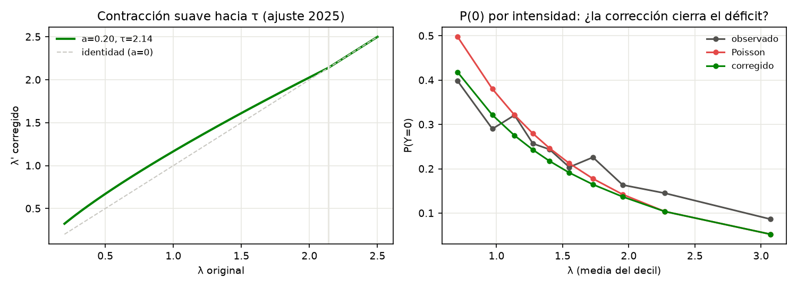

# EXP-006.1 — Corrección suave de la media a baja λ: PASA en desarrollo

**Fecha**: 2026-07-23 · `lambda_correction.py` → `.json` + `fig/lambda_correction.png`.
Autorizada por el director (contracción continua, no piso duro). Ajuste solo con
λ OOS de 2025; evaluación descriptiva en 2026 (dev). Ningún dato de la ventana
confirmatoria (≥ 27-jul) fue tocado.

## Modelo

$$\log\lambda' = (1-a)\log\lambda + a\log\tau \ \ (\lambda<\tau); \qquad \log\lambda'=\log\lambda\ \ (\lambda\ge\tau)$$

Ajuste 2025 (minimizando log-loss de **marcador**): **a = 0.202, τ = 2.140**.
Es una contracción suave hacia arriba que actúa sobre casi todo el rango pero con
fuerza creciente hacia λ bajo (Fig., panel izquierdo).

## Resultado vs los seis criterios de promoción del director

| Criterio | Resultado 2026 (dev) | ¿Cumple? |
|---|---|---|
| Reduce log-loss de marcador | Poisson 3.2196 → **corrección 3.2038**; supera a NB (3.209) y a global-c (3.2236) | **Sí** |
| No empeora RPS 1X2 > 0.0005 | Δ = **−0.0009**, IC [−0.0018, +0.0000] — mejora, no empeora | **Sí** |
| Reduce el sesgo Y−λ del decil bajo | 0.205 [0.112,0.291] → **0.030 [−0.064,0.120]** (ahora incluye 0) | **Sí** |
| Mejora P(0) sin déficit en intensidades medias | Cierra el gap a baja λ, converge a Poisson en λ alto (Fig., panel derecho) | **Sí** |
| Mismo signo en los tres países (rotación fit-en-2/eval-en-3ro) | FIN Δll −0.0117, SWE −0.0185, NOR −0.0179; Δrps −0.0004/−0.0007/−0.0016 — **todos negativos** | **Sí** |
| No requiere parámetros por temporada | a=0.20/τ=2.14 (2025) vs a=0.31/τ=1.80 (2026); los de 2025 **transfieren** a 2026 (eval principal) y la rotación es estable (a≈0.20-0.24) | **Parcial** (ver caveat) |

Supera además a los dos comparadores clave: **NB drop-in** (que arreglaba colas
pero agravaba el 0-0) y la **corrección global constante** (λ'=1.055·λ), que de
hecho empeora el log-loss de marcador — confirma que la señal es específica de
baja intensidad, no un reescalado uniforme.

*Izq.: la función de contracción λ→λ' (a=0.20, τ=2.14) empuja las intensidades
bajas hacia arriba de forma suave y monótona, sin discontinuidad, y se funde con
la identidad en λ≥τ. Der.: P(Y=0) por decil de λ en 2026 — Poisson (rojo) queda
por encima de lo observado (gris) a baja intensidad (el déficit de ceros); la
corrección (verde) baja hacia lo observado cerrando la mayor parte del gap sin
generar déficit en el medio.*

## Encuadre de evidencia (regla del director)

**Este es un éxito de desarrollo, no evidencia confirmatoria.** El decil bajo se
destacó tras inspeccionar diez bins, sin corrección por multiplicidad, y tanto
2025 como 2026 son conjuntos de desarrollo. Que la corrección pase los seis
criterios —incluida la transferencia a países retenidos y la superioridad sobre
NB y global-c— la convierte en el **primer candidato con base empírica sólida**
para promover, pero exige confirmación en una ventana verdaderamente nueva.

**No entra a la ventana confirmatoria en curso** (instrucción explícita del
director: ningún modelo nuevo a EXP-005, que empezó el 27-jul). Corresponde
**pre-registrarla para la próxima ventana** (temporada 2027, o un segmento fresco
posterior al cierre de EXP-005), con estos mismos criterios congelados y los
parámetros a=0.202, τ=2.140 fijados desde 2025.

**Caveat de estacionalidad**: los puntos (a, τ) difieren entre temporadas
(a 0.20 vs 0.31). No es descalificante —los parámetros de 2025 funcionan en 2026
y la rotación por países da a≈0.20-0.24 estable— pero la pre-registración debe
fijar los valores de 2025 y tratar cualquier re-ajuste como violación.

## Qué NO se hizo (y por qué)

No se construyó CMP ni hurdle: el director lo condicionó a que *persista* un
déficit de ceros **después** de corregir la media. La corrección de media ya
elimina el sesgo del decil bajo y cierra la mayor parte del déficit de P(0); no
hay evidencia de un residuo de forma que justifique esa complejidad adicional
todavía. Se re-evalúa recién con la corrección de media ya en su lugar.
