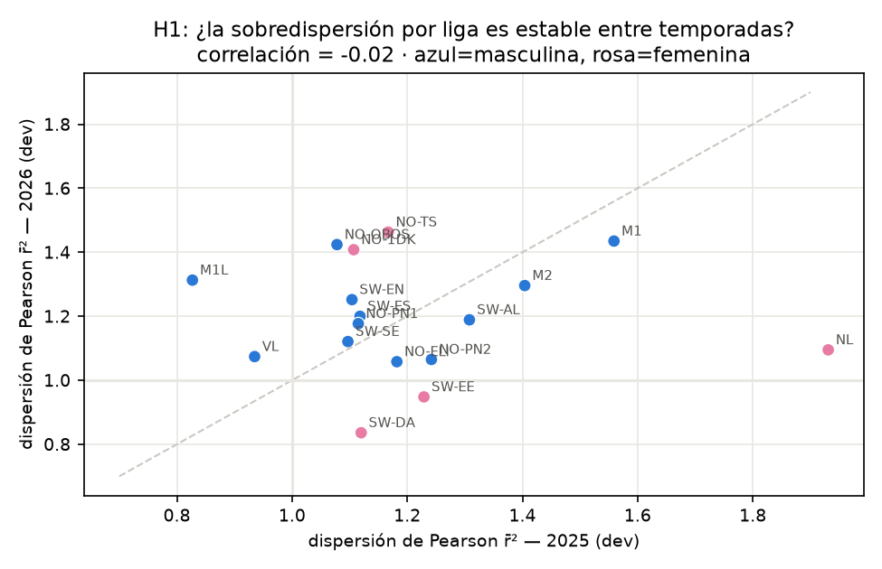
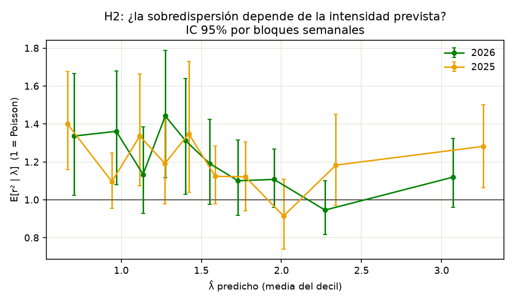

# EXP-006 — Fase de desarrollo del programa enfocado: cuatro líneas, cuatro veredictos

**Fecha**: 2026-07-23 · **Regla**: todo con datos ≤ 2025 o desarrollo 2026
(≤ 20-jul); **ningún** partido de la ventana confirmatoria (≥ 27-jul) fue
observado. Los tests confirmatorios se corren una sola vez en diciembre
(`EXP-005-prospectivo/`).

Este reporte responde al programa del director. Su regla rectora —"cada nueva
complejidad debe explicar un residuo medido, formular una predicción nueva y
sobrevivir datos que todavía no miramos"— se aplicó estrictamente. Las tres
apuestas científicas del director se pusieron a prueba en desarrollo; **las tres
salieron negativas o matizadas**. Eso es el método funcionando.

---

## Resumen de veredictos

| Línea | Hipótesis | Predicción del director | Veredicto en desarrollo |
|---|---|---|---|
| 3 | Localía dinámica (H6) | "la mayor mejora próxima" (apuesta #1) | **Nula.** ΔRPS = 0.0000, IC [−0.0002,+0.0002]; H_γ óptimo inestable entre países. **H4 retirada del cierre** (AMENDMENT-002). |
| 2 | Recalibrador de empate con s,d (H4-dir) | "la mejora de log-loss" (apuesta #2) | **Matizada-negativa.** Mejora la pendiente del empate 0.37→0.51 pero **menos que stack_cal** (0.68) y no le gana (Δlog-loss vs stack_cal = +0.0042, IC [+0.0000,+0.0079]). |
| 1 | Estructura de la sobredispersión (H1,H2) | "concentrada en ligas/regímenes; mezcla > NB uniforme" (apuesta #3) | **Matizada.** φ **global** estable (0.076→0.074) pero por-liga **no replica** (corr 2025→2026 = −0.02). E[r²\|λ] **plano**, no creciente ⇒ quasi-Poisson, no NB. NB drop-in **empeora el 0-0** (como predijo el director). |
| 4 | Fijar ρ=0 (H7) | "parsimonia sin perder capacidad" | **Confirmada.** ΔRPS(ρ=0 − ρ ajustado) = −0.0002, IC [−0.0004,+0.0001] < umbral 0.0005; ρ=0 además no sobrepredice el 0-0. Recomendado para producción. |

---

## Línea 3 — Localía dinámica (apuesta #1 del director): NULA

Implementación: kernel propio $w^\gamma_m = 2^{-\Delta t/H_\gamma}$ para γ,
re-estimada perfilando la verosimilitud Poisson. El perfil tiene **solución
cerrada**: $e^{\hat\gamma} = \frac{\sum_m w^\gamma_m\, g_{H,m}}{\sum_m w^\gamma_m\, \lambda^0_{H,m}}$
con $\lambda^0 = e^{\mu + \mathrm{atk}_h - \mathrm{def}_a}$ (intensidad local sin
localía). Costo ~0.

Tuning solo-2025 (`dyn_gamma_tuning.json`): todos los $H_\gamma \in \{30,60,120,240\}$
dan RPS 0.1951–0.1952, idénticos al base. Mejor vs base: ΔRPS −0.0000, IC
[−0.0002,+0.0002]. Leave-one-country-out: el óptimo salta (240 sin FIN, 30 sin
SWE, 60 sin NOR) — ajuste de ruido.

**Por qué falló una hipótesis bien motivada**: la ablación mostró que la localía
*importa* (quitarla cuesta +0.0045 RPS), pero γ es un único escalar por liga que
el decaimiento de 120 días ya estima bien; su deriva entre temporadas (M1
0.52→0.39) la absorbe el propio kernel general. No quedaba residuo para un
segundo kernel. **Decisión**: H4 no entra al cierre (AMENDMENT-002).

## Línea 2 — El empate como problema propio (apuesta #2): NO SUPERA A stack_cal

Recalibrador binario del empate (`draw_recalibrator.py`), features del director:
$s = \log(\lambda_H+\lambda_A)$ (intensidad total), $d = |\log(\lambda_H/\lambda_A)|$
(desigualdad), más el logit de $p_D^{DC}$ y la interacción $sd$; entrenado solo
con predicciones DC out-of-sample; $1-\hat P(D)$ repartido entre H/A preservando
su razón.

| Modelo | RPS | log-loss | ECE(D) | pendiente(D) |
|---|---|---|---|---|
| DC | 0.2139 | 1.0007 | 0.029 | 0.37 |
| draw_recal | 0.2139 | 0.9982 | 0.027 | **0.51** |
| stack_cal (referencia) | 0.2132 | 0.9940 | 0.021 | **0.68** |

El recalibrador específico mejora la pendiente del empate (0.37→0.51) pero
**stack_cal, genérico, lo hace mejor** (→0.68) y con menor log-loss. Contraste
directo draw_recal − stack_cal en log-loss: Δ=+0.0042, IC [+0.0000,+0.0079] —
draw_recal es peor. La forma funcional $s,d$ impuesta **no agrega** sobre la
recalibración logística genérica de los dos logits del DC (que ya contiene $d$
implícitamente). **Decisión**: stack_cal sigue siendo la capa de calibración; no
se adopta el recalibrador específico.

## Línea 1 — Estructura de la sobredispersión (apuesta #3): global y plana, no per-liga ni NB


*Fig. 1 — Dispersión de Pearson r̄² por liga: 2025 (eje x) vs 2026 (eje y). Si la
sobredispersión fuera una propiedad estable de cada liga, los puntos caerían sobre
la diagonal. No lo hacen: correlación −0.02. NL pasa de 1.93 a 1.10; M1L de 0.83 a
1.31. La sobredispersión por liga es esencialmente irrepetible entre temporadas ⇒
una dispersión jerárquica por liga ajustaría ruido. Bajo control de comparaciones
múltiples (Benjamini-Hochberg, FDR 10%) solo 4 ligas superan r̄²=1 en 2026
(NO-TS, M1, NO-OBOS, M2), y no son las mismas que en 2025.*


*Fig. 2 — E[r²|λ] por deciles de intensidad prevista, con IC 95% por bloques
semanales, en ambas temporadas. La curva es aproximadamente **plana** en ~1.1–1.4,
no creciente. Una binomial negativa (Var = λ+φλ²) predice E[r²|λ] = 1+φλ
**creciente** con λ — lo que NO se observa. La forma plana es la firma de una
sobredispersión **multiplicativa constante** (quasi-Poisson, Var ≈ cλ), no de una NB.*

Hallazgos (`overdispersion_structure.json`):
1. **La dispersión global φ es estable**: 0.076 (2025) → 0.074 (2026). Hay un
   exceso real y reproducible.
2. **Pero no es per-liga**: r̄² por liga tiene correlación −0.02 entre temporadas
   (Fig. 1). Modelar dispersión jerárquica por liga sería ajustar ruido — refuta
   la parte "concentrada en ligas" de la apuesta #3.
3. **Su forma es plana en λ** (Fig. 2), no creciente ⇒ apunta a **quasi-Poisson**
   (dispersión multiplicativa constante), no a NB.
4. **NB drop-in** (`negbin_dropin.py`, misma media, φ=0.074): predice 0-0 = 0.059
   vs Poisson 0.051 vs observado **0.040** — **NB empeora el 0-0**, tal como el
   director predijo, aunque mejora marginalmente el log-loss de marcador
   (3.214 vs 3.222) arreglando colas altas. Trade-off desfavorable dado que el
   defecto vivo es el 0-0.

**Decisión**: no adoptar NB ni dispersión per-liga. El candidato coherente con la
evidencia es una sobredispersión **global multiplicativa** (quasi-Poisson) o la
mezcla abierto/cerrado del director (H3), que puede generar dispersión de razón
constante. La mezcla queda como el único candidato distribucional vivo, a
implementar y testear en desarrollo antes de cualquier promoción.

## Línea 4 — ρ=0 (H7): CONFIRMADA por parsimonia

Evidencia acumulada convergente: ablación −ρ da ΔRPS = −0.0002, IC [−0.0004,+0.0001]
(dentro de la región de equivalencia |Δ|<0.0005 del director, y de hecho
levemente a favor de ρ=0); el diagnóstico muestra que el 0-0 está sobrepredicho y
ρ<0 lo agrava; el aporte de ρ al RPS es nulo. **Recomendación**: ρ=0 como
parametrización de producción. *No* se cambió el `dc_best` congelado del cierre
(sigue con ρ ajustado por respeto al registro); dado que ambos están en región de
equivalencia, el resultado confirmatorio es insensible a la elección.

## Qué queda para desarrollo (antes de cualquier promoción)

- **Mezcla abierto/cerrado** (Línea 1, H3): único candidato distribucional
  compatible con "dispersión global de razón constante". Requiere latente Z
  predicho de features pre-partido; es un build sustancial, se hace en desarrollo.
- **Jerárquico intra-M2** (Línea 5, H8): pooling entre lohkos de la MISMA
  división (grafo conectado, escala común real) — el lugar limpio para la
  jerarquía, a diferencia del pooling entre divisiones que ya fracasó.
- **Laplace segmentado** (Línea 6, H10) y **mapa de residuos / abstención**
  (Línea 7): posteriores, menor prioridad.
- **Prioridad 0 sigue siendo el archivado de cuotas**: sin él ninguna de estas
  mejoras se puede evaluar contra la única vara que importa para apostar (el
  mercado). Es una sesión de implementación del bot, no de investigación.

## Reproducir

```bash
research/.venv/bin/python research/experiments/EXP-005-prospectivo/dyn_gamma_tuning.py
research/.venv/bin/python research/experiments/EXP-004-referee/overdispersion_structure.py
research/.venv/bin/python research/experiments/EXP-004-referee/draw_recalibrator.py
research/.venv/bin/python research/experiments/EXP-004-referee/negbin_dropin.py
research/.venv/bin/python research/experiments/EXP-005-prospectivo/run_confirmatory.py --dry-run  # valida pipeline
```

Artefactos: `dyn_gamma_tuning.json`, `overdispersion_structure.json` + 2 figs,
`draw_recalibrator.json`, `negbin_dropin.json`, `dryrun_results.json`.
Confirmatorio: `run_confirmatory.py` (guardado, se niega a correr antes del
2026-12-01), `AMENDMENT-002.md` (H4 retirada).
